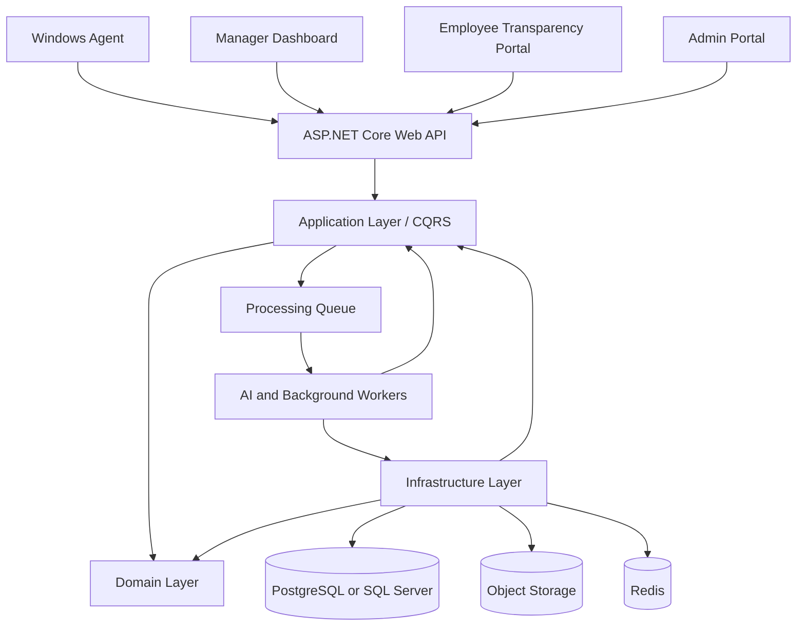

# WorkGraph AI

**Enterprise Workforce Intelligence Platform**

> Transparent • Consent-Based • Auditable • Usage-Metered

WorkGraph AI is an enterprise-grade AI workforce intelligence platform for remote and distributed teams.

It helps companies understand work patterns, operational bottlenecks, focus trends, software usage, and delivery context during approved monitoring sessions.

WorkGraph AI is **not spyware**.

The platform must be built as a transparent, consent-based, auditable workforce analytics system.

---

## Product Vision

Remote companies often struggle to understand what is happening during distributed work:

- Which tools are being used?
- Where is focus being lost?
- Which teams are overloaded?
- Which work categories dominate the day?
- Where are delivery bottlenecks?
- When does unrelated or unclassified activity appear?
- How much AI processing and storage is being consumed?

WorkGraph AI converts lightweight Windows activity data and screenshots into operational intelligence.

The product should focus on **summaries, trends, and decision support**, not raw surveillance.

---

## Positioning

Use this language:

```text
AI Workforce Intelligence
Operational Visibility
Remote Team Insights
Activity Summaries
Focus Trends
Work Category Timeline
Compliance-Ready Monitoring Sessions
```

Avoid this language:

```text
Spyware
Stealth Monitoring
Hidden Tracking
Employee Spying
Screen Logger
Keylogger
Surveillance Tool
```

---

## Core Principles

1. Monitoring must be transparent.
2. The Windows Agent must be visible to the employee.
3. Capture must happen only during approved monitoring sessions.
4. Every session must have a business justification.
5. Consent or authorization records must be stored.
6. Raw screenshot access must be audited.
7. Managers should see summaries first and screenshots second.
8. The system must use neutral language and avoid moral judgment.
9. AI cost must be minimized through staged processing.
10. Tenant isolation, audit logging, privacy rules, and usage metering are mandatory.

---

## Target Market

Primary target customers:

- Remote outsourcing companies
- BPO teams
- Call centers
- Offshore software teams
- Remote support teams
- Enterprise contractors
- Managed service providers

Primary users:

- Operations managers
- Delivery managers
- CEOs/founders of remote teams
- Compliance/security teams
- Later: HR managers for workload and burnout analytics

---

## Business Model

WorkGraph AI uses a usage-based / PAYG model.

Customers should not mainly pay per user. They pay based on internal AI Units and platform usage.

Example unit model:

| Operation | Example Units |
|---|---:|
| Screenshot upload | 1 |
| OCR processing | 1 |
| Basic classification | 1 |
| Vision analysis | 5 |
| Deep AI reasoning | 20 |
| Daily summary | 10 |
| Long-term storage | Storage-based |

Possible packages:

- Starter: small prepaid credit package
- Business: larger package with lower unit price
- Enterprise: custom pricing
- On-Prem: custom deployment and support pricing

---

## High-Level Architecture



---

## Main Components

### 1. Windows Agent

Installed on employee Windows devices with company/employee approval.

Responsibilities:

- Show visible tray/status icon
- Detect active monitoring session
- Capture screenshots only during active sessions
- Capture lightweight metadata
- Apply privacy rules where possible
- Compress screenshots to WebP/JPEG
- Queue encrypted offline uploads
- Upload securely to server
- Send heartbeat and agent health status

Captured metadata:

```text
Timestamp
Active window title
Process name
Application name
Optional browser domain
Idle/activity/locked state
Capture trigger
Agent device ID
Monitoring session ID
```

---

### 2. Web API

ASP.NET Core Web API responsible for:

- Authentication
- Tenant resolution
- RBAC
- Agent device registration
- Monitoring session management
- Screenshot and metadata ingestion
- Dashboard queries
- Employee portal queries
- Audit logging
- Usage metering

---

### 3. Processing Queue

RabbitMQ or Kafka can be used for async processing.

Typical events:

```text
activity.snapshot.uploaded
screenshot.asset.uploaded
ocr.processing.requested
classification.requested
timeblock.summary.requested
daily.summary.requested
premium.analysis.requested
retention.cleanup.requested
```

---

### 4. AI and Background Workers

Workers process captured activity data in stages.

Staged pipeline:

```text
Stage 1: Deterministic / rule-based processing
Stage 2: Lightweight AI classification
Stage 3: Premium AI reasoning only when needed
```

The system must not send every screenshot to expensive multimodal models.

---

### 5. Storage Layer

Relational database stores:

- Tenants
- Users
- Teams
- Employees
- Agent devices
- Monitoring sessions
- Activity metadata
- Screenshot metadata
- OCR results
- Analysis results
- Usage events
- Audit logs
- Privacy rules
- Retention policies

Object storage stores:

- Raw screenshots
- Blurred screenshots
- Report exports
- Large generated artifacts

---

### 6. Manager Dashboard

The dashboard should show:

- Team focus trends
- Work category timeline
- Software usage breakdown
- Context switching score
- Idle/activity timeline
- Daily AI summary
- Anomaly alerts
- Compliance reports
- Usage and credit consumption

Managers should not need to browse thousands of screenshots.

---

### 7. Employee Transparency Portal

Employees should be able to view:

- Active monitoring status
- Session history
- Session justification where allowed
- Collected data types
- Retention policy
- Consent records
- Access history where policy allows
- Privacy concern/report option

---

## Recommended Technology Stack

Backend:

```text
C#
ASP.NET Core Web API
Clean Architecture
CQRS
EF Core
PostgreSQL or SQL Server
Redis
RabbitMQ or Kafka
Background workers
```

Frontend:

```text
Blazor or React
Manager Dashboard
Employee Portal
Admin Portal
Billing Dashboard
```

AI:

```text
Local/rule-based processing first
OCR engine
Abstract AI provider interface
Optional cloud vision model later
Optional self-hosted model later
```

Storage:

```text
PostgreSQL or SQL Server for relational data
S3-compatible storage, Azure Blob, or MinIO for screenshots
Redis for cache/session state
```

---

## Clean Architecture Direction

Recommended solution structure:

```text
src/
├── WorkGraph.Domain
├── WorkGraph.Application
├── WorkGraph.Infrastructure
├── WorkGraph.WebApi
├── WorkGraph.Workers
└── WorkGraph.Contracts

clients/
├── WorkGraph.Agent.Windows
└── WorkGraph.Dashboard

tests/
├── WorkGraph.UnitTests
├── WorkGraph.IntegrationTests
├── WorkGraph.ArchitectureTests
└── WorkGraph.WorkerTests
```

Dependency direction:

```text
WebApi -> Application -> Domain
Infrastructure -> Application + Domain
Workers -> Application + Infrastructure
Contracts -> lightweight DTOs/events
```

The Domain project must not depend on:

```text
EF Core
ASP.NET Core
Redis
RabbitMQ/Kafka
AI SDKs
Object storage providers
```

---

## Bounded Contexts

MVP bounded contexts:

1. Identity & Access
2. Tenancy
3. Organization
4. Agent Management
5. Monitoring
6. Activity Ingestion
7. Intelligence Analysis
8. Reporting
9. Billing & Usage Metering
10. Audit & Compliance
11. Privacy & Retention

Start as a modular monolith. Do not start with microservices.

Future candidates for service extraction:

```text
Intelligence Service
Ingestion Service
Billing Service
Reporting Service
Compliance Service
```

---

## Core Domain Entities

Important MVP entities:

```text
Tenant
TenantSettings
User
Role
UserRole
Team
EmployeeProfile
AgentDevice
MonitoringPolicy
MonitoringSession
ConsentRecord
ActivitySnapshot
ScreenshotAsset
OcrResult
AnalysisResult
TimeBlockSummary
DailyEmployeeSummary
BillingAccount
UsageEvent
CreditTransaction
AuditLogEntry
RetentionPolicy
PrivacyRule
```

---

## Data Extraction Flow

```mermaid
flowchart LR
    Capture[Screenshot + Metadata]
    Privacy[Privacy Rules]
    Store[Store Metadata + Object]
    OCR[OCR]
    Classify[Classification]
    Aggregate[Time Block Aggregation]
    Summary[Daily Summary]
    Dashboard[Manager Dashboard]

    Capture --> Privacy
    Privacy --> Store
    Store --> OCR
    OCR --> Classify
    Classify --> Aggregate
    Aggregate --> Summary
    Summary --> Dashboard
```



The screenshot is only one input.

The product value comes from transforming raw screen activity into privacy-safe operational intelligence.

---

## Safe Analytics Language

Use:

```text
Low work-related activity detected
High context switching
Long idle period
Unclassified activity
Potential non-work activity
Needs manager review
Sensitive content rule matched
```

Avoid:

```text
Lazy
Cheating
Bad employee
Untrustworthy
Wasting time
```

---

## MVP Scope

Build first:

1. Tenant/user/team management
2. RBAC
3. Agent registration and approval
4. Monitoring policy creation
5. Monitoring session request/start/stop
6. Consent or authorization record
7. Activity metadata upload
8. Screenshot upload to object storage
9. Usage metering
10. Audit logging
11. OCR processing
12. Basic app/domain classification
13. Time block summary
14. Daily summary
15. Basic manager dashboard
16. Employee transparency portal basics

Do not overbuild the first version.

Prioritize:

```text
Privacy
Usage metering
Auditability
Session boundary
Manager summaries
```

---

## Documentation Index

Architecture documents:

```text
docs/architecture/class-diagram.md
docs/architecture/bounded-contexts.md
docs/architecture/use-case-diagrams.md
docs/architecture/database-design.md
docs/architecture/sequence-diagrams.md
docs/architecture/core-data-extraction-diagram.md
```

Recommended next documents:

```text
docs/architecture/security.md
docs/architecture/multi-tenancy.md
docs/architecture/api-design.md
docs/agent/windows-agent.md
docs/ai/ai-scoring-engine.md
docs/development/codex-instructions.md
.github/copilot-instructions.md
```

---

## Implementation Rules for Codex

When generating code, Codex must follow these rules:

1. Do not implement hidden monitoring.
2. Do not implement stealth mode.
3. Do not implement keylogging.
4. Do not implement password extraction.
5. Do not implement full URL capture by default.
6. Do not put business logic in controllers.
7. Do not put Infrastructure dependencies in Domain.
8. Always enforce TenantId filtering.
9. Always audit raw screenshot access.
10. Always meter billable operations.
11. Always validate monitoring session state before accepting captures.
12. Prefer summaries over raw screenshot views.
13. Use neutral, reviewable analytics language.
14. Keep the MVP as a modular monolith.
15. Keep AI provider usage behind interfaces.

---

## Security and Compliance Principles

WorkGraph AI should be designed with GDPR-style principles:

- Transparency
- Proportionality
- Data minimization
- Purpose limitation
- Retention limits
- Employee access rights
- Auditability
- Consent or authorization workflow
- Tenant isolation
- Encryption in transit and at rest

Security requirements:

```text
Tenant isolation
RBAC
Short-lived tokens
Secure device registration
Signed agent updates
Encrypted object storage
Screenshot access logging
Admin activity logging
Optional on-prem deployment
```

---

## Current Status

This repository is currently in the architecture and planning stage.

The first goal is to create clear documentation that Codex can use to generate a clean MVP implementation.

No production code should be generated until the core architecture documents are stable.

---

## Final Product Rule

WorkGraph AI should help managers understand work patterns, not spy on people.

The product should turn this:

```text
Raw screenshots and activity metadata
```

into this:

```text
Privacy-aware operational intelligence
```
