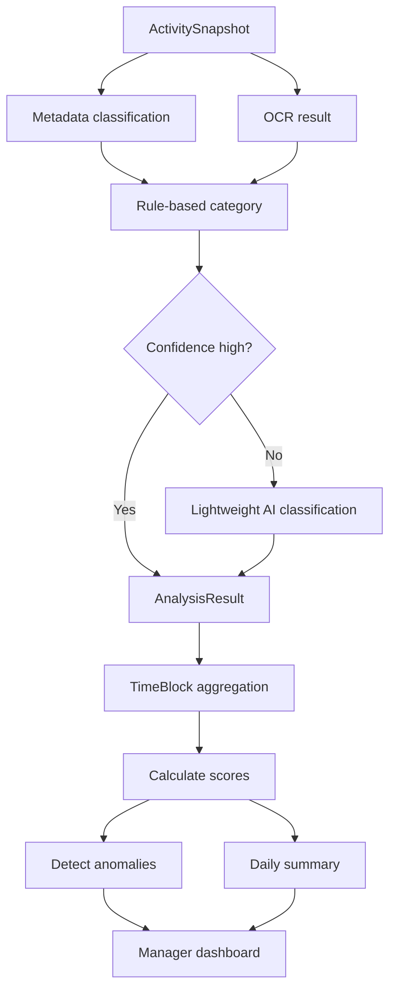

# WorkGraph AI - AI Scoring Engine

This document defines the first version of the WorkGraph AI scoring engine.

The scoring engine is the product brain. Screenshot capture is only data collection. The business value comes from converting raw activity into safe, useful, explainable workforce intelligence.

---

## Why WorkGraph Uses RabbitMQ or Kafka

WorkGraph AI receives many small events from Windows Agents:

- Activity metadata uploads
- Screenshot uploads
- OCR jobs
- Classification jobs
- Daily summary jobs
- Billing usage events
- Retention cleanup jobs

These operations should not all run inside the Web API request.

The Web API should stay fast:

```text
Receive upload
Validate tenant/device/session
Store metadata/object reference
Publish processing event
Return response
```

Then background workers process OCR, classification, summaries, billing, and retention asynchronously.

---

## Why A Queue Is Needed

### 1. Protect API Performance

OCR and AI analysis can be slow. If the API waits for them, screenshot uploads become slow and unreliable.

With a queue:

```text
API accepts data quickly
Workers process later
Dashboard updates when results are ready
```

---

### 2. Handle Traffic Spikes

If 500 agents upload screenshots around the same time, the queue absorbs the spike.

Without a queue, the API and database may become overloaded.

---

### 3. Retry Failed Jobs

OCR, object storage, and AI providers can fail temporarily.

A queue allows:

```text
Retry
Dead-letter queue
Backoff
Failure tracking
Idempotency
```

---

### 4. Scale Workers Independently

AI workers may need more CPU/GPU than the Web API.

With a queue, you can scale independently:

```text
More OCR workers
More classification workers
More summary workers
More billing workers
```

---

### 5. Reduce AI Cost

The queue allows staged processing:

```text
Duplicate detection first
OCR second
Rule-based classification third
AI only when needed
```

This avoids sending every screenshot to expensive AI models.

---

## RabbitMQ vs Kafka

### RabbitMQ

Best for MVP.

Use RabbitMQ when:

- You want simpler setup
- You need reliable work queues
- You need retries and dead-letter queues
- You have background jobs like OCR and classification
- You want easier .NET integration

Recommended for first version:

```text
RabbitMQ
```

---

### Kafka

Better later for high-scale event streaming.

Use Kafka when:

- You need very high throughput
- You want long event retention
- You want replayable event streams
- You want analytics pipelines over historical events
- You have many downstream consumers

Recommended later if the platform grows large:

```text
Kafka
```

---

## Recommendation

For WorkGraph AI MVP:

```text
Use RabbitMQ first.
```

Design the application with an abstraction like:

```text
IEventBus
IBackgroundJobPublisher
IIntegrationEventPublisher
```

Later, RabbitMQ can be replaced by Kafka without changing domain or application logic.

---

# Scoring Engine Goal

The scoring engine should produce useful operational signals without making final moral judgments.

It should help managers understand patterns, not label employees as good or bad.

The system must say:

```text
Low work-related activity detected
High context switching
Long idle period
Potential non-work activity
Needs manager review
```

It must not say:

```text
Lazy
Cheating
Bad employee
Untrustworthy
Wasting time
```

---

## Main Scores

The MVP scoring engine should calculate:

```text
Focus Score
Context Switching Score
Work-Related Activity Percentage
Potential Non-Work Percentage
Idle Percentage
Unclassified Percentage
Session Productivity Signal
Daily Work Pattern Summary
Team Overview Score
Anomaly Signals
```

These are not final performance ratings. They are reviewable operational signals.

---

# Core Inputs

The scoring engine should use these inputs:

## ActivitySnapshot

```text
CapturedAtUtc
ApplicationName
ProcessName
ActiveWindowTitle
BrowserDomain
ActivityState
CaptureTrigger
```

## ScreenshotAsset

```text
IsDuplicate
IsBlurred
IsSensitive
ContentHash
PerceptualHash
```

## OcrResult

```text
MaskedText
Confidence
EngineName
```

## AnalysisResult

```text
WorkCategory
FocusLevel
RiskSignal
Confidence
Stage
Summary
```

## MonitoringSession

```text
StartedAtUtc
EndedAtUtc
CaptureMode
ScreenshotIntervalSeconds
Justification
```

---

# Work Categories

Recommended categories:

```text
Development
Support
Meeting
Documentation
Research
Communication
Administration
Design
Testing
Learning
Unclassified
PotentialNonWork
```

WorkGraph should allow tenant-specific mapping.

Example:

```text
YouTube may be Learning for a software training session.
YouTube may be PotentialNonWork for a support shift.
```

Context matters.

---

# Time Block Model

Do not score a single screenshot as final productivity.

Scores should be calculated over time blocks.

Recommended block size:

```text
15 minutes for detailed timeline
30 minutes for normal dashboard
60 minutes for executive summaries
```

For MVP:

```text
30-minute time blocks
```

Each time block should include:

```text
StartAtUtc
EndAtUtc
SnapshotCount
ActiveSnapshotCount
IdleSnapshotCount
DominantWorkCategory
WorkRelatedPercentage
PotentialNonWorkPercentage
UnclassifiedPercentage
FocusScore
ContextSwitchingScore
IdlePercentage
RiskSignals
Summary
```

---

# Score 1: Work-Related Activity Percentage

## Purpose

Estimate how much of a time block appears related to configured work categories.

## Work-Related Categories

Default work-related categories:

```text
Development
Support
Meeting
Documentation
Research
Communication
Administration
Design
Testing
Learning
```

Tenant admins should be able to customize this mapping.

## Formula

```text
WorkRelatedPercentage = WorkRelatedSnapshots / ValidSnapshots * 100
```

Where:

```text
ValidSnapshots = TotalSnapshots - SensitiveSkippedSnapshots
```

## Example

```text
30 snapshots in a block
24 work-related
3 potential non-work
3 unclassified

WorkRelatedPercentage = 24 / 30 * 100 = 80%
```

## Safe Output

```text
80% work-related activity detected in this time block.
```

---

# Score 2: Potential Non-Work Percentage

## Purpose

Estimate activity that may be unrelated based on tenant rules and classification.

This is not an accusation.

## Formula

```text
PotentialNonWorkPercentage = PotentialNonWorkSnapshots / ValidSnapshots * 100
```

## Safe Output

```text
Potential non-work activity detected. Needs manager review.
```

## Important Rule

Never automatically decide that activity is definitely non-work.

Example:

```text
YouTube may be training.
Social media may be part of marketing work.
Personal email may be a privacy-sensitive area and should be masked.
```

---

# Score 3: Idle Percentage

## Purpose

Show how much of a time block was idle, locked, or unknown.

## Formula

```text
IdlePercentage = IdleOrLockedSnapshots / TotalSnapshots * 100
```

Recommended grouping:

```text
Active = Active
Idle = Idle + Locked
Unknown = Unknown
```

## Safe Output

```text
Long idle period detected from 14:10 to 14:35.
```

Not:

```text
Employee was not working.
```

---

# Score 4: Context Switching Score

## Purpose

Measure how frequently the employee switches between apps, windows, or domains.

High context switching may indicate fragmented focus, support workload, multitasking, or interruptions.

It is not automatically bad.

## Inputs

```text
Application changes
Process changes
Window title changes
Browser domain changes
Capture trigger frequency
```

## Basic MVP Formula

```text
SwitchEvents = ApplicationChanges + BrowserDomainChanges + SignificantWindowTitleChanges
SwitchRate = SwitchEvents / BlockDurationMinutes
ContextSwitchingScore = min(100, SwitchRate * 20)
```

Example:

```text
5 switch events in 30 minutes
SwitchRate = 5 / 30 = 0.166
ContextSwitchingScore = 0.166 * 20 = 3.3
```

For a more visible 0-100 scale in MVP, use:

```text
ContextSwitchingScore = min(100, SwitchEvents / ExpectedSwitchEventsPerBlock * 100)
```

Default:

```text
ExpectedSwitchEventsPerBlock = 12 for 30 minutes
```

So:

```text
5 switches = 41.6
12 switches = 100
```

## Safe Output

```text
High context switching detected during this time block.
```

Not:

```text
Employee was distracted.
```

---

# Score 5: Focus Score

## Purpose

Estimate continuity of work activity during a time block.

Focus Score should be based on time patterns, not one screenshot.

## Inputs

Positive signals:

```text
Long continuous activity in same work category
Low context switching
Low idle percentage
High work-related percentage
Repeated work-related app usage
```

Negative signals:

```text
High context switching
Long idle period
High unclassified activity
High potential non-work percentage
Frequent sensitive/skipped captures
```

## MVP Formula

```text
FocusScore = 100
FocusScore -= IdlePenalty
FocusScore -= ContextSwitchingPenalty
FocusScore -= PotentialNonWorkPenalty
FocusScore -= UnclassifiedPenalty
FocusScore += ContinuityBonus
FocusScore = clamp(FocusScore, 0, 100)
```

### Penalties

```text
IdlePenalty = IdlePercentage * 0.7
ContextSwitchingPenalty = ContextSwitchingScore * 0.3
PotentialNonWorkPenalty = PotentialNonWorkPercentage * 0.5
UnclassifiedPenalty = UnclassifiedPercentage * 0.2
```

### Continuity Bonus

```text
ContinuityBonus = min(10, LongestContinuousWorkMinutes / 3)
```

Example:

```text
Longest continuous work period = 24 minutes
ContinuityBonus = min(10, 24 / 3) = 8
```

## Example

```text
IdlePercentage = 10
ContextSwitchingScore = 40
PotentialNonWorkPercentage = 5
UnclassifiedPercentage = 10
ContinuityBonus = 8

FocusScore = 100 - 7 - 12 - 2.5 - 2 + 8 = 84.5
```

Safe output:

```text
Strong focus pattern detected in this block.
```

---

# Focus Level Mapping

Map FocusScore to display labels:

```text
High: 75-100
Medium: 50-74
Low: 25-49
Unknown: 0-24 or insufficient data
```

Important:

If snapshot count is too low, return Unknown instead of Low.

```text
MinimumSnapshotsForScore = 5
```

---

# Score 6: Unclassified Percentage

## Purpose

Measure how much activity cannot be confidently categorized.

## Formula

```text
UnclassifiedPercentage = UnclassifiedSnapshots / ValidSnapshots * 100
```

## Safe Output

```text
High unclassified activity. Classification rules may need review.
```

This can mean the system needs better rules, not that the employee did anything wrong.

---

# Score 7: Session Productivity Signal

## Purpose

Summarize one monitoring session.

This is not an employee performance rating.

## Inputs

```text
AverageFocusScore
WorkRelatedPercentage
PotentialNonWorkPercentage
IdlePercentage
ContextSwitchingScore
AnomalyCount
SensitiveSkippedCount
```

## MVP Formula

```text
SessionSignal = 0
SessionSignal += AverageFocusScore * 0.35
SessionSignal += WorkRelatedPercentage * 0.35
SessionSignal += (100 - IdlePercentage) * 0.15
SessionSignal += (100 - ContextSwitchingScore) * 0.10
SessionSignal += (100 - PotentialNonWorkPercentage) * 0.05
SessionSignal = clamp(SessionSignal, 0, 100)
```

## Display Labels

```text
Strong work pattern: 75-100
Normal work pattern: 50-74
Needs review: 25-49
Insufficient data: 0-24 or low sample count
```

Avoid labels like:

```text
Good employee
Bad employee
Unproductive employee
```

---

# Score 8: Daily Work Pattern Score

## Purpose

Summarize a day for one employee.

## Inputs

```text
TimeBlockSummaries
MonitoringSessions
DailyEmployeeSummary
Usage breakdown
```

## MVP Formula

```text
DailyScore = WeightedAverage(TimeBlock.FocusScore, BlockActiveMinutes)
```

Then adjust:

```text
DailyScore -= LongIdlePenalty
DailyScore -= HighPotentialNonWorkPenalty
DailyScore -= HighUnclassifiedPenalty
DailyScore = clamp(DailyScore, 0, 100)
```

## Output

```text
Daily work pattern shows mostly development and support activity, with two high context-switching periods in the afternoon.
```

---

# Score 9: Team Overview Score

## Purpose

Show team-level operational health.

Do not rank employees aggressively in MVP.

## Inputs

```text
Daily employee scores
Team work category distribution
Team idle percentage
Team context switching average
Anomaly count
Coverage of monitoring sessions
```

## MVP Formula

```text
TeamScore = Average(DailyEmployeeScores for monitored employees)
```

Weighted by monitored active time:

```text
TeamScore = Sum(EmployeeDailyScore * ActiveMinutes) / Sum(ActiveMinutes)
```

## Output

```text
Team focus trend is stable. Context switching increased after 15:00, mainly across communication and support tools.
```

---

# Anomaly Detection Rules

Anomalies should be review signals, not accusations.

## MVP Anomaly Rules

```text
LongIdlePeriod
HighContextSwitching
HighPotentialNonWorkPercentage
HighUnclassifiedPercentage
SensitiveContentDetected
RepeatedDuplicateScreenshots
UnusualApplicationUsage
MonitoringSessionWithoutData
AgentOfflineDuringActiveSession
HighAIUsageCost
```

---

## LongIdlePeriod

Trigger when:

```text
Continuous idle or locked duration >= 20 minutes
```

Safe wording:

```text
Long idle period detected. Needs review if unexpected.
```

---

## HighContextSwitching

Trigger when:

```text
ContextSwitchingScore >= 80 for a time block
```

Safe wording:

```text
High context switching detected during this time block.
```

---

## HighPotentialNonWorkPercentage

Trigger when:

```text
PotentialNonWorkPercentage >= 40 for a time block
```

Safe wording:

```text
Potential non-work activity exceeded configured threshold. Needs manager review.
```

---

## HighUnclassifiedPercentage

Trigger when:

```text
UnclassifiedPercentage >= 50 for a time block
```

Safe wording:

```text
High unclassified activity. Classification rules may need review.
```

---

## SensitiveContentDetected

Trigger when privacy rules match:

```text
Banking domain
Personal email
Password manager
HR/payroll system
Medical/health portal
Private chat
```

Safe wording:

```text
Sensitive content rule matched. Screenshot was hidden or masked according to policy.
```

---

## AgentOfflineDuringActiveSession

Trigger when:

```text
Agent heartbeat missing during active session for more than configured threshold
```

Safe wording:

```text
Agent connection gap detected during active monitoring session.
```

---

# Confidence Model

Every classification should include confidence.

Recommended confidence levels:

```text
High: >= 0.80
Medium: 0.60-0.79
Low: 0.40-0.59
Unknown: < 0.40
```

If confidence is low:

```text
Use Unclassified
Do not create strong claims
Optionally request lightweight AI
```

---

# Scoring Pipeline



---

# Example Time Block Calculation

## Input

```text
Block: 09:00-09:30
Snapshots: 30
Work-related: 24
Potential non-work: 2
Unclassified: 2
Idle/locked: 2
Switch events: 5
Longest continuous work: 18 minutes
```

## Calculations

```text
WorkRelatedPercentage = 24 / 30 * 100 = 80
PotentialNonWorkPercentage = 2 / 30 * 100 = 6.7
UnclassifiedPercentage = 2 / 30 * 100 = 6.7
IdlePercentage = 2 / 30 * 100 = 6.7
ContextSwitchingScore = 5 / 12 * 100 = 41.7
ContinuityBonus = min(10, 18 / 3) = 6

FocusScore = 100
- 6.7 * 0.7
- 41.7 * 0.3
- 6.7 * 0.5
- 6.7 * 0.2
+ 6
= 84.1
```

## Output

```text
FocusScore: 84
FocusLevel: High
DominantWorkCategory: Development
RiskSignal: None
Summary: Strong work-related development activity detected with moderate context switching.
```

---

# Manager Dashboard Display Rules

Show:

```text
Focus trend
Work category timeline
Context switching score
Idle/activity timeline
Software usage breakdown
Potential anomalies
Daily summary
```

Hide by default:

```text
Raw screenshots
Full OCR text
Sensitive content
Private personal pages
Detailed personal messages
```

Raw screenshots should be available only through audited access.

---

# Employee Portal Display Rules

Show:

```text
Monitoring status
Session history
Session justification
Collected data types
Retention policy
Consent status
Access history where policy allows
```

Allow employee to report:

```text
Wrong classification
Sensitive content captured
Privacy concern
```

---

# Billing Events From Scoring

Scoring should create billable usage events where applicable.

Recommended usage events:

```text
BasicClassification = 1 unit
VisionAnalysis = 5 units
DeepReasoning = 20 units
DailySummary = 10 units
```

Do not double-charge retries.

Use idempotency keys:

```text
tenantId:activitySnapshotId:stage
```

Example:

```text
tenant-1:snapshot-123:basic-classification
```

---

# MVP Implementation Order

Build scoring in this order:

```text
1. Work category mapping rules
2. Metadata-based classification
3. Idle percentage
4. Context switching score
5. Work-related percentage
6. Potential non-work percentage
7. Focus score
8. Time block summary
9. Daily employee summary
10. Anomaly rules
11. Team overview score
12. Premium AI explanations
```

---

# Configuration Needed Per Tenant

Tenant admins should eventually configure:

```text
Work-related app/domain rules
Potential non-work app/domain rules
Learning/training exceptions
Sensitive domains/apps
Idle threshold
Context switching threshold
Potential non-work threshold
Unclassified threshold
Score weights
Capture modes
Privacy actions
```

For MVP, provide safe defaults.

---

# Safe Defaults

```text
TimeBlockMinutes = 30
MinimumSnapshotsForScore = 5
LongIdleThresholdMinutes = 20
HighContextSwitchingThreshold = 80
HighPotentialNonWorkThreshold = 40
HighUnclassifiedThreshold = 50
ExpectedSwitchEventsPer30MinBlock = 12
```

Focus score weights:

```text
IdlePenaltyWeight = 0.7
ContextSwitchingPenaltyWeight = 0.3
PotentialNonWorkPenaltyWeight = 0.5
UnclassifiedPenaltyWeight = 0.2
MaxContinuityBonus = 10
```

---

# Important Product Warning

Do not market the score as an employee performance score.

Better names:

```text
Focus Trend
Work Pattern Signal
Operational Signal
Activity Context Score
Team Work Pattern
```

Avoid names:

```text
Employee Score
Laziness Score
Trust Score
Productivity Judgment
Performance Rating
```

---

# Final Principle

The scoring engine must be explainable.

Every score should be traceable to simple signals:

```text
Idle time
Context switching
Work category
Unclassified activity
Potential non-work activity
Continuity of work
```

If a manager asks why a score is low, the system should explain:

```text
This block had 35% idle time and high context switching across 9 applications.
```

not:

```text
AI decided the employee was unproductive.
```
