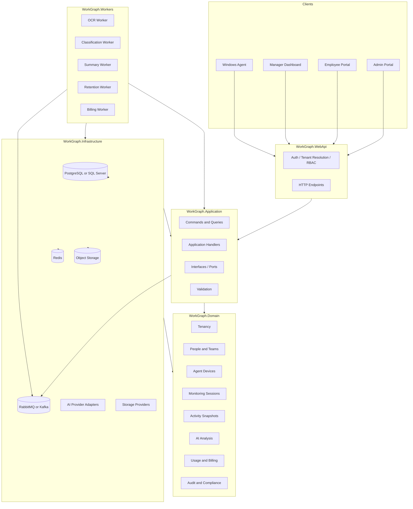
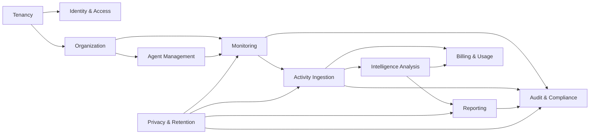
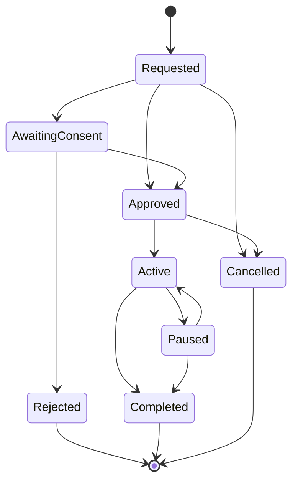

# WorkGraph AI - Bounded Contexts and Clean Architecture Structure

This document defines the recommended DDD bounded contexts, modular monolith structure, Clean Architecture project layout, and future service split strategy for **WorkGraph AI**.

WorkGraph AI should start as a **modular monolith**, not microservices.

The goal is to keep the first implementation simple enough to build, while preserving clear boundaries for future enterprise/on-prem scaling.

---

## Architecture Decision

Use:

- Clean Architecture
- Lightweight CQRS
- Modular monolith
- Event-driven background processing
- Multi-tenant design from day one
- Privacy-first auditability from day one

Avoid in MVP:

- Microservices
- Distributed transactions
- Complex event sourcing
- Overly abstract domain modeling
- Expensive AI for every screenshot

---

## High-Level Modular Monolith Diagram



---

## Bounded Contexts Overview

Recommended MVP bounded contexts:

```text
1. Identity & Access
2. Tenancy
3. Organization
4. Agent Management
5. Monitoring
6. Activity Ingestion
7. Intelligence Analysis
8. Reporting
9. Billing & Usage Metering
10. Audit & Compliance
11. Privacy & Retention
```

These are logical modules inside one solution. They do not need to become separate services in MVP.

---

## Context Map



---

# 1. Identity & Access Context

## Purpose

Controls authentication identity, roles, permissions, and access decisions.

## Core Concepts

- User
- Role
- Permission
- UserRole
- RBAC policy

## Main Responsibilities

- Login identity management
- Role assignment
- Access checks
- Manager/auditor/admin/employee authorization
- Short-lived API tokens
- Agent/device authentication support through separate device credentials

## Should Own

```text
User
Role
UserRole
Permission
AccessDecision
```

## Should Not Own

```text
Employee productivity data
Screenshots
Monitoring sessions
Billing balance
AI results
```

## Important Roles

```text
Owner
Admin
Manager
Auditor
Employee
```

## Example Commands

```text
InviteUserCommand
AssignUserRoleCommand
DisableUserCommand
```

## Example Queries

```text
GetCurrentUserQuery
GetTenantUsersQuery
GetUserPermissionsQuery
```

---

# 2. Tenancy Context

## Purpose

Represents customer organizations and tenant-wide configuration.

## Core Concepts

- Tenant
- TenantSettings
- TenantStatus
- TenantIsolation

## Main Responsibilities

- Tenant lifecycle
- Tenant settings
- Tenant isolation
- Default policies
- Tenant-level feature flags

## Should Own

```text
Tenant
TenantSettings
TenantFeatureFlag
```

## Should Not Own

```text
Employee activity details
Screenshots
AI classification logic
Payment provider implementation
```

## Critical Rule

Every tenant-owned entity must include `TenantId`.

Application queries must never return data across tenants unless explicitly implemented for a system owner/super-admin scenario.

## Example Commands

```text
CreateTenantCommand
UpdateTenantSettingsCommand
SuspendTenantCommand
```

## Example Queries

```text
GetTenantSettingsQuery
GetTenantHealthQuery
```

---

# 3. Organization Context

## Purpose

Models the customer workforce structure.

## Core Concepts

- Team
- EmployeeProfile
- Manager assignment
- Department/grouping

## Main Responsibilities

- Create teams
- Assign employees to teams
- Link employee profiles to users
- Support manager dashboard scoping

## Should Own

```text
Team
EmployeeProfile
TeamMembership
ManagerAssignment
```

## Should Not Own

```text
Agent installation details
Screenshot storage
AI analysis results
Billing usage calculation
```

## Important Distinction

`User` is an authentication identity.

`EmployeeProfile` is the workforce subject being analyzed.

One employee profile may optionally link to one user account for employee portal access.

## Example Commands

```text
CreateTeamCommand
CreateEmployeeProfileCommand
AssignEmployeeToTeamCommand
LinkEmployeeProfileToUserCommand
```

## Example Queries

```text
GetTeamsQuery
GetEmployeeProfileQuery
GetEmployeesByManagerQuery
```

---

# 4. Agent Management Context

## Purpose

Controls Windows Agent registration, device approval, agent health, and secure communication.

## Core Concepts

- AgentDevice
- DeviceRegistration
- DeviceCredential
- AgentHeartbeat
- AgentVersion

## Main Responsibilities

- Register Windows Agent
- Approve/revoke device
- Track last seen time
- Track agent version
- Support signed updates
- Provide active monitoring configuration to the agent

## Should Own

```text
AgentDevice
AgentRegistrationRequest
AgentHeartbeat
DeviceCredential
```

## Should Not Own

```text
Raw screenshots
AI analysis output
Manager reporting
Employee HR profile beyond link to EmployeeProfile
```

## Security Rules

- Agent must be visible to employee.
- Agent must not run as hidden spyware.
- Device credentials must be revocable.
- Agent uploads must use short-lived tokens or securely rotated credentials.
- Device registration must be auditable.

## Example Commands

```text
RegisterAgentDeviceCommand
ApproveAgentDeviceCommand
RevokeAgentDeviceCommand
RecordAgentHeartbeatCommand
```

## Example Queries

```text
GetAgentDevicesQuery
GetAgentDeviceStatusQuery
GetAgentConfigurationQuery
```

---

# 5. Monitoring Context

## Purpose

Controls monitoring policies and approved monitoring sessions.

This is the most important business context.

## Core Concepts

- MonitoringPolicy
- MonitoringSession
- ConsentRecord
- MonitoringJustification
- CaptureMode

## Main Responsibilities

- Create monitoring policies
- Request monitoring session
- Require consent if configured
- Start/pause/stop monitoring session
- Enforce capture frequency
- Enforce session boundaries

## Should Own

```text
MonitoringPolicy
MonitoringSession
ConsentRecord
MonitoringSessionStateTransition
```

## Should Not Own

```text
Stored screenshot binary
OCR engine
AI model provider
Billing invoice generation
```

## Critical Rule

No activity data should be accepted unless it belongs to an active or valid monitoring session.

## Valid Session Lifecycle



## Example Commands

```text
CreateMonitoringPolicyCommand
RequestMonitoringSessionCommand
SubmitConsentDecisionCommand
ApproveMonitoringSessionCommand
StartMonitoringSessionCommand
PauseMonitoringSessionCommand
StopMonitoringSessionCommand
```

## Example Queries

```text
GetMonitoringPoliciesQuery
GetMonitoringSessionDetailsQuery
GetActiveMonitoringSessionsQuery
GetEmployeeSessionHistoryQuery
```

---

# 6. Activity Ingestion Context

## Purpose

Receives lightweight activity metadata and screenshots from the Windows Agent.

## Core Concepts

- ActivitySnapshot
- ScreenshotAsset
- CaptureTrigger
- ActiveWindowMetadata
- BrowserDomainMetadata
- IdleState

## Main Responsibilities

- Accept metadata upload
- Accept screenshot upload
- Store screenshot references
- Detect duplicate screenshots
- Create processing jobs
- Record usage events

## Should Own

```text
ActivitySnapshot
ScreenshotAsset
IngestionBatch
DuplicateDetectionResult
```

## Should Not Own

```text
Monitoring approval workflow
AI model selection
Payment plans
Final dashboard aggregation logic
```

## Ingestion Rules

- Validate tenant.
- Validate device.
- Validate monitoring session.
- Validate capture mode and allowed metadata fields.
- Apply privacy rules before storage when possible.
- Store binaries in object storage, not relational database.
- Record usage event for billable ingestion operations.

## Example Commands

```text
UploadActivitySnapshotCommand
UploadScreenshotAssetCommand
CreateIngestionBatchCommand
MarkScreenshotDuplicateCommand
```

## Example Queries

```text
GetActivitySnapshotQuery
GetSessionActivityTimelineQuery
GetScreenshotAssetQuery
```

---

# 7. Intelligence Analysis Context

## Purpose

Converts raw activity data into useful workforce intelligence.

## Core Concepts

- OcrResult
- AnalysisResult
- WorkCategory
- FocusLevel
- RiskSignal
- TimeBlockSummary
- DailyEmployeeSummary

## Main Responsibilities

- OCR processing
- App/domain classification
- Work category detection
- Focus score estimation
- Context switching calculation
- Daily summary generation
- Deep analysis when requested

## Should Own

```text
OcrResult
AnalysisResult
TimeBlockSummary
DailyEmployeeSummary
WorkCategoryRule
ClassificationRule
```

## Should Not Own

```text
Agent registration
Raw authorization workflow
Billing account balance
Screenshot binary storage implementation
```

## AI Cost Rule

Do not send every screenshot to expensive multimodal AI.

Use staged analysis:

```text
Stage 1: Deterministic / rule-based
Stage 2: Lightweight AI
Stage 3: Premium AI only when needed
```

## Safe Language Rule

The system must not make moral judgments.

Use:

```text
Low work-related activity detected
High context switching
Long idle period
Unclassified activity
Potential non-work activity
Needs manager review
```

Avoid:

```text
Lazy
Cheating
Bad employee
Untrustworthy
```

## Example Commands

```text
CreateOcrResultCommand
ClassifyActivitySnapshotCommand
GenerateTimeBlockSummaryCommand
GenerateDailyEmployeeSummaryCommand
RequestDeepAnalysisCommand
```

## Example Queries

```text
GetAnalysisResultQuery
GetEmployeeFocusTrendQuery
GetDailyEmployeeSummaryQuery
GetWorkCategoryBreakdownQuery
```

---

# 8. Reporting Context

## Purpose

Provides manager-facing and employee-facing analytics views.

## Core Concepts

- DashboardView
- TeamOverview
- EmployeeTimeline
- WorkCategoryTimeline
- FocusTrend
- ComplianceReport

## Main Responsibilities

- Team dashboard
- Employee timeline
- Software usage breakdown
- Focus trend
- Idle/activity timeline
- Manager summaries
- Employee transparency portal views

## Should Own

Reporting read models and dashboard DTOs.

```text
TeamDashboardReadModel
EmployeeTimelineReadModel
UsageBreakdownReadModel
ComplianceReportReadModel
```

## Should Not Own

```text
Monitoring session state transitions
Agent credentials
OCR execution
Billing ledger mutation
```

## Design Rule

Managers should see summaries first and raw screenshots second.

Raw screenshot access should be audited.

## Example Queries

```text
GetTeamDashboardQuery
GetEmployeeTimelineQuery
GetSoftwareUsageBreakdownQuery
GetContextSwitchingTrendQuery
GetIdleActivityTimelineQuery
GetComplianceReportQuery
```

---

# 9. Billing & Usage Metering Context

## Purpose

Tracks internal AI Units and customer credit usage.

## Core Concepts

- BillingAccount
- UsageEvent
- CreditTransaction
- PricingPlan
- AIUnit

## Main Responsibilities

- Record usage events
- Deduct credits
- Track credit balance
- Support PAYG pricing
- Support prepaid packages
- Support enterprise/on-prem pricing

## Should Own

```text
BillingAccount
UsageEvent
CreditTransaction
PricingPlan
UnitPrice
```

## Should Not Own

```text
Screenshot binary
Employee performance interpretation
Monitoring approval workflow
```

## Example Internal Unit Model

```text
Screenshot upload = 1 unit
OCR = 1 unit
Basic classification = 1 unit
Vision analysis = 5 units
Deep reasoning = 20 units
Daily summary = 10 units
Long-term storage = storage-based cost
```

## Example Commands

```text
RecordUsageEventCommand
DeductCreditsCommand
AddPrepaidCreditsCommand
ChangeBillingPlanCommand
```

## Example Queries

```text
GetBillingBalanceQuery
GetUsageReportQuery
GetTenantUsageBreakdownQuery
GetCreditTransactionsQuery
```

---

# 10. Audit & Compliance Context

## Purpose

Records sensitive access and administrative actions for trust, compliance, and enterprise readiness.

## Core Concepts

- AuditLogEntry
- AccessReason
- ComplianceEvent
- DataAccessRecord

## Main Responsibilities

- Log screenshot access
- Log report exports
- Log policy changes
- Log employee data access
- Log monitoring lifecycle events
- Support auditor queries

## Should Own

```text
AuditLogEntry
ComplianceEvent
DataAccessRecord
```

## Should Not Own

```text
Business logic for every domain action
Billing calculation
AI classification
```

## Critical Rule

Audit logs should be append-only from the application point of view.

Never silently access sensitive data.

## Example Commands

```text
WriteAuditLogCommand
RecordDataAccessCommand
RecordComplianceEventCommand
```

## Example Queries

```text
GetAuditLogQuery
GetScreenshotAccessHistoryQuery
GetEmployeeDataAccessHistoryQuery
GetComplianceEventsQuery
```

---

# 11. Privacy & Retention Context

## Purpose

Controls privacy masking, data minimization, retention, and deletion policies.

## Core Concepts

- PrivacyRule
- RetentionPolicy
- DataDeletionJob
- MaskingRule
- SensitiveContentSignal

## Main Responsibilities

- Define privacy rules
- Apply masking/skipping rules
- Manage retention periods
- Delete expired screenshots/reports
- Respect purpose limitation
- Support employee access rights

## Should Own

```text
PrivacyRule
RetentionPolicy
DataDeletionJob
PrivacyAction
```

## Should Not Own

```text
AI provider calls
Manager dashboard layout
Payment processing
```

## Example Commands

```text
CreatePrivacyRuleCommand
UpdatePrivacyRuleCommand
CreateRetentionPolicyCommand
RunRetentionCleanupCommand
RequestEmployeeDataExportCommand
RequestEmployeeDataDeletionCommand
```

## Example Queries

```text
GetPrivacyRulesQuery
GetRetentionPolicyQuery
GetDataRetentionStatusQuery
GetEmployeeCollectedDataQuery
```

---

## Recommended Solution Structure

```text
WorkGraph-AI/
│
├── docs/
│   ├── architecture/
│   │   ├── class-diagram.md
│   │   ├── bounded-contexts.md
│   │   ├── clean-architecture.md
│   │   ├── cqrs-guidelines.md
│   │   ├── multi-tenancy.md
│   │   ├── security.md
│   │   ├── compliance.md
│   │   └── billing-engine.md
│   │
│   ├── agent/
│   ├── ai/
│   ├── api/
│   ├── ui/
│   └── development/
│
├── src/
│   ├── WorkGraph.Domain/
│   │   ├── Common/
│   │   ├── Tenancy/
│   │   ├── Identity/
│   │   ├── Organization/
│   │   ├── Agents/
│   │   ├── Monitoring/
│   │   ├── Activity/
│   │   ├── Intelligence/
│   │   ├── Billing/
│   │   ├── Audit/
│   │   └── Privacy/
│   │
│   ├── WorkGraph.Application/
│   │   ├── Common/
│   │   ├── Abstractions/
│   │   ├── Tenancy/
│   │   ├── Identity/
│   │   ├── Organization/
│   │   ├── Agents/
│   │   ├── Monitoring/
│   │   ├── Activity/
│   │   ├── Intelligence/
│   │   ├── Reporting/
│   │   ├── Billing/
│   │   ├── Audit/
│   │   └── Privacy/
│   │
│   ├── WorkGraph.Infrastructure/
│   │   ├── Persistence/
│   │   ├── ObjectStorage/
│   │   ├── Messaging/
│   │   ├── Caching/
│   │   ├── Identity/
│   │   ├── AiProviders/
│   │   ├── Ocr/
│   │   ├── Billing/
│   │   └── Security/
│   │
│   ├── WorkGraph.WebApi/
│   │   ├── Endpoints/
│   │   ├── Middleware/
│   │   ├── Authentication/
│   │   ├── Authorization/
│   │   └── DependencyInjection/
│   │
│   ├── WorkGraph.Workers/
│   │   ├── OcrWorker/
│   │   ├── ClassificationWorker/
│   │   ├── SummaryWorker/
│   │   ├── RetentionWorker/
│   │   └── BillingWorker/
│   │
│   └── WorkGraph.Contracts/
│       ├── Requests/
│       ├── Responses/
│       ├── Events/
│       └── Shared/
│
├── clients/
│   ├── WorkGraph.Agent.Windows/
│   └── WorkGraph.Dashboard/
│
└── tests/
    ├── WorkGraph.UnitTests/
    ├── WorkGraph.IntegrationTests/
    ├── WorkGraph.ArchitectureTests/
    └── WorkGraph.WorkerTests/
```

---

## Dependency Rules

```text
WorkGraph.Domain
- Depends on nothing except base .NET libraries.

WorkGraph.Application
- Depends on Domain.
- Defines interfaces for persistence, storage, queues, AI, OCR, billing, and auditing.

WorkGraph.Infrastructure
- Depends on Application and Domain.
- Implements interfaces using EF Core, Redis, RabbitMQ/Kafka, object storage, OCR, AI providers.

WorkGraph.WebApi
- Depends on Application, Infrastructure, Contracts.
- Contains endpoints, auth, tenant resolution, DI wiring.

WorkGraph.Workers
- Depends on Application, Infrastructure, Contracts.
- Runs background processing jobs.

WorkGraph.Contracts
- Should stay lightweight.
- Contains DTOs and integration events only.
```

---

## Suggested Application Module Structure

Each application module should follow this pattern:

```text
Monitoring/
├── Commands/
│   ├── RequestMonitoringSession/
│   ├── StartMonitoringSession/
│   └── StopMonitoringSession/
│
├── Queries/
│   ├── GetMonitoringSessionDetails/
│   └── GetActiveMonitoringSessions/
│
├── Events/
│   ├── MonitoringSessionStartedEventHandler.cs
│   └── MonitoringSessionStoppedEventHandler.cs
│
├── Validators/
└── Policies/
```

Do not put all commands in one global folder.

Keep commands close to their bounded context.

---

## Suggested Domain Module Structure

Each domain module should follow this pattern:

```text
Monitoring/
├── MonitoringSession.cs
├── MonitoringPolicy.cs
├── ConsentRecord.cs
├── MonitoringSessionStatus.cs
├── CaptureMode.cs
├── Events/
│   ├── MonitoringSessionRequestedDomainEvent.cs
│   ├── MonitoringSessionStartedDomainEvent.cs
│   └── MonitoringSessionCompletedDomainEvent.cs
└── Rules/
```

---

## Domain Events

Use domain events for important internal business events.

Recommended domain events:

```text
TenantCreatedDomainEvent
UserInvitedDomainEvent
AgentDeviceRegisteredDomainEvent
AgentDeviceApprovedDomainEvent
MonitoringSessionRequestedDomainEvent
MonitoringSessionApprovedDomainEvent
MonitoringSessionStartedDomainEvent
MonitoringSessionCompletedDomainEvent
ActivitySnapshotUploadedDomainEvent
ScreenshotUploadedDomainEvent
OcrCompletedDomainEvent
AnalysisCompletedDomainEvent
DailySummaryGeneratedDomainEvent
UsageEventRecordedDomainEvent
PrivacyRuleChangedDomainEvent
RetentionCleanupCompletedDomainEvent
SensitiveDataAccessedDomainEvent
```

Do not overuse domain events for simple CRUD changes.

Use events for behavior that other modules need to react to.

---

## Integration Events / Queue Messages

Use integration events for async workers.

Recommended queue messages:

```text
activity.snapshot.uploaded
screenshot.asset.uploaded
ocr.processing.requested
ocr.processing.completed
classification.requested
classification.completed
timeblock.summary.requested
daily.summary.requested
retention.cleanup.requested
billing.usage.recorded
```

---

## Future Microservice Split

Do not start with microservices.

But design the modules so they can later split like this:

```text
WorkGraph Identity Service
WorkGraph Monitoring Service
WorkGraph Ingestion Service
WorkGraph Intelligence Service
WorkGraph Billing Service
WorkGraph Reporting Service
WorkGraph Compliance Service
```

Most likely first service to split later:

```text
Intelligence Service
```

because AI workers may require independent scaling.

Second likely service to split:

```text
Ingestion Service
```

because screenshot upload traffic can become heavy.

---

## MVP Build Order

Codex should build the project in this order:

```text
1. Solution and project structure
2. Domain common base classes
3. Tenant entity
4. User and role model
5. Team and EmployeeProfile
6. AgentDevice
7. MonitoringPolicy
8. MonitoringSession and ConsentRecord
9. ActivitySnapshot and ScreenshotAsset
10. UsageEvent and BillingAccount
11. AuditLogEntry
12. PrivacyRule and RetentionPolicy
13. Application interfaces
14. CQRS command/query skeletons
15. EF Core persistence
16. Web API endpoints
17. Basic worker skeletons
18. Basic dashboard placeholders
```

---

## Rules For Codex

1. Do not create hidden monitoring behavior.
2. Do not use spyware-related names.
3. Do not put business logic in controllers/endpoints.
4. Do not put EF Core attributes inside Domain unless explicitly approved.
5. Do not let Domain depend on Infrastructure.
6. Do not build microservices in MVP.
7. Do not send every screenshot to AI.
8. Always enforce tenant isolation.
9. Always record audit logs for sensitive data access.
10. Always meter billable operations.
11. Prefer summaries over raw screenshot browsing.
12. Use safe, neutral language for productivity insights.

---

## Final Recommendation

The MVP should be designed as:

```text
A privacy-first modular monolith with strong boundaries.
```

The most important long-term boundary is between:

```text
Raw Activity Ingestion
```

and

```text
Workforce Intelligence Reporting
```

This prevents the product from becoming a screenshot viewer and keeps it positioned as an enterprise workforce intelligence platform.
