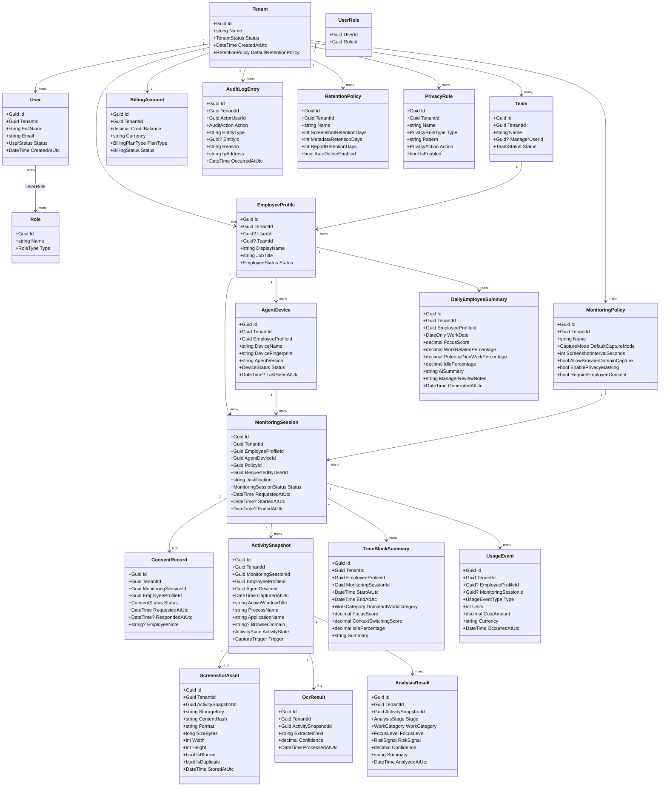

# WorkGraph AI - MVP Class Diagram

This document defines the first domain model for **WorkGraph AI**, an enterprise-grade, transparent workforce intelligence platform.

The goal of this class diagram is to guide implementation, not to represent final database tables exactly. Codex should use this as a domain and architecture reference when generating the system.

---

## Product Positioning Rule

WorkGraph AI is **not spyware**.

The platform must be designed as:

- Transparent
- Consent-based
- Auditable
- Session-based
- Privacy-aware
- Enterprise-ready

The system should avoid hidden surveillance concepts. All monitoring must happen through approved monitoring sessions.

---

## Core Bounded Contexts

For the MVP, use a modular monolith with Clean Architecture and lightweight CQRS.

Recommended bounded contexts:

1. Identity & Tenancy
2. Employee & Team Management
3. Agent & Device Management
4. Monitoring Sessions
5. Screenshot & Activity Ingestion
6. AI Analysis
7. Usage Metering & Billing
8. Audit & Compliance
9. Reporting & Dashboard

---

## High-Level Class Diagram



---

## Main Entity Responsibilities

### Tenant
Represents a customer organization. Every business entity must belong to a tenant.

Important rules:

- Tenant isolation is mandatory.
- No query should accidentally cross tenant boundaries.
- Tenant-specific policies must control retention, monitoring, privacy, and billing.

---

### User
Represents a login identity in the system.

A user can be:

- Owner
- Admin
- Manager
- Auditor
- Employee

Not every employee must initially have a login account, but the model allows it.

---

### EmployeeProfile
Represents the monitored person inside the customer organization.

Important distinction:

- `User` = authentication identity
- `EmployeeProfile` = workforce subject being analyzed

Some employees may later access the employee transparency portal through a linked user account.

---

### AgentDevice
Represents an installed Windows Agent on an employee machine.

Responsibilities:

- Device registration
- Agent version tracking
- Last-seen tracking
- Device status
- Secure identification

The agent must never be invisible or hidden.

---

### MonitoringPolicy
Defines how monitoring sessions are allowed to operate.

Examples:

- Screenshot frequency
- Browser domain capture allowed or not
- Privacy masking enabled or not
- Consent required or not
- Default capture mode

---

### MonitoringSession
This is the core monitoring boundary.

All captured data must belong to a monitoring session.

A session contains:

- Employee
- Agent device
- Manager/requester
- Policy
- Justification
- Start/end time
- Status

No screenshots should exist outside a monitoring session.

---

### ConsentRecord
Stores employee consent or authorization workflow.

Useful statuses:

- Requested
- Accepted
- Declined
- NotRequiredByPolicy
- Revoked

Even if a tenant uses company-level approval instead of per-session employee approval, the authorization decision should be recorded.

---

### ActivitySnapshot
Represents one captured activity event from the Windows Agent.

It may or may not have a screenshot.

Examples:

- Screenshot captured every 3 minutes
- Active window changed
- Browser domain changed
- Idle state changed

ActivitySnapshot is the central event for timeline analytics.

---

### ScreenshotAsset
Represents the stored screenshot file.

The screenshot binary should not be stored in the relational database.

Store only:

- Object storage key
- hash
- size
- format
- dimensions
- privacy flags

---

### OcrResult
Stores extracted text from screenshots.

This should be treated as sensitive data because it may contain private or confidential information.

---

### AnalysisResult
Stores AI or rule-based classification output.

It should use safe language and avoid moral judgment.

Allowed wording examples:

- Low work-related activity detected
- High context switching
- Long idle period
- Unclassified activity
- Potential non-work activity
- Needs manager review

Forbidden wording examples:

- Lazy
- Cheating
- Bad employee
- Untrustworthy

---

### TimeBlockSummary
Aggregates multiple activity snapshots into a useful time block.

Example:

- 09:00-10:00: Development, high focus
- 10:00-10:30: Meeting
- 10:30-11:00: High context switching

Managers should mostly use summaries instead of raw screenshots.

---

### DailyEmployeeSummary
Daily AI-generated summary for a single employee.

This should be generated from aggregated metadata and analysis, not by sending every screenshot to expensive AI models.

---

### UsageEvent
Records billable operations.

Examples:

- Screenshot uploaded
- OCR processed
- Basic classification completed
- Vision analysis completed
- Deep reasoning requested
- Daily summary generated
- Long-term storage charged

This is critical for PAYG pricing.

---

### AuditLogEntry
Records sensitive access and administrative actions.

Must log:

- Screenshot viewed
- Report exported
- Monitoring session created
- Monitoring session started/stopped
- Policy changed
- Privacy rule changed
- Employee data accessed
- Billing changed

Audit logs should be append-only from the application point of view.

---

### PrivacyRule
Defines masking or exclusion rules.

Examples:

- Blur banking websites
- Skip personal email domains
- Blur password fields where possible
- Mask configured application names
- Exclude private browser domains

---

## Important Enums

```text
TenantStatus
- Active
- Suspended
- Deleted

UserStatus
- Active
- Invited
- Disabled

RoleType
- Owner
- Admin
- Manager
- Auditor
- Employee

EmployeeStatus
- Active
- Inactive
- Archived

DeviceStatus
- PendingApproval
- Active
- Disabled
- Revoked

CaptureMode
- Passive
- Standard
- Intensive
- EventDriven

CaptureTrigger
- Interval
- WindowChanged
- ApplicationChanged
- BrowserDomainChanged
- IdleStateChanged
- ManualRequest

MonitoringSessionStatus
- Requested
- AwaitingConsent
- Approved
- Active
- Paused
- Completed
- Cancelled
- Rejected

ConsentStatus
- Requested
- Accepted
- Declined
- Revoked
- NotRequiredByPolicy

ActivityState
- Active
- Idle
- Locked
- Unknown

AnalysisStage
- Deterministic
- LightweightAI
- PremiumAI

WorkCategory
- Development
- Support
- Meeting
- Documentation
- Research
- Communication
- Administration
- Design
- Testing
- Learning
- Unclassified
- PotentialNonWork

FocusLevel
- High
- Medium
- Low
- Unknown

RiskSignal
- None
- HighContextSwitching
- LongIdlePeriod
- PotentialNonWorkActivity
- SensitiveContentDetected
- UnusualApplicationUsage
- NeedsManagerReview

UsageEventType
- ScreenshotUploaded
- OcrProcessed
- BasicClassification
- VisionAnalysis
- DeepReasoning
- DailySummary
- StorageRetention
- ReportExport

AuditAction
- UserLoggedIn
- MonitoringSessionCreated
- MonitoringSessionStarted
- MonitoringSessionStopped
- ScreenshotViewed
- ReportViewed
- ReportExported
- PolicyChanged
- PrivacyRuleChanged
- EmployeeDataAccessed
- BillingChanged
- AgentRegistered
- AgentRevoked

BillingPlanType
- Starter
- Business
- Enterprise
- OnPrem

BillingStatus
- Active
- LowCredit
- Suspended
- InvoiceRequired

PrivacyRuleType
- BrowserDomain
- ApplicationName
- WindowTitlePattern
- OcrTextPattern
- UrlPattern

PrivacyAction
- BlurScreenshot
- SkipScreenshot
- MaskOcrText
- FlagForReview
```

---

## Recommended Aggregate Roots

For Clean Architecture, start with these aggregate roots:

```text
Tenant
User
Team
EmployeeProfile
AgentDevice
MonitoringPolicy
MonitoringSession
ActivitySnapshot
AnalysisResult
BillingAccount
AuditLogEntry
```

For MVP, avoid making every class a heavy aggregate. Keep the domain clean but practical.

---

## Suggested CQRS Commands

```text
CreateTenantCommand
InviteUserCommand
CreateTeamCommand
CreateEmployeeProfileCommand
RegisterAgentDeviceCommand
ApproveAgentDeviceCommand
CreateMonitoringPolicyCommand
RequestMonitoringSessionCommand
ApproveMonitoringSessionCommand
StartMonitoringSessionCommand
PauseMonitoringSessionCommand
StopMonitoringSessionCommand
SubmitConsentDecisionCommand
UploadActivitySnapshotCommand
UploadScreenshotAssetCommand
CreateOcrResultCommand
CreateAnalysisResultCommand
GenerateDailyEmployeeSummaryCommand
RecordUsageEventCommand
CreatePrivacyRuleCommand
WriteAuditLogCommand
```

---

## Suggested CQRS Queries

```text
GetTenantDashboardQuery
GetTeamDashboardQuery
GetEmployeeTimelineQuery
GetMonitoringSessionDetailsQuery
GetMonitoringSessionScreenshotsQuery
GetActivitySnapshotDetailsQuery
GetDailyEmployeeSummaryQuery
GetUsageReportQuery
GetBillingBalanceQuery
GetAuditLogQuery
GetPrivacyRulesQuery
GetMonitoringPoliciesQuery
GetAgentDevicesQuery
```

---

## MVP Implementation Priorities

Build first:

1. Tenant
2. User and RBAC
3. EmployeeProfile
4. AgentDevice
5. MonitoringPolicy
6. MonitoringSession
7. ActivitySnapshot
8. ScreenshotAsset
9. UsageEvent
10. AuditLogEntry
11. Basic AnalysisResult
12. DailyEmployeeSummary

Build later:

1. Advanced anomaly detection
2. Complex privacy rule engine
3. Team-level benchmarking
4. Burnout analytics
5. Enterprise compliance exports
6. On-prem deployment automation
7. Advanced billing invoices
8. Multi-model AI provider routing

---

## Design Warnings For Codex

Do not implement hidden monitoring behavior.

Do not use spyware language in class names, API routes, UI labels, or documentation.

Avoid names such as:

- Spy
- Watcher
- Tracker
- ScreenLogger
- Surveillance
- Stealth

Prefer names such as:

- Workforce Intelligence
- Activity Snapshot
- Monitoring Session
- Transparency Portal
- Audit Log
- Work Category
- Focus Trend
- Operational Insight

---

## Clean Architecture Guidance

Suggested projects:

```text
src/WorkGraph.Domain
src/WorkGraph.Application
src/WorkGraph.Infrastructure
src/WorkGraph.WebApi
src/WorkGraph.Workers
src/WorkGraph.Contracts
clients/WorkGraph.Agent.Windows
clients/WorkGraph.Dashboard
```

Dependency direction:

```text
WebApi -> Application -> Domain
Infrastructure -> Application + Domain
Workers -> Application + Infrastructure
Contracts -> independent shared DTOs/contracts
```

Do not allow Domain to depend on EF Core, ASP.NET Core, Redis, RabbitMQ, AI SDKs, or storage providers.

---

## Final MVP Principle

The manager dashboard should show summaries first and screenshots second.

The product should optimize for:

- Less raw surveillance
- More operational insight
- Strong auditability
- Lower AI cost
- Enterprise trust
