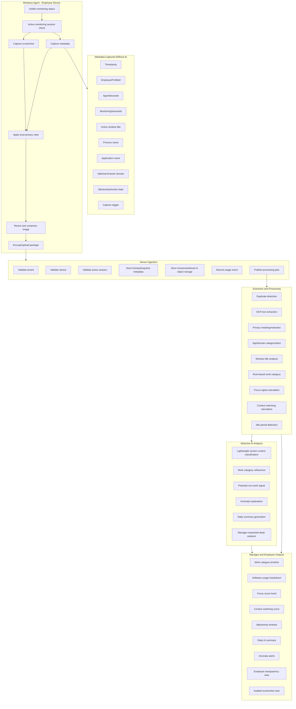
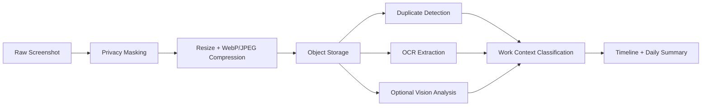
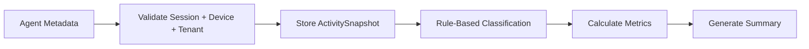
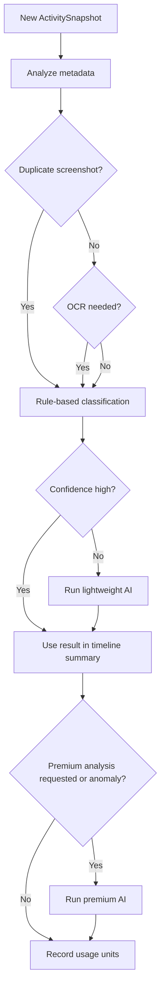
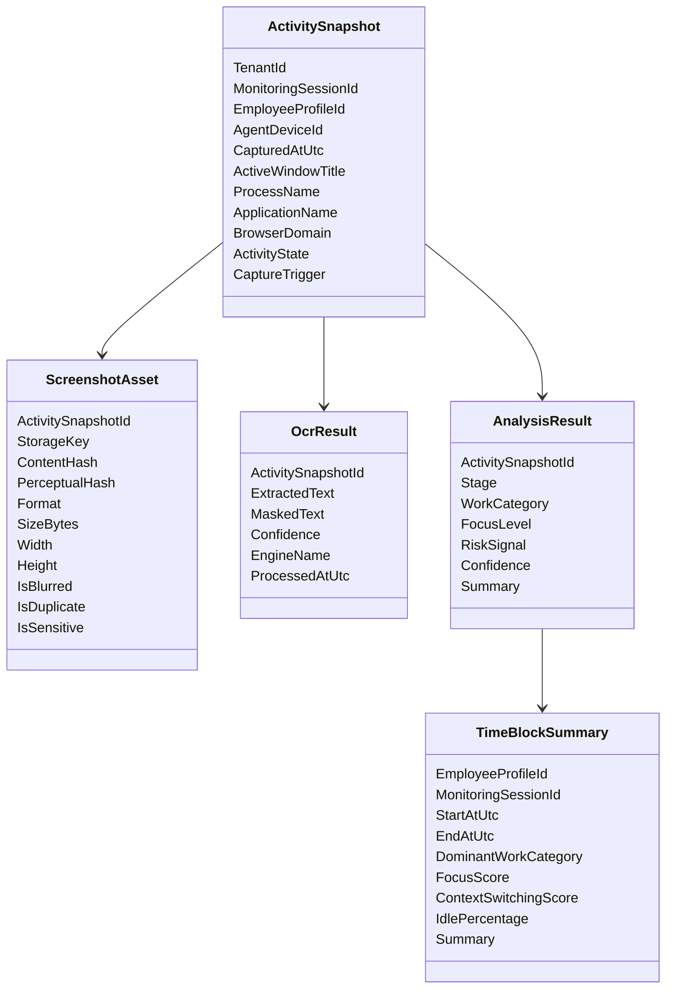

# WorkGraph AI - Core Screenshot Data Extraction Diagram

This document explains what happens when the Windows Agent captures a screenshot and what data is extracted from it.

The goal is to make the system clearly positioned as **transparent workforce intelligence**, not hidden surveillance.

The platform should collect only what is needed for approved monitoring sessions and should convert raw screenshots into useful operational signals.

---

## Core Principle

The system should not be designed as a screenshot browsing tool.

The correct flow is:

```text
Screenshot + Metadata
→ Privacy filtering
→ Lightweight extraction
→ Classification
→ Aggregation
→ Manager summary
```

Managers should primarily see:

- Timelines
- Work categories
- Focus trends
- Software usage
- Idle/activity blocks
- Daily summaries
- Anomaly signals

Raw screenshots should be secondary, controlled, and audited.

---

## High-Level Data Extraction Diagram



---

## What the Agent Captures

The Windows Agent should capture two categories of data.

---

## 1. Screenshot Image

Captured only during an active approved monitoring session.

```text
Screenshot binary
```

Before upload, the Agent should:

```text
Apply privacy rules
Resize image
Compress to WebP/JPEG
Encrypt in transit
Queue offline if needed
```

The screenshot is used for:

```text
OCR
Duplicate detection
Optional visual classification
Audited review when needed
```

The screenshot is not the final product. It is raw evidence used to generate summaries.

---

## 2. Activity Metadata

Metadata is cheaper and more important than screenshots.

```text
Timestamp
TenantId
EmployeeProfileId
AgentDeviceId
MonitoringSessionId
Active window title
Process name
Application name
Optional browser domain
Idle/activity/locked state
Capture trigger
Client sequence number
Agent version
```

This metadata enables most analytics without expensive AI.

---

## Screenshot Extraction Pipeline



---

## Metadata Extraction Pipeline



---

# Data Extracted From Each Screenshot

A screenshot can produce the following extracted data.

---

## A. OCR Text

Extracted by OCR engine.

Examples:

```text
Visible page titles
Document text
Code snippets
Ticket titles
CRM fields
Error messages
Chat labels
Email subject lines
```

Important:

OCR text can be sensitive and searchable. Treat it as high-risk data.

Recommended storage:

```text
OcrResult.ExtractedText
OcrResult.MaskedText
OcrResult.Confidence
OcrResult.EngineName
```

Use OCR for:

```text
Work category detection
Ticket/task context
Document/research detection
Meeting/email/support detection
Anomaly explanation
Daily summaries
```

Avoid using OCR for:

```text
Reading private messages unnecessarily
Extracting passwords
Extracting banking/personal data
Making moral judgments
```

---

## B. Application Context

Extracted mostly from metadata, not image.

Sources:

```text
Process name
Application name
Window title
Browser domain
```

Examples:

```text
Visual Studio -> Development
Rider -> Development
VS Code -> Development
Jira -> Project management
GitHub -> Development/review
Slack/Teams -> Communication
Zoom/Meet -> Meeting
Zendesk -> Support
Chrome domain: docs.microsoft.com -> Research
Chrome domain: youtube.com -> Potential non-work or learning depending on context
```

Output:

```text
ApplicationCategory
WorkCategory
Confidence
```

---

## C. Work Category

WorkGraph should classify each snapshot into a safe work category.

Recommended categories:

```text
Development
Support
Meeting
Documentation
Research
Communication
Administration
Design
Testing
Learning
Unclassified
PotentialNonWork
```

Important:

Use `PotentialNonWork`, not accusations.

Never use:

```text
Lazy
Cheating
Wasting time
Bad employee
```

---

## D. Focus Signals

Focus should be inferred from patterns, not from one screenshot.

Inputs:

```text
Time spent in same work category
Frequency of app/window changes
Idle time
Long uninterrupted work blocks
Meeting duration
Repeated unrelated domains
```

Outputs:

```text
FocusLevel: High / Medium / Low / Unknown
FocusScore: 0-100
ContextSwitchingScore: 0-100
```

Important:

A single screenshot should not define focus. Focus is a time-block metric.

---

## E. Context Switching

Calculated from metadata over time.

Inputs:

```text
Application changes
Window title changes
Browser domain changes
Capture trigger frequency
```

Output examples:

```text
Low context switching
Moderate context switching
High context switching
```

Manager wording:

```text
High context switching detected during this time block.
```

Not:

```text
Employee was distracted.
```

---

## F. Idle / Activity State

Captured by Agent.

Inputs:

```text
Mouse/keyboard activity state
OS lock state
Idle duration
```

Outputs:

```text
Active
Idle
Locked
Unknown
```

Manager wording:

```text
Long idle period detected.
```

Not:

```text
Employee was not working.
```

---

## G. Sensitive Content Signals

The system should detect or flag sensitive content where possible.

Possible sources:

```text
Browser domain rules
Window title rules
OCR text patterns
Application name rules
Visual patterns if using vision model later
```

Examples:

```text
Banking domain
Personal email domain
Password manager
Medical/health portal
Private chat
HR/payroll system
```

Possible actions:

```text
Blur screenshot
Skip screenshot
Mask OCR text
Flag for review
Do not show raw screenshot to manager
```

---

## H. Duplicate / Near-Duplicate Screenshots

Used to reduce cost.

Inputs:

```text
Content hash
Perceptual hash
Previous screenshot comparison
Same app/window/domain
```

Outputs:

```text
IsDuplicate = true/false
DuplicateOfScreenshotId
SimilarityScore
```

Benefit:

```text
Avoid repeated OCR
Avoid repeated AI analysis
Reduce storage cost
Reduce billing cost
```

---

## Data Extraction Table

| Source | Data Extracted | Method | Cost Level | Stored In | Used For |
|---|---|---|---|---|---|
| Agent metadata | Timestamp | Deterministic | Very low | ActivitySnapshots | Timeline |
| Agent metadata | Process name | Deterministic | Very low | ActivitySnapshots | App classification |
| Agent metadata | Application name | Deterministic | Very low | ActivitySnapshots | Software usage |
| Agent metadata | Window title | Deterministic | Very low | ActivitySnapshots | Context classification |
| Agent metadata | Browser domain | Deterministic | Very low | ActivitySnapshots | Domain categorization |
| Agent metadata | Idle state | Deterministic | Very low | ActivitySnapshots | Idle/activity timeline |
| Screenshot | Image hash | Local/server hash | Low | ScreenshotAssets | Duplicate detection |
| Screenshot | OCR text | OCR engine | Low/medium | OcrResults | Work context |
| Screenshot | Sensitive text | Rules/OCR | Low/medium | OcrResults / Privacy flags | Privacy masking |
| Screenshot | Visual context | Vision model | High | AnalysisResults | Optional classification |
| Timeline | Focus score | Rules/metrics | Low | TimeBlockSummaries | Dashboard |
| Timeline | Context switching | Rules/metrics | Low | TimeBlockSummaries | Dashboard |
| Aggregated day | Daily summary | LLM on summaries | Medium/high | DailyEmployeeSummaries | Manager summary |

---

## Recommended MVP Extraction Strategy

For MVP, do not start with expensive multimodal AI.

Use this order:

```text
1. Metadata extraction from Agent
2. Screenshot compression and object storage
3. Duplicate detection by hash
4. OCR text extraction
5. Rule-based app/domain classification
6. Rule-based work category classification
7. Time-block aggregation
8. Daily summary from aggregated data
9. Optional premium AI only on demand
```

---

## AI Decision Flow



---

## What Managers Should See

Managers should see extracted intelligence:

```text
Work category timeline
Software usage breakdown
Focus score trend
Context switching score
Idle/activity timeline
Daily AI summary
Potential anomaly alerts
Needs manager review items
```

Managers should not normally see:

```text
Thousands of raw screenshots
Private personal content
Full OCR text dumps
Unfiltered browser URLs
Sensitive personal data
```

---

## What Employees Should See

Employees should see transparency information:

```text
Monitoring active/inactive status
Monitoring session history
Session justification
Collected data types
Retention policy
Who accessed their screenshots/reports if policy allows
Consent status
Privacy contact/report concern option
```

---

## Core Entities Involved



---

## Example Snapshot Processing

### Example Input

```text
ApplicationName: Visual Studio
ProcessName: devenv.exe
ActiveWindowTitle: WorkGraph.Api - MonitoringSessionCommandHandler.cs
BrowserDomain: null
ActivityState: Active
Screenshot: IDE with C# code
```

### Extracted Result

```text
WorkCategory: Development
FocusLevel: High or Medium depending on time block
RiskSignal: None
Summary: Development activity detected in Visual Studio.
```

---

### Example Input

```text
ApplicationName: Chrome
ProcessName: chrome.exe
ActiveWindowTitle: YouTube - C# Clean Architecture tutorial
BrowserDomain: youtube.com
ActivityState: Active
Screenshot: Video tutorial
```

### Extracted Result

```text
WorkCategory: Learning or PotentialNonWork depending on tenant rules and context
FocusLevel: Unknown or Medium
RiskSignal: NeedsManagerReview only if policy requires
Summary: Browser activity on YouTube detected. Context may be learning or non-work depending on project policy.
```

Do not automatically accuse the employee.

---

### Example Input

```text
ApplicationName: Chrome
ProcessName: chrome.exe
ActiveWindowTitle: Online Banking
BrowserDomain: bank-example.com
ActivityState: Active
Screenshot: Banking page
```

### Privacy Result

```text
PrivacyAction: SkipScreenshot or BlurScreenshot
RiskSignal: SensitiveContentDetected
Summary: Sensitive content rule matched. Screenshot hidden or masked according to policy.
```

Manager should not see raw banking content.

---

## Billing Units Created By This Flow

Potential usage events:

```text
ScreenshotUploaded = 1 unit
OcrProcessed = 1 unit
BasicClassification = 1 unit
VisionAnalysis = 5 units
DeepReasoning = 20 units
DailySummary = 10 units
StorageRetention = storage-based
```

Use idempotency keys so retries do not create duplicate billing.

---

## Safety Warnings For Implementation

Codex must not implement:

```text
Hidden capture
Stealth mode
Keylogging
Password extraction
Private message extraction
Full URL capture by default
Personal banking/email inspection
Automatic employee judgment
```

Codex should implement:

```text
Visible agent status
Session-bound capture
Consent/authorization records
Privacy masking
Object storage for screenshots
Audit log for raw screenshot access
Summary-first dashboard
Usage metering
Neutral language
```

---

## Final Core Concept

The screenshot is only one input.

The product value comes from this transformation:

```text
Raw screen activity
→ Privacy-safe metadata
→ Work context signals
→ Aggregated operational intelligence
→ Manager decision support
```

WorkGraph AI should help managers understand work patterns, not spy on people.
