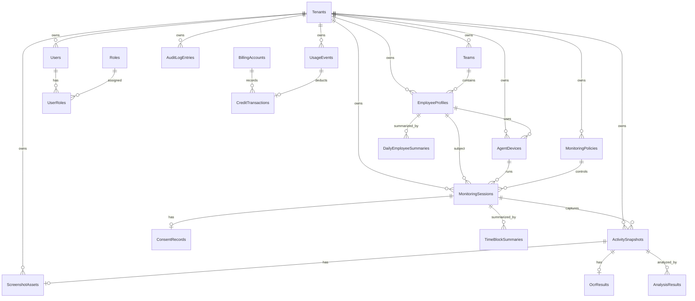

# WorkGraph AI - Database Design

This document defines the recommended MVP database design for **WorkGraph AI**.

The database must support:

- Multi-tenancy
- Monitoring sessions
- Screenshot metadata
- AI analysis results
- Usage metering
- Audit logging
- Privacy and retention policies
- Manager dashboards
- Employee transparency portal

This document is intended to guide EF Core entity design, migrations, indexing, storage strategy, and future scalability.

---

## Database Architecture Decision

For MVP, use one relational database:

```text
PostgreSQL or SQL Server
```

Recommended for SaaS MVP:

```text
PostgreSQL
```

Recommended for Microsoft-enterprise/on-prem customers:

```text
SQL Server
```

The application should keep persistence behind interfaces so the product can support both later if needed.

---

## Storage Rule

Do not store screenshot binaries in the relational database.

Use relational database for:

```text
Metadata
Relationships
Policies
Audit logs
Billing events
Analysis results
Report summaries
Object storage references
```

Use object storage for:

```text
Screenshots
Blurred screenshots
OCR export files if needed
Report exports
Large JSON analysis payloads if needed
```

Recommended object storage options:

```text
SaaS: S3-compatible storage, Azure Blob Storage, MinIO
On-prem: MinIO or customer object storage
```

---

## Multi-Tenancy Strategy

MVP strategy:

```text
Shared database, shared schema, TenantId column on tenant-owned tables.
```

Every tenant-owned table must include:

```text
TenantId
```

All queries must filter by `TenantId`.

Future enterprise strategy:

```text
Large enterprise tenants may use separate database or separate deployment.
```

---

## Tenant Isolation Rules

1. Every tenant-owned entity must include `TenantId`.
2. Every query must include tenant filtering.
3. Use global query filters in EF Core where practical.
4. Never trust tenant ID from client body when authenticated tenant context already exists.
5. Tenant ID should be resolved from authentication context, subdomain, header, or server-side session.
6. Cross-tenant reporting should not exist in MVP except for internal platform administration.
7. All audit logs must include `TenantId`.
8. All object storage keys must include tenant scope.

---

## Suggested Schemas

Use schemas to keep modules organized.

```text
identity
platform
organization
agents
monitoring
activity
intelligence
reporting
billing
audit
privacy
```

If schema separation is too heavy for MVP, use one schema with clear table prefixes.

Recommended MVP approach:

```text
Use one schema first, but keep table names and modules clear.
```

---

# Core Tables

---

## 1. Tenants

Stores customer organizations.

```text
Table: Tenants
```

| Column | Type | Required | Notes |
|---|---|---:|---|
| Id | uuid / uniqueidentifier | Yes | Primary key |
| Name | varchar(200) | Yes | Tenant display name |
| Slug | varchar(100) | Yes | Unique tenant slug |
| Status | varchar(50) | Yes | Active, Suspended, Deleted |
| CreatedAtUtc | datetime | Yes | Creation time |
| UpdatedAtUtc | datetime | No | Last update time |

### Indexes

```text
PK_Tenants_Id
UX_Tenants_Slug
IX_Tenants_Status
```

---

## 2. TenantSettings

Stores tenant-level configuration.

```text
Table: TenantSettings
```

| Column | Type | Required | Notes |
|---|---|---:|---|
| Id | uuid | Yes | Primary key |
| TenantId | uuid | Yes | FK Tenants.Id |
| DefaultRetentionPolicyId | uuid | No | FK RetentionPolicies.Id |
| DefaultMonitoringPolicyId | uuid | No | FK MonitoringPolicies.Id |
| TimeZoneId | varchar(100) | Yes | Example: Asia/Baku |
| AllowEmployeePortal | bool | Yes | Employee transparency portal |
| RequireSessionJustification | bool | Yes | Should be true by default |
| CreatedAtUtc | datetime | Yes | Creation time |
| UpdatedAtUtc | datetime | No | Last update time |

### Indexes

```text
UX_TenantSettings_TenantId
```

---

## 3. Users

Stores authenticated users.

```text
Table: Users
```

| Column | Type | Required | Notes |
|---|---|---:|---|
| Id | uuid | Yes | Primary key |
| TenantId | uuid | Yes | FK Tenants.Id |
| FullName | varchar(200) | Yes | User full name |
| Email | varchar(320) | Yes | Unique per tenant |
| PasswordHash | varchar(500) | No | If local auth is used |
| ExternalIdentityProvider | varchar(100) | No | SSO provider |
| ExternalSubjectId | varchar(200) | No | External identity ID |
| Status | varchar(50) | Yes | Active, Invited, Disabled |
| LastLoginAtUtc | datetime | No | Last login |
| CreatedAtUtc | datetime | Yes | Creation time |
| UpdatedAtUtc | datetime | No | Last update time |

### Indexes

```text
PK_Users_Id
UX_Users_TenantId_Email
IX_Users_TenantId_Status
IX_Users_ExternalIdentityProvider_ExternalSubjectId
```

---

## 4. Roles

Stores role definitions.

```text
Table: Roles
```

| Column | Type | Required | Notes |
|---|---|---:|---|
| Id | uuid | Yes | Primary key |
| Name | varchar(100) | Yes | Owner, Admin, Manager, Auditor, Employee |
| Type | varchar(50) | Yes | RoleType enum |
| IsSystemRole | bool | Yes | Built-in role or custom |

### Indexes

```text
PK_Roles_Id
UX_Roles_Type
```

---

## 5. UserRoles

Many-to-many relationship between users and roles.

```text
Table: UserRoles
```

| Column | Type | Required | Notes |
|---|---|---:|---|
| UserId | uuid | Yes | FK Users.Id |
| RoleId | uuid | Yes | FK Roles.Id |
| TenantId | uuid | Yes | FK Tenants.Id |
| AssignedAtUtc | datetime | Yes | Assignment time |
| AssignedByUserId | uuid | No | FK Users.Id |

### Indexes

```text
PK_UserRoles_UserId_RoleId
IX_UserRoles_TenantId_RoleId
```

---

## 6. Teams

Stores teams/departments.

```text
Table: Teams
```

| Column | Type | Required | Notes |
|---|---|---:|---|
| Id | uuid | Yes | Primary key |
| TenantId | uuid | Yes | FK Tenants.Id |
| Name | varchar(200) | Yes | Team name |
| ManagerUserId | uuid | No | FK Users.Id |
| Status | varchar(50) | Yes | Active, Inactive, Archived |
| CreatedAtUtc | datetime | Yes | Creation time |
| UpdatedAtUtc | datetime | No | Last update time |

### Indexes

```text
PK_Teams_Id
UX_Teams_TenantId_Name
IX_Teams_TenantId_ManagerUserId
IX_Teams_TenantId_Status
```

---

## 7. EmployeeProfiles

Represents workforce subjects being analyzed.

```text
Table: EmployeeProfiles
```

| Column | Type | Required | Notes |
|---|---|---:|---|
| Id | uuid | Yes | Primary key |
| TenantId | uuid | Yes | FK Tenants.Id |
| UserId | uuid | No | Optional FK Users.Id |
| TeamId | uuid | No | FK Teams.Id |
| DisplayName | varchar(200) | Yes | Employee display name |
| WorkEmail | varchar(320) | No | Work email |
| JobTitle | varchar(200) | No | Job title |
| Status | varchar(50) | Yes | Active, Inactive, Archived |
| CreatedAtUtc | datetime | Yes | Creation time |
| UpdatedAtUtc | datetime | No | Last update time |

### Indexes

```text
PK_EmployeeProfiles_Id
IX_EmployeeProfiles_TenantId_TeamId
IX_EmployeeProfiles_TenantId_Status
IX_EmployeeProfiles_TenantId_UserId
UX_EmployeeProfiles_TenantId_WorkEmail
```

---

# Agent Tables

---

## 8. AgentDevices

Stores installed Windows Agent device records.

```text
Table: AgentDevices
```

| Column | Type | Required | Notes |
|---|---|---:|---|
| Id | uuid | Yes | Primary key |
| TenantId | uuid | Yes | FK Tenants.Id |
| EmployeeProfileId | uuid | Yes | FK EmployeeProfiles.Id |
| DeviceName | varchar(200) | Yes | Windows machine name |
| DeviceFingerprintHash | varchar(256) | Yes | Hashed fingerprint, not raw sensitive fingerprint |
| AgentVersion | varchar(50) | Yes | Installed agent version |
| Status | varchar(50) | Yes | PendingApproval, Active, Disabled, Revoked |
| LastSeenAtUtc | datetime | No | Last heartbeat |
| RegisteredAtUtc | datetime | Yes | Registration time |
| ApprovedAtUtc | datetime | No | Approval time |
| ApprovedByUserId | uuid | No | FK Users.Id |
| RevokedAtUtc | datetime | No | Revocation time |
| RevokedByUserId | uuid | No | FK Users.Id |

### Indexes

```text
PK_AgentDevices_Id
UX_AgentDevices_TenantId_DeviceFingerprintHash
IX_AgentDevices_TenantId_EmployeeProfileId
IX_AgentDevices_TenantId_Status
IX_AgentDevices_TenantId_LastSeenAtUtc
```

---

## 9. AgentHeartbeats

Stores agent health events.

For high scale, this table can become large. In MVP, keep recent records only.

```text
Table: AgentHeartbeats
```

| Column | Type | Required | Notes |
|---|---|---:|---|
| Id | uuid | Yes | Primary key |
| TenantId | uuid | Yes | FK Tenants.Id |
| AgentDeviceId | uuid | Yes | FK AgentDevices.Id |
| AgentVersion | varchar(50) | Yes | Agent version |
| IpAddress | varchar(100) | No | Last known IP |
| Status | varchar(50) | Yes | Healthy, Warning, Error |
| Message | varchar(500) | No | Optional health message |
| OccurredAtUtc | datetime | Yes | Heartbeat time |

### Indexes

```text
PK_AgentHeartbeats_Id
IX_AgentHeartbeats_TenantId_AgentDeviceId_OccurredAtUtc
```

### Retention

Keep detailed heartbeat records for limited time, for example:

```text
30 to 90 days
```

---

# Monitoring Tables

---

## 10. MonitoringPolicies

Defines monitoring behavior.

```text
Table: MonitoringPolicies
```

| Column | Type | Required | Notes |
|---|---|---:|---|
| Id | uuid | Yes | Primary key |
| TenantId | uuid | Yes | FK Tenants.Id |
| Name | varchar(200) | Yes | Policy name |
| Description | varchar(1000) | No | Policy description |
| DefaultCaptureMode | varchar(50) | Yes | Passive, Standard, Intensive, EventDriven |
| ScreenshotIntervalSeconds | int | Yes | Capture interval |
| AllowBrowserDomainCapture | bool | Yes | Domain capture allowed |
| EnablePrivacyMasking | bool | Yes | Local/server privacy masking |
| RequireEmployeeConsent | bool | Yes | Consent required |
| RequireManagerJustification | bool | Yes | Should be true |
| MaxSessionDurationMinutes | int | No | Optional max duration |
| IsDefault | bool | Yes | Default tenant policy |
| IsActive | bool | Yes | Active policy |
| CreatedAtUtc | datetime | Yes | Creation time |
| UpdatedAtUtc | datetime | No | Last update time |

### Indexes

```text
PK_MonitoringPolicies_Id
UX_MonitoringPolicies_TenantId_Name
IX_MonitoringPolicies_TenantId_IsActive
IX_MonitoringPolicies_TenantId_IsDefault
```

---

## 11. MonitoringSessions

Central boundary for all monitoring data.

```text
Table: MonitoringSessions
```

| Column | Type | Required | Notes |
|---|---|---:|---|
| Id | uuid | Yes | Primary key |
| TenantId | uuid | Yes | FK Tenants.Id |
| EmployeeProfileId | uuid | Yes | FK EmployeeProfiles.Id |
| AgentDeviceId | uuid | Yes | FK AgentDevices.Id |
| MonitoringPolicyId | uuid | Yes | FK MonitoringPolicies.Id |
| RequestedByUserId | uuid | Yes | FK Users.Id |
| ApprovedByUserId | uuid | No | FK Users.Id |
| Justification | varchar(2000) | Yes | Business reason |
| Status | varchar(50) | Yes | Requested, AwaitingConsent, Approved, Active, Paused, Completed, Cancelled, Rejected |
| CaptureMode | varchar(50) | Yes | Actual capture mode used |
| ScreenshotIntervalSeconds | int | Yes | Actual interval used |
| RequestedAtUtc | datetime | Yes | Request time |
| ApprovedAtUtc | datetime | No | Approval time |
| StartedAtUtc | datetime | No | Start time |
| EndedAtUtc | datetime | No | End time |
| CancelledAtUtc | datetime | No | Cancel time |
| RejectedAtUtc | datetime | No | Reject time |
| CreatedAtUtc | datetime | Yes | Creation time |
| UpdatedAtUtc | datetime | No | Last update time |

### Indexes

```text
PK_MonitoringSessions_Id
IX_MonitoringSessions_TenantId_EmployeeProfileId_StartedAtUtc
IX_MonitoringSessions_TenantId_AgentDeviceId_Status
IX_MonitoringSessions_TenantId_Status
IX_MonitoringSessions_TenantId_RequestedByUserId_RequestedAtUtc
IX_MonitoringSessions_TenantId_StartedAtUtc_EndedAtUtc
```

### Critical Constraint

Activity snapshots must always reference a valid monitoring session.

---

## 12. ConsentRecords

Stores consent or authorization records.

```text
Table: ConsentRecords
```

| Column | Type | Required | Notes |
|---|---|---:|---|
| Id | uuid | Yes | Primary key |
| TenantId | uuid | Yes | FK Tenants.Id |
| MonitoringSessionId | uuid | Yes | FK MonitoringSessions.Id |
| EmployeeProfileId | uuid | Yes | FK EmployeeProfiles.Id |
| Status | varchar(50) | Yes | Requested, Accepted, Declined, Revoked, NotRequiredByPolicy |
| RequestedAtUtc | datetime | Yes | Request time |
| RespondedAtUtc | datetime | No | Employee response time |
| EmployeeNote | varchar(1000) | No | Optional note |
| PolicyVersion | varchar(100) | No | Consent policy version |

### Indexes

```text
PK_ConsentRecords_Id
UX_ConsentRecords_TenantId_MonitoringSessionId
IX_ConsentRecords_TenantId_EmployeeProfileId_RequestedAtUtc
IX_ConsentRecords_TenantId_Status
```

---

# Activity Tables

---

## 13. ActivitySnapshots

Represents one captured metadata event from the Windows Agent.

```text
Table: ActivitySnapshots
```

| Column | Type | Required | Notes |
|---|---|---:|---|
| Id | uuid | Yes | Primary key |
| TenantId | uuid | Yes | FK Tenants.Id |
| MonitoringSessionId | uuid | Yes | FK MonitoringSessions.Id |
| EmployeeProfileId | uuid | Yes | FK EmployeeProfiles.Id |
| AgentDeviceId | uuid | Yes | FK AgentDevices.Id |
| CapturedAtUtc | datetime | Yes | Capture time on device/server-normalized |
| ReceivedAtUtc | datetime | Yes | Server receive time |
| ActiveWindowTitle | varchar(1000) | No | Window title, may be masked |
| ProcessName | varchar(300) | No | Process name |
| ApplicationName | varchar(300) | No | Friendly app name |
| BrowserDomain | varchar(300) | No | Optional domain only, not full URL by default |
| ActivityState | varchar(50) | Yes | Active, Idle, Locked, Unknown |
| CaptureTrigger | varchar(50) | Yes | Interval, WindowChanged, ApplicationChanged, BrowserDomainChanged, IdleStateChanged |
| IsSensitive | bool | Yes | Sensitive signal detected |
| IsMasked | bool | Yes | Metadata masked |
| ClientSequenceNumber | bigint | No | For offline ordering |

### Indexes

```text
PK_ActivitySnapshots_Id
IX_ActivitySnapshots_TenantId_MonitoringSessionId_CapturedAtUtc
IX_ActivitySnapshots_TenantId_EmployeeProfileId_CapturedAtUtc
IX_ActivitySnapshots_TenantId_AgentDeviceId_CapturedAtUtc
IX_ActivitySnapshots_TenantId_ApplicationName_CapturedAtUtc
IX_ActivitySnapshots_TenantId_BrowserDomain_CapturedAtUtc
IX_ActivitySnapshots_TenantId_ActivityState_CapturedAtUtc
```

### Scaling Note

This will become one of the largest tables.

For large deployments, consider partitioning by:

```text
TenantId + CapturedAtUtc
```

or by date/month.

---

## 14. ScreenshotAssets

Stores screenshot object metadata.

```text
Table: ScreenshotAssets
```

| Column | Type | Required | Notes |
|---|---|---:|---|
| Id | uuid | Yes | Primary key |
| TenantId | uuid | Yes | FK Tenants.Id |
| ActivitySnapshotId | uuid | Yes | FK ActivitySnapshots.Id |
| StorageProvider | varchar(100) | Yes | S3, AzureBlob, MinIO, LocalDev |
| StorageBucket | varchar(300) | Yes | Bucket/container |
| StorageKey | varchar(1000) | Yes | Object path |
| ContentHash | varchar(256) | Yes | SHA-256 or perceptual hash |
| PerceptualHash | varchar(256) | No | For near-duplicate detection |
| Format | varchar(20) | Yes | webp, jpg, png |
| SizeBytes | bigint | Yes | Compressed file size |
| Width | int | Yes | Image width |
| Height | int | Yes | Image height |
| IsBlurred | bool | Yes | Privacy blurred |
| IsDuplicate | bool | Yes | Duplicate flag |
| IsSensitive | bool | Yes | Sensitive content signal |
| StoredAtUtc | datetime | Yes | Stored time |
| ExpiresAtUtc | datetime | No | Retention expiry |

### Indexes

```text
PK_ScreenshotAssets_Id
UX_ScreenshotAssets_TenantId_ActivitySnapshotId
IX_ScreenshotAssets_TenantId_StoredAtUtc
IX_ScreenshotAssets_TenantId_ContentHash
IX_ScreenshotAssets_TenantId_PerceptualHash
IX_ScreenshotAssets_TenantId_ExpiresAtUtc
```

### Important Rule

Raw screenshot access must create an audit log entry.

---

## Object Storage Key Format

Recommended object key format:

```text
tenants/{tenantId}/employees/{employeeProfileId}/sessions/{sessionId}/yyyy/MM/dd/{activitySnapshotId}.webp
```

For blurred variants:

```text
tenants/{tenantId}/employees/{employeeProfileId}/sessions/{sessionId}/yyyy/MM/dd/{activitySnapshotId}.blurred.webp
```

For report exports:

```text
tenants/{tenantId}/reports/yyyy/MM/dd/{reportId}.pdf
```

---

# Intelligence Tables

---

## 15. OcrResults

Stores OCR results for activity snapshots.

```text
Table: OcrResults
```

| Column | Type | Required | Notes |
|---|---|---:|---|
| Id | uuid | Yes | Primary key |
| TenantId | uuid | Yes | FK Tenants.Id |
| ActivitySnapshotId | uuid | Yes | FK ActivitySnapshots.Id |
| ExtractedText | text | No | Sensitive, may be masked |
| MaskedText | text | No | Safer version for reports |
| Confidence | decimal(5,4) | No | OCR confidence |
| EngineName | varchar(100) | Yes | Tesseract, PaddleOCR, CloudOCR |
| EngineVersion | varchar(100) | No | Engine version |
| ProcessedAtUtc | datetime | Yes | Processing time |

### Indexes

```text
PK_OcrResults_Id
UX_OcrResults_TenantId_ActivitySnapshotId
IX_OcrResults_TenantId_ProcessedAtUtc
```

### Security Note

OCR text can be more sensitive than screenshots because it is searchable.

Protect it carefully.

---

## 16. AnalysisResults

Stores deterministic and AI classification results.

```text
Table: AnalysisResults
```

| Column | Type | Required | Notes |
|---|---|---:|---|
| Id | uuid | Yes | Primary key |
| TenantId | uuid | Yes | FK Tenants.Id |
| ActivitySnapshotId | uuid | Yes | FK ActivitySnapshots.Id |
| Stage | varchar(50) | Yes | Deterministic, LightweightAI, PremiumAI |
| WorkCategory | varchar(100) | Yes | Development, Support, Meeting, etc. |
| FocusLevel | varchar(50) | Yes | High, Medium, Low, Unknown |
| RiskSignal | varchar(100) | Yes | None, LongIdlePeriod, etc. |
| Confidence | decimal(5,4) | No | Confidence score |
| Summary | varchar(2000) | No | Neutral summary |
| ModelProvider | varchar(100) | No | OpenAI, Local, AzureOpenAI, etc. |
| ModelName | varchar(200) | No | Model used |
| PromptVersion | varchar(100) | No | Prompt version |
| TokenInputCount | int | No | AI usage |
| TokenOutputCount | int | No | AI usage |
| CostAmount | decimal(18,6) | No | Internal cost |
| AnalyzedAtUtc | datetime | Yes | Analysis time |

### Indexes

```text
PK_AnalysisResults_Id
IX_AnalysisResults_TenantId_ActivitySnapshotId
IX_AnalysisResults_TenantId_WorkCategory_AnalyzedAtUtc
IX_AnalysisResults_TenantId_RiskSignal_AnalyzedAtUtc
IX_AnalysisResults_TenantId_Stage_AnalyzedAtUtc
```

---

## 17. TimeBlockSummaries

Aggregates snapshots into meaningful time blocks.

```text
Table: TimeBlockSummaries
```

| Column | Type | Required | Notes |
|---|---|---:|---|
| Id | uuid | Yes | Primary key |
| TenantId | uuid | Yes | FK Tenants.Id |
| EmployeeProfileId | uuid | Yes | FK EmployeeProfiles.Id |
| MonitoringSessionId | uuid | No | FK MonitoringSessions.Id |
| StartAtUtc | datetime | Yes | Block start |
| EndAtUtc | datetime | Yes | Block end |
| DominantWorkCategory | varchar(100) | Yes | Most common category |
| FocusScore | decimal(5,2) | No | 0-100 |
| ContextSwitchingScore | decimal(5,2) | No | 0-100 |
| IdlePercentage | decimal(5,2) | No | 0-100 |
| WorkRelatedPercentage | decimal(5,2) | No | 0-100 |
| PotentialNonWorkPercentage | decimal(5,2) | No | 0-100 |
| Summary | varchar(3000) | No | Neutral summary |
| GeneratedAtUtc | datetime | Yes | Generation time |

### Indexes

```text
PK_TimeBlockSummaries_Id
IX_TimeBlockSummaries_TenantId_EmployeeProfileId_StartAtUtc
IX_TimeBlockSummaries_TenantId_MonitoringSessionId_StartAtUtc
IX_TimeBlockSummaries_TenantId_DominantWorkCategory_StartAtUtc
```

---

## 18. DailyEmployeeSummaries

Daily summary per employee.

```text
Table: DailyEmployeeSummaries
```

| Column | Type | Required | Notes |
|---|---|---:|---|
| Id | uuid | Yes | Primary key |
| TenantId | uuid | Yes | FK Tenants.Id |
| EmployeeProfileId | uuid | Yes | FK EmployeeProfiles.Id |
| WorkDate | date | Yes | Local tenant date |
| FocusScore | decimal(5,2) | No | 0-100 |
| WorkRelatedPercentage | decimal(5,2) | No | 0-100 |
| PotentialNonWorkPercentage | decimal(5,2) | No | 0-100 |
| IdlePercentage | decimal(5,2) | No | 0-100 |
| ContextSwitchingScore | decimal(5,2) | No | 0-100 |
| AiSummary | varchar(5000) | No | AI-generated neutral summary |
| ManagerReviewNotes | varchar(5000) | No | Human notes |
| GeneratedAtUtc | datetime | Yes | Generation time |
| UpdatedAtUtc | datetime | No | Update time |

### Indexes

```text
PK_DailyEmployeeSummaries_Id
UX_DailyEmployeeSummaries_TenantId_EmployeeProfileId_WorkDate
IX_DailyEmployeeSummaries_TenantId_WorkDate
IX_DailyEmployeeSummaries_TenantId_FocusScore
```

---

# Reporting Tables

---

## 19. ReportExports

Stores exported report metadata.

```text
Table: ReportExports
```

| Column | Type | Required | Notes |
|---|---|---:|---|
| Id | uuid | Yes | Primary key |
| TenantId | uuid | Yes | FK Tenants.Id |
| RequestedByUserId | uuid | Yes | FK Users.Id |
| ReportType | varchar(100) | Yes | Team, Employee, Compliance, Billing |
| ScopeType | varchar(100) | Yes | Tenant, Team, Employee, Session |
| ScopeId | uuid | No | Related entity ID |
| StorageProvider | varchar(100) | No | Object storage provider |
| StorageKey | varchar(1000) | No | Export file location |
| Status | varchar(50) | Yes | Requested, Completed, Failed, Expired |
| RequestedAtUtc | datetime | Yes | Request time |
| CompletedAtUtc | datetime | No | Complete time |
| ExpiresAtUtc | datetime | No | Retention expiry |

### Indexes

```text
PK_ReportExports_Id
IX_ReportExports_TenantId_RequestedByUserId_RequestedAtUtc
IX_ReportExports_TenantId_ReportType_RequestedAtUtc
IX_ReportExports_TenantId_ExpiresAtUtc
```

---

# Billing Tables

---

## 20. BillingAccounts

Stores tenant billing account.

```text
Table: BillingAccounts
```

| Column | Type | Required | Notes |
|---|---|---:|---|
| Id | uuid | Yes | Primary key |
| TenantId | uuid | Yes | FK Tenants.Id |
| CreditBalance | decimal(18,4) | Yes | Current credit balance |
| Currency | varchar(10) | Yes | USD, EUR, etc. |
| PlanType | varchar(50) | Yes | Starter, Business, Enterprise, OnPrem |
| Status | varchar(50) | Yes | Active, LowCredit, Suspended, InvoiceRequired |
| CreatedAtUtc | datetime | Yes | Creation time |
| UpdatedAtUtc | datetime | No | Last update time |

### Indexes

```text
PK_BillingAccounts_Id
UX_BillingAccounts_TenantId
IX_BillingAccounts_Status
```

---

## 21. UsageEvents

Ledger of billable operations.

```text
Table: UsageEvents
```

| Column | Type | Required | Notes |
|---|---|---:|---|
| Id | uuid | Yes | Primary key |
| TenantId | uuid | Yes | FK Tenants.Id |
| EmployeeProfileId | uuid | No | Optional FK EmployeeProfiles.Id |
| MonitoringSessionId | uuid | No | Optional FK MonitoringSessions.Id |
| ActivitySnapshotId | uuid | No | Optional FK ActivitySnapshots.Id |
| Type | varchar(100) | Yes | ScreenshotUploaded, OcrProcessed, etc. |
| Units | int | Yes | Internal AI Units |
| UnitPrice | decimal(18,6) | No | Price per unit |
| CostAmount | decimal(18,6) | No | Total cost |
| Currency | varchar(10) | Yes | USD, EUR, etc. |
| MetadataJson | json/text | No | Optional metadata |
| OccurredAtUtc | datetime | Yes | Usage time |

### Indexes

```text
PK_UsageEvents_Id
IX_UsageEvents_TenantId_OccurredAtUtc
IX_UsageEvents_TenantId_Type_OccurredAtUtc
IX_UsageEvents_TenantId_MonitoringSessionId
IX_UsageEvents_TenantId_EmployeeProfileId_OccurredAtUtc
```

### Ledger Rule

UsageEvents should be append-only from the application point of view.

---

## 22. CreditTransactions

Stores credit purchases, deductions, adjustments, and refunds.

```text
Table: CreditTransactions
```

| Column | Type | Required | Notes |
|---|---|---:|---|
| Id | uuid | Yes | Primary key |
| TenantId | uuid | Yes | FK Tenants.Id |
| BillingAccountId | uuid | Yes | FK BillingAccounts.Id |
| Type | varchar(100) | Yes | Purchase, Deduction, Adjustment, Refund |
| Amount | decimal(18,4) | Yes | Positive or negative amount |
| BalanceAfter | decimal(18,4) | Yes | Balance after transaction |
| Currency | varchar(10) | Yes | Currency |
| RelatedUsageEventId | uuid | No | FK UsageEvents.Id |
| Reason | varchar(1000) | No | Reason |
| CreatedAtUtc | datetime | Yes | Transaction time |
| CreatedByUserId | uuid | No | FK Users.Id |

### Indexes

```text
PK_CreditTransactions_Id
IX_CreditTransactions_TenantId_BillingAccountId_CreatedAtUtc
IX_CreditTransactions_TenantId_Type_CreatedAtUtc
```

---

# Audit and Compliance Tables

---

## 23. AuditLogEntries

Append-only audit log.

```text
Table: AuditLogEntries
```

| Column | Type | Required | Notes |
|---|---|---:|---|
| Id | uuid | Yes | Primary key |
| TenantId | uuid | Yes | FK Tenants.Id |
| ActorUserId | uuid | No | FK Users.Id, null for system |
| ActorType | varchar(50) | Yes | User, Agent, System, Worker |
| Action | varchar(100) | Yes | ScreenshotViewed, PolicyChanged, etc. |
| EntityType | varchar(100) | Yes | Entity name |
| EntityId | uuid | No | Entity ID |
| Reason | varchar(1000) | No | Required for sensitive access |
| IpAddress | varchar(100) | No | IP address |
| UserAgent | varchar(500) | No | Browser/client info |
| MetadataJson | json/text | No | Extra metadata |
| OccurredAtUtc | datetime | Yes | Event time |

### Indexes

```text
PK_AuditLogEntries_Id
IX_AuditLogEntries_TenantId_OccurredAtUtc
IX_AuditLogEntries_TenantId_ActorUserId_OccurredAtUtc
IX_AuditLogEntries_TenantId_Action_OccurredAtUtc
IX_AuditLogEntries_TenantId_EntityType_EntityId
```

### Audit Rule

AuditLogEntries should be append-only from the application point of view.

Sensitive access must include a reason.

---

## 24. ComplianceEvents

Stores important compliance events.

```text
Table: ComplianceEvents
```

| Column | Type | Required | Notes |
|---|---|---:|---|
| Id | uuid | Yes | Primary key |
| TenantId | uuid | Yes | FK Tenants.Id |
| EventType | varchar(100) | Yes | RetentionCleanup, ConsentRevoked, SensitiveContentDetected |
| Severity | varchar(50) | Yes | Info, Warning, Critical |
| EntityType | varchar(100) | No | Related entity type |
| EntityId | uuid | No | Related entity ID |
| Message | varchar(2000) | Yes | Neutral message |
| CreatedAtUtc | datetime | Yes | Event time |

### Indexes

```text
PK_ComplianceEvents_Id
IX_ComplianceEvents_TenantId_CreatedAtUtc
IX_ComplianceEvents_TenantId_EventType_CreatedAtUtc
IX_ComplianceEvents_TenantId_Severity_CreatedAtUtc
```

---

# Privacy and Retention Tables

---

## 25. RetentionPolicies

Defines retention periods.

```text
Table: RetentionPolicies
```

| Column | Type | Required | Notes |
|---|---|---:|---|
| Id | uuid | Yes | Primary key |
| TenantId | uuid | Yes | FK Tenants.Id |
| Name | varchar(200) | Yes | Policy name |
| ScreenshotRetentionDays | int | Yes | Screenshot retention |
| MetadataRetentionDays | int | Yes | Activity metadata retention |
| OcrRetentionDays | int | Yes | OCR retention |
| ReportRetentionDays | int | Yes | Report retention |
| AuditRetentionDays | int | Yes | Audit retention, usually longer |
| AutoDeleteEnabled | bool | Yes | Enable cleanup |
| IsDefault | bool | Yes | Default policy |
| CreatedAtUtc | datetime | Yes | Creation time |
| UpdatedAtUtc | datetime | No | Last update time |

### Indexes

```text
PK_RetentionPolicies_Id
UX_RetentionPolicies_TenantId_Name
IX_RetentionPolicies_TenantId_IsDefault
```

---

## 26. PrivacyRules

Defines privacy masking/skipping rules.

```text
Table: PrivacyRules
```

| Column | Type | Required | Notes |
|---|---|---:|---|
| Id | uuid | Yes | Primary key |
| TenantId | uuid | Yes | FK Tenants.Id |
| Name | varchar(200) | Yes | Rule name |
| Type | varchar(100) | Yes | BrowserDomain, ApplicationName, WindowTitlePattern, OcrTextPattern, UrlPattern |
| Pattern | varchar(1000) | Yes | Domain, app name, regex, or pattern |
| Action | varchar(100) | Yes | BlurScreenshot, SkipScreenshot, MaskOcrText, FlagForReview |
| IsEnabled | bool | Yes | Enabled flag |
| Priority | int | Yes | Rule priority |
| CreatedAtUtc | datetime | Yes | Creation time |
| UpdatedAtUtc | datetime | No | Last update time |

### Indexes

```text
PK_PrivacyRules_Id
IX_PrivacyRules_TenantId_IsEnabled_Priority
IX_PrivacyRules_TenantId_Type
```

---

## 27. DataDeletionJobs

Tracks retention cleanup jobs.

```text
Table: DataDeletionJobs
```

| Column | Type | Required | Notes |
|---|---|---:|---|
| Id | uuid | Yes | Primary key |
| TenantId | uuid | Yes | FK Tenants.Id |
| JobType | varchar(100) | Yes | RetentionCleanup, EmployeeDataDeletion |
| Status | varchar(50) | Yes | Pending, Running, Completed, Failed |
| StartedAtUtc | datetime | No | Start time |
| CompletedAtUtc | datetime | No | Complete time |
| DeletedScreenshotCount | int | Yes | Count |
| DeletedMetadataCount | int | Yes | Count |
| DeletedReportCount | int | Yes | Count |
| ErrorMessage | varchar(2000) | No | Failure reason |
| CreatedAtUtc | datetime | Yes | Created time |

### Indexes

```text
PK_DataDeletionJobs_Id
IX_DataDeletionJobs_TenantId_Status_CreatedAtUtc
IX_DataDeletionJobs_TenantId_JobType_CreatedAtUtc
```

---

# Recommended Relationships



---

# Recommended Partitioning Strategy

Do not implement partitioning immediately unless needed.

But design large tables with partitioning in mind.

High-growth tables:

```text
ActivitySnapshots
ScreenshotAssets
OcrResults
AnalysisResults
UsageEvents
AuditLogEntries
AgentHeartbeats
```

Future partitioning options:

```text
By month/date
By tenant for large enterprise tenants
By tenant + date for very large deployments
```

Recommended first partition candidates:

```text
ActivitySnapshots by CapturedAtUtc month
AuditLogEntries by OccurredAtUtc month
UsageEvents by OccurredAtUtc month
```

---

# Dashboard Query Optimization

Manager dashboards should not query raw screenshots directly.

Use summary tables:

```text
TimeBlockSummaries
DailyEmployeeSummaries
Report read models
```

Recommended read models for later:

```text
TeamDailySummaries
EmployeeSoftwareUsageDaily
EmployeeWorkCategoryDaily
EmployeeFocusTrendDaily
SessionTimelineReadModels
```

These can be generated asynchronously.

---

# EF Core Guidance

## Entity Configuration

Use separate configuration classes:

```text
TenantConfiguration
UserConfiguration
EmployeeProfileConfiguration
MonitoringSessionConfiguration
ActivitySnapshotConfiguration
ScreenshotAssetConfiguration
AnalysisResultConfiguration
UsageEventConfiguration
AuditLogEntryConfiguration
```

Do not put all mappings inside `DbContext.OnModelCreating`.

---

## Global Query Filters

For tenant-owned entities, consider EF Core global query filters:

```text
Entity.TenantId == CurrentTenantId
```

But be careful with background workers and admin jobs that may process multiple tenants.

---

## Delete Behavior

Avoid cascade delete for sensitive business data.

Prefer:

```text
Soft delete for users/employees/teams/devices
Retention cleanup for screenshots and activity data
Append-only for audit and usage ledgers
```

---

## Enums

Store enums as strings for readability:

```text
MonitoringSessionStatus = "Active"
WorkCategory = "Development"
UsageEventType = "ScreenshotUploaded"
```

This improves audit/debugging and database inspection.

---

## Date/Time

Store all timestamps in UTC.

Use tenant timezone only for reports and daily summary grouping.

```text
CapturedAtUtc
ReceivedAtUtc
StartedAtUtc
EndedAtUtc
OccurredAtUtc
```

Daily summaries should include local work date:

```text
WorkDate
```

---

# Security Guidance

Sensitive tables:

```text
ScreenshotAssets
OcrResults
AnalysisResults
AuditLogEntries
ConsentRecords
EmployeeProfiles
```

Security rules:

1. Encrypt database at rest.
2. Encrypt object storage at rest.
3. Encrypt data in transit.
4. Never expose object storage keys directly to unauthorized clients.
5. Use short-lived signed URLs only after authorization and audit logging.
6. Store hashed device fingerprint, not raw sensitive fingerprint.
7. Redact or mask sensitive OCR where possible.
8. Record audit logs for screenshot viewing and report export.

---

# Billing Integrity Rules

Usage and billing data should be reliable.

Rules:

1. Every billable operation creates a UsageEvent.
2. UsageEvent should be append-only.
3. CreditTransaction should be append-only.
4. BillingAccount balance should be updated transactionally.
5. Failed AI processing should be marked but not always billed.
6. Retried jobs should avoid duplicate billing.
7. Use idempotency keys for ingestion and AI jobs.

Recommended idempotency columns later:

```text
IdempotencyKey
SourceEventId
ClientSequenceNumber
```

---

# Recommended MVP Tables

Build these first:

```text
Tenants
TenantSettings
Users
Roles
UserRoles
Teams
EmployeeProfiles
AgentDevices
MonitoringPolicies
MonitoringSessions
ConsentRecords
ActivitySnapshots
ScreenshotAssets
OcrResults
AnalysisResults
TimeBlockSummaries
DailyEmployeeSummaries
BillingAccounts
UsageEvents
CreditTransactions
AuditLogEntries
RetentionPolicies
PrivacyRules
```

Build later:

```text
AgentHeartbeats
ReportExports
ComplianceEvents
DataDeletionJobs
TeamDailySummaries
EmployeeSoftwareUsageDaily
EmployeeWorkCategoryDaily
EmployeeFocusTrendDaily
```

---

# MVP Implementation Warning

Do not overbuild the database with every possible enterprise table on day one.

But do not skip these three foundations:

```text
TenantId everywhere
Audit logs
Usage events
```

Without those, the product becomes hard to sell as enterprise-grade and difficult to monetize as PAYG.

---

# Final Recommendation

For the first implementation, prioritize:

```text
1. Correct tenant isolation
2. Monitoring session boundary
3. Screenshot metadata/object storage separation
4. Usage event ledger
5. Audit log for sensitive access
6. Summary-first reporting model
```

The database should make the product behave like a trusted enterprise workforce intelligence platform, not a screenshot dump system.
