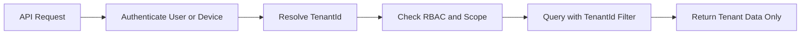
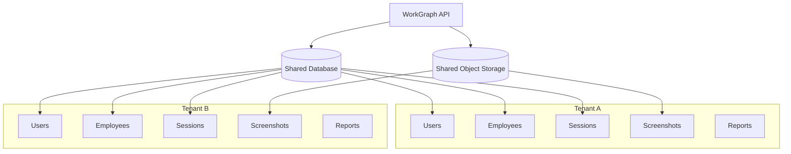

# WorkGraph AI - Simple Multi-Tenancy Design

This document explains the multi-tenancy design for WorkGraph AI in a simple way.

Multi-tenancy means one platform can serve many customer companies while keeping their data isolated.

Example:

```text
Company A must never see Company B data.
Company B must never access Company A screenshots.
```

---

## MVP Decision

For MVP, use:

```text
Shared database
Shared schema
TenantId column on every tenant-owned table
```

This is the simplest and fastest approach.

Do not start with one database per tenant.

---

## Why This Approach

Benefits:

```text
Simple development
Simple migrations
Lower cost
Easier SaaS launch
Works well for MVP
Easy to query tenant data
```

Later, large enterprise customers can move to:

```text
Dedicated database
Dedicated storage
Dedicated deployment
On-prem deployment
```

---

## Core Rule

Every business table must have:

```text
TenantId
```

Examples:

```text
Users.TenantId
Teams.TenantId
EmployeeProfiles.TenantId
AgentDevices.TenantId
MonitoringSessions.TenantId
ActivitySnapshots.TenantId
ScreenshotAssets.TenantId
AnalysisResults.TenantId
UsageEvents.TenantId
AuditLogEntries.TenantId
PrivacyRules.TenantId
RetentionPolicies.TenantId
```

---

## Tenant-Owned Tables

These tables must include `TenantId`:

```text
Users
UserRoles
Teams
EmployeeProfiles
AgentDevices
AgentHeartbeats
MonitoringPolicies
MonitoringSessions
ConsentRecords
ActivitySnapshots
ScreenshotAssets
OcrResults
AnalysisResults
TimeBlockSummaries
DailyEmployeeSummaries
ReportExports
BillingAccounts
UsageEvents
CreditTransactions
AuditLogEntries
ComplianceEvents
RetentionPolicies
PrivacyRules
DataDeletionJobs
```

Tables that may not need `TenantId`:

```text
Roles
SystemLookupTables
GlobalFeatureDefinitions
```

Even then, keep the model simple and safe.

---

## How Tenant Is Resolved

TenantId should come from trusted sources, not from random request body data.

For web users:

```text
Authenticated user token contains TenantId
```

For Windows Agent:

```text
Device credential contains TenantId
```

For background workers:

```text
Queue message contains TenantId
Worker validates TenantId before processing
```

For object storage:

```text
Storage key contains TenantId
```

---

## Tenant Flow



---

## Database Query Rule

Every query must filter by TenantId.

Correct:

```text
Get sessions where TenantId = currentTenantId
```

Wrong:

```text
Get sessions without TenantId filter
```

This is one of the most important security rules in the whole product.

---

## Example Access Rules

A Manager from Tenant A can access:

```text
Tenant A
Team assigned to manager
Employees inside assigned team
Sessions for those employees
Summaries for those employees
```

A Manager from Tenant A cannot access:

```text
Tenant B
Tenant B employees
Tenant B screenshots
Tenant B usage reports
Tenant B audit logs
```

---

## Tenant Isolation Diagram



Important:

```text
Same platform does not mean shared customer access.
TenantId separates all customer data.
```

---

## Object Storage Isolation

Screenshot files must be stored with tenant-scoped paths.

Recommended path:

```text
tenants/{tenantId}/employees/{employeeProfileId}/sessions/{sessionId}/yyyy/MM/dd/{activitySnapshotId}.webp
```

Example:

```text
tenants/tenant-a/employees/emp-123/sessions/session-789/2026/06/01/snapshot-001.webp
```

Never use a flat path like:

```text
screenshots/snapshot-001.webp
```

because it is harder to secure and manage.

---

## Cache Isolation

Redis keys must include TenantId.

Correct:

```text
tenant:{tenantId}:agent:{deviceId}:config
tenant:{tenantId}:dashboard:team:{teamId}:today
tenant:{tenantId}:privacy-rules
```

Wrong:

```text
agent:{deviceId}:config
dashboard:team:{teamId}:today
privacy-rules
```

---

## Queue Message Isolation

Every queue message must include TenantId.

Example:

```json
{
  "tenantId": "tenant-123",
  "activitySnapshotId": "snapshot-456",
  "monitoringSessionId": "session-789",
  "eventType": "screenshot.asset.uploaded"
}
```

Workers must validate TenantId before processing.

---

## Billing Isolation

Billing must be per tenant.

Each tenant has its own:

```text
BillingAccount
CreditBalance
UsageEvents
CreditTransactions
PricingPlan
```

A usage event must always include:

```text
TenantId
UsageEventType
Units
OccurredAtUtc
```

---

## Audit Isolation

Audit logs must be per tenant.

Every audit entry must include:

```text
TenantId
ActorUserId or ActorType
Action
EntityType
EntityId
OccurredAtUtc
```

Examples:

```text
Tenant A manager viewed Tenant A screenshot
Tenant B admin changed Tenant B privacy rule
Tenant A employee accepted Tenant A consent request
```

---

## Region and Country Awareness

Because WorkGraph AI may run in multiple countries, each tenant should have region settings.

Simple tenant fields:

```text
RegionCode
DefaultLanguage
ComplianceMode
StorageRegion
AllowedAiRegion
```

Example:

```text
Tenant: German Company
RegionCode: EU
DefaultLanguage: de-DE
ComplianceMode: GDPR-style
StorageRegion: EU
AllowedAiRegion: EU
```

This keeps the product ready for international customers.

---

## Tenant Settings

Each tenant should have its own settings:

```text
Default language
Allowed languages
Monitoring policies
Privacy rules
Retention policies
Billing plan
Capture modes
AI usage rules
Employee portal settings
```

Do not hard-code one global rule for all countries and companies.

---

## Tenant Context Object

In application code, use a tenant context abstraction.

Example concept:

```text
ICurrentTenant
- TenantId
- RegionCode
- DefaultLanguage
- ComplianceMode
```

Application services should use this instead of trusting request body TenantId.

---

## EF Core Guidance

For tenant-owned entities, consider a base interface:

```text
ITenantOwned
- TenantId
```

Use global query filters where practical:

```text
Entity.TenantId == CurrentTenantId
```

But be careful with:

```text
Background workers
Retention jobs
Platform admin jobs
Cross-tenant maintenance
```

Those jobs must explicitly set tenant context.

---

## API Rules

Do not design endpoints like this:

```text
GET /tenants/{tenantId}/employees
```

for normal tenant users.

Prefer:

```text
GET /employees
```

The server gets TenantId from the authenticated user.

For platform admin or internal operations, tenant-specific routes may exist later, but they must be highly restricted.

---

## Windows Agent Rules

The Agent must be tied to one tenant.

Agent upload must validate:

```text
Device belongs to TenantId
Employee belongs to TenantId
Session belongs to TenantId
Session belongs to device and employee
Session was active at capture time
```

If any validation fails, reject the upload.

---

## What Can Go Wrong

Common dangerous mistakes:

```text
Forgetting TenantId filter in queries
Using object storage keys without tenant path
Using Redis keys without TenantId
Queue messages without TenantId
Trusting TenantId from request body
Letting managers access employees outside their team
Not auditing screenshot access
Sharing AI prompts/results across tenants
```

---

## Simple Testing Checklist

Test these cases:

```text
Tenant A user cannot see Tenant B employees
Tenant A manager cannot see Tenant B sessions
Tenant A manager cannot view Tenant B screenshots
Tenant A agent cannot upload to Tenant B session
Tenant A dashboard only shows Tenant A data
Tenant A billing only shows Tenant A usage
Tenant A audit logs only show Tenant A records
Redis keys include TenantId
Object storage keys include TenantId
Queue messages include TenantId
```

---

## Future Tenant Models

MVP:

```text
Shared database, shared schema, TenantId column
```

Enterprise later:

```text
Dedicated database per large tenant
Dedicated object storage bucket
Dedicated worker deployment
Dedicated region
On-prem installation
```

Do not build all of this in MVP.

Just keep the code clean enough to support it later.

---

## Codex Rules

Codex must follow these rules:

1. Add TenantId to every tenant-owned entity.
2. Never query tenant-owned data without TenantId filter.
3. Do not trust TenantId from request body.
4. Use current tenant context.
5. Include TenantId in queue messages.
6. Include TenantId in Redis keys.
7. Include TenantId in object storage paths.
8. Include TenantId in audit logs.
9. Include TenantId in usage events.
10. Reject agent uploads if tenant/device/session do not match.
11. Managers only access employees in their allowed scope.
12. Employees only access their own transparency data.

---

## Final Rule

The most important multi-tenancy rule is simple:

```text
Every request, query, file, cache key, queue message, audit log, and billing event must belong to exactly one tenant.
```

If that rule is followed, the product is much safer and easier to scale internationally.
