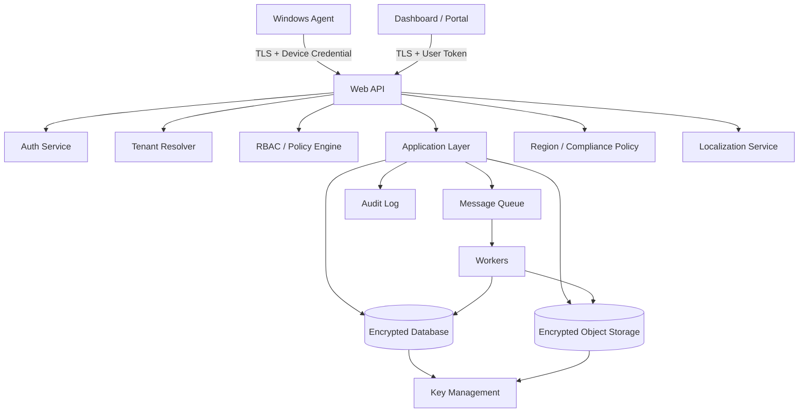
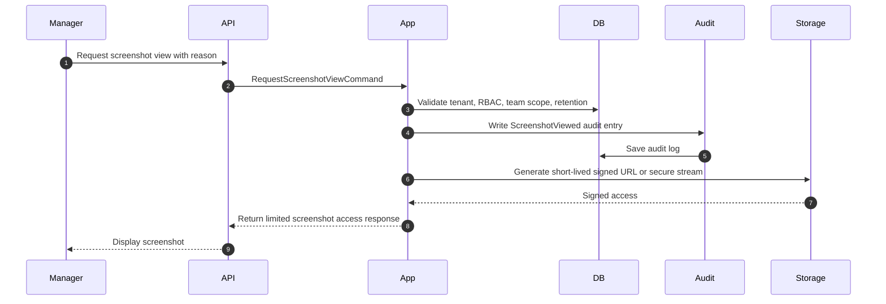

# WorkGraph AI - Security Architecture

This document defines the security architecture for **WorkGraph AI**.

WorkGraph AI is a multi-tenant, multi-country, multi-language workforce intelligence platform. It handles sensitive employee activity data, screenshots, OCR text, AI analysis, usage billing, and audit logs.

Security is not optional. It is a core product feature.

---

## Security Positioning

WorkGraph AI must be designed as:

```text
Transparent
Consent-based or authorization-based
Auditable
Privacy-aware
Region-aware
Multi-language ready
Enterprise-ready
```

WorkGraph AI must not be designed as:

```text
Hidden surveillance
Spyware
Stealth monitoring
Keylogging software
Covert screenshot logger
```

---

## Multi-Country and Multi-Language Requirement

WorkGraph AI may be sold in multiple countries and languages.

This affects security, compliance, product design, consent text, data storage, and reporting.

The platform must support:

```text
Multiple UI languages
Tenant-level default language
Employee-preferred language
Localized consent notices
Localized monitoring notifications
Localized privacy policy text
Country-specific retention rules
Regional data residency
Region-specific legal/compliance mode
Localized audit/export labels
Localized employee portal content
```

---

## Region-Aware Architecture

Each tenant should have a configured region.

Examples:

```text
EU
US
Middle East
UK
Canada
Australia
On-Prem
Custom Enterprise Region
```

Tenant region controls:

```text
Primary database region
Object storage region
Backup region
Allowed AI provider region
Retention defaults
Compliance templates
Legal text templates
Data export behavior
```

---

## Localization Security Principle

Security and consent language must be understandable to the employee.

Do not show only English notices to employees in non-English deployments.

The platform should support localized versions of:

```text
Monitoring start notification
Monitoring stop notification
Consent request
Consent decline message
Data collection explanation
Retention policy explanation
Screenshot access explanation
Privacy concern form
Employee data export message
Sensitive content masking message
```

---

## Compliance Modes

WorkGraph should support tenant-level compliance modes.

Examples:

```text
Default
GDPR-style
Enterprise Strict
BPO/Call Center
Software Outsourcing
On-Prem Restricted
Country-Specific Custom
```

Compliance mode can control:

```text
Consent required or not
Employee portal visibility
Raw screenshot access restrictions
Retention defaults
OCR enablement
Browser domain capture setting
Full URL capture prohibition
Export restrictions
AI provider restrictions
Data residency requirements
Audit retention
```

---

# Security Goals

The platform must protect:

```text
Employee screenshots
Activity metadata
OCR text
AI analysis results
Monitoring session records
Consent records
Audit logs
Billing data
Tenant configuration
Device credentials
Access tokens
Object storage keys
```

---

# Security Principles

1. Tenant isolation by default.
2. Least privilege access.
3. Strong RBAC.
4. Short-lived authentication tokens.
5. Secure device registration.
6. Session-bound capture.
7. Audit all sensitive access.
8. Encrypt data in transit.
9. Encrypt data at rest.
10. Never expose object storage keys directly.
11. Use short-lived signed URLs or secure streaming.
12. Do not collect more data than needed.
13. Respect region and country configuration.
14. Localize consent and transparency text.
15. Keep AI provider usage region-aware and policy-controlled.

---

# Threat Model Overview

## Main Threats

```text
Unauthorized manager views screenshot
Cross-tenant data leak
Compromised agent device
Fake agent upload
Stolen access token
Object storage URL leakage
Insider admin abuse
Excessive monitoring without justification
AI provider data exposure
OCR sensitive data leakage
Billing manipulation
Audit log tampering
Data stored in wrong country/region
Employee cannot understand consent notice language
```

---

## High-Level Security Diagram



---

# Authentication

## User Authentication

Users authenticate through:

```text
Email/password for MVP
SSO/SAML/OIDC for Enterprise
Microsoft Entra ID later
Google Workspace later
```

Recommended MVP:

```text
JWT access token
Refresh token
HttpOnly secure cookie for web dashboard if possible
```

Access tokens should be short-lived.

Recommended defaults:

```text
Access token lifetime: 15 minutes
Refresh token lifetime: 7-30 days depending on tenant policy
```

---

## Agent Authentication

The Windows Agent should not use normal user credentials.

It should use device credentials.

Recommended flow:

```text
Agent installed
Agent creates registration request
Admin approves device
Server issues device credential or certificate
Agent uses device credential to request short-lived upload token
Agent uploads only for valid active sessions
```

---

## Device Credential Rules

```text
Device credential must be revocable
Device fingerprint must be hashed
Device credentials must not be stored in plain text
Agent tokens must be short-lived
Device must be linked to TenantId and EmployeeProfileId
Device must not upload for another tenant or employee
```

---

# Authorization and RBAC

## Roles

```text
Owner
Admin
Manager
Auditor
Employee
SystemWorker
AgentDevice
```

---

## Access Control Matrix

| Resource | Owner | Admin | Manager | Auditor | Employee |
|---|---:|---:|---:|---:|---:|
| Tenant settings | Full | Limited | No | Read audit | No |
| Billing | Full | Limited/Read | No | Read audit | No |
| Users/Roles | Full | Full | No | Read audit | No |
| Teams | Full | Full | Own scope | Read audit | No |
| Employee profile | Full | Full | Own team | Read audit | Own profile |
| Agent devices | Read | Full | Own team read | Read audit | Own device read |
| Monitoring policy | Full | Full | Select allowed | Read | Read relevant |
| Monitoring session | Full | Full | Own team | Read audit | Own sessions |
| Activity timeline | Full | Full | Own team | Read audit | Own data where allowed |
| Screenshot | Policy-based | Policy-based | Policy-based + audited | Audit only or policy-based | Own data where allowed |
| OCR text | Restricted | Restricted | Restricted | Restricted audit | Restricted own data |
| AI summary | Full | Full | Own team | Read audit | Own summary where allowed |
| Audit logs | Full | Config/system | Own actions limited | Full | Own access history where allowed |
| Privacy rules | Full | Full | Read | Read audit | Read relevant |
| Retention rules | Full | Full | Read | Read audit | Read relevant |

---

## Authorization Rules

1. Authentication is not enough.
2. Every request must resolve tenant context.
3. Every request must check role and resource scope.
4. Managers can only access assigned teams/employees.
5. Employees can only access their own transparency data.
6. Raw screenshot access requires explicit authorization and audit logging.
7. Auditor access should be read-only unless explicitly configured.
8. System workers need service-level permissions, not human user permissions.

---

# Tenant Isolation

## TenantId Enforcement

Every tenant-owned table must include:

```text
TenantId
```

Every application query must filter by TenantId.

Do not trust TenantId from request body.

TenantId should come from:

```text
Authenticated user claims
Resolved tenant subdomain
Validated tenant header
Device credential claims
Server-side context
```

---

## Cross-Tenant Data Leak Prevention

Required protections:

```text
Global query filters where practical
Tenant-aware repository methods
Tenant-aware object storage keys
Tenant-aware cache keys
Tenant-aware queue messages
Tenant-aware audit logs
Integration tests for tenant isolation
Architecture tests to prevent bypasses
```

Object storage key format must include tenant scope:

```text
tenants/{tenantId}/employees/{employeeProfileId}/sessions/{sessionId}/yyyy/MM/dd/{activitySnapshotId}.webp
```

---

# Session-Bound Capture Security

The server must reject uploads that do not belong to a valid monitoring session.

Validation rules:

```text
Tenant exists
Agent device exists
Agent device is Active
EmployeeProfile exists
MonitoringSession exists
MonitoringSession belongs to same tenant
MonitoringSession belongs to same employee/device
MonitoringSession was active at CapturedAtUtc
Capture mode allows uploaded data type
Privacy policy allows uploaded metadata type
```

---

# Screenshot Security

Screenshots are sensitive and must be protected.

## Storage Rules

```text
Do not store screenshot binary in relational database
Store screenshot binary in encrypted object storage
Store only metadata and storage reference in database
Use tenant-scoped object keys
Do not expose storage keys directly to clients
```

---

## Screenshot Access Flow



---

## Screenshot Access Rules

1. Require authorization.
2. Require reason where configured.
3. Log every raw screenshot view.
4. Use short-lived signed URLs or secure streaming.
5. Never expose permanent object URLs.
6. Respect retention expiry.
7. Respect sensitive content flags.
8. Respect regional storage boundaries.

---

# OCR Security

OCR text can be more sensitive than screenshots because it is searchable.

## OCR Rules

```text
OCR can be disabled per tenant or policy
OCR text must be protected as sensitive data
MaskedText should be used for reporting where possible
ExtractedText access must be restricted
Sensitive OCR patterns should be masked
OCR results should follow retention policy
```

Avoid extracting or storing:

```text
Passwords
Bank account numbers
Private personal messages
Medical information
Personal email content
```

---

# AI Provider Security

The AI provider must be abstracted behind an interface.

Example:

```text
IAiAnalysisProvider
IScreenContextClassifier
IDailySummaryGenerator
```

Do not hard-code one provider into the domain or application core.

---

## AI Data Minimization

Before sending data to AI:

```text
Remove unnecessary screenshot data
Prefer metadata and summaries
Use masked OCR text
Avoid private/personal content
Avoid sensitive domains
Use minimal prompt input
```

---

## Regional AI Rules

For multi-country deployment, tenants may restrict AI processing region.

Examples:

```text
EU tenant data must use EU-region AI provider
On-prem tenant may require local model only
Government tenant may disable cloud AI
Enterprise strict mode may allow only metadata-based summaries
```

Tenant setting examples:

```text
AllowedAiProcessingRegion
AllowCloudAi
AllowVisionAi
AllowOcr
AllowPremiumDeepAnalysis
```

---

# Encryption

## In Transit

Use TLS for all communication:

```text
Dashboard -> API
Employee Portal -> API
Windows Agent -> API
API -> Object Storage
API -> Queue
Workers -> Database
Workers -> Object Storage
```

Recommended:

```text
TLS 1.2 minimum
TLS 1.3 preferred
```

---

## At Rest

Encrypt:

```text
Database
Object storage
Backups
Offline agent queue
Secrets
Device credentials
```

For SaaS:

```text
Cloud KMS or managed key vault
```

For on-prem:

```text
Customer-managed keys or local key vault
```

---

## Offline Agent Queue Encryption

The Windows Agent may need offline upload support.

Rules:

```text
Offline queue must be encrypted locally
Queue should be scoped to tenant/device/session
Queue should delete successful uploads
Queue should quarantine rejected uploads
Queue must not store plaintext screenshots unnecessarily
```

---

# Key Management

Recommended key types:

```text
Application secrets
JWT signing keys
Refresh token protection keys
Device credential signing keys
Object storage encryption keys
Database encryption keys
Agent update signing key
```

Rules:

```text
Rotate keys periodically
Separate environments use separate keys
Never store secrets in source code
Use secret manager/key vault
Restrict production secret access
Log secret access where possible
```

---

# Signed Agent Updates

The Windows Agent should support signed updates.

Rules:

```text
Agent update packages must be signed
Agent must verify signature before installing update
Update channel should be tenant-configurable
Rollback should be controlled
Update metadata should be served over TLS
```

This prevents attackers from replacing the agent with malicious software.

---

# Privacy Masking Security

Privacy rules can run in two places:

```text
Agent-side before upload
Server-side after upload
```

Agent-side is preferred for sensitive data minimization.

Server-side is still needed as defense-in-depth.

---

## Privacy Rule Examples

```text
BrowserDomain = personal-email.com -> SkipScreenshot
BrowserDomain = bank.com -> BlurScreenshot
ApplicationName = Password Manager -> SkipScreenshot
WindowTitle contains Payroll -> BlurScreenshot
OCR contains credit card pattern -> MaskOcrText
```

---

# Audit Logging

Audit logging is mandatory.

## Actions That Must Be Audited

```text
User login
Failed login attempts
Agent registered
Agent approved
Agent revoked
Monitoring session requested
Monitoring session approved
Monitoring session started
Monitoring session stopped
Consent requested
Consent accepted
Consent declined
Screenshot viewed
Report viewed
Report exported
OCR text viewed
Employee data accessed
Policy changed
Privacy rule changed
Retention policy changed
Billing plan changed
Credit package purchased
Admin role changed
Deep AI analysis requested
```

---

## Audit Log Rules

```text
Audit logs are append-only from application perspective
Audit logs include TenantId
Audit logs include ActorUserId or ActorType
Audit logs include action and entity
Sensitive access must include reason
Audit logs should have longer retention than screenshots
Audit log deletion should be highly restricted
```

---

# Billing Security

Billing affects revenue and customer trust.

Rules:

```text
Usage events are append-only
Credit transactions are append-only
Billing account balance updates are transactional
Use idempotency keys to avoid duplicate charges
Do not bill failed jobs unless explicitly configured
Audit billing plan changes
Audit credit adjustments
Restrict manual credit modification
```

---

# API Security

## Required Protections

```text
Authentication
Authorization
Tenant resolution
Rate limiting
Request validation
Input size limits
File upload size limits
Malware scanning where applicable
Content type validation
Anti-forgery protection for cookie-based dashboard auth
CORS restrictions
Security headers
Structured logging without sensitive data leakage
```

---

## Upload Security

Screenshot upload endpoints must enforce:

```text
Authenticated device
Valid tenant
Valid active session
Allowed file type
Allowed file size
Image dimensions limit
Checksum/hash validation
Idempotency key
Rate limit per device
```

---

# Rate Limiting

Recommended rate limits:

```text
Per tenant
Per user
Per agent device
Per endpoint
Per IP address for public endpoints
```

Agent upload limits should depend on capture mode:

```text
Passive: low upload rate
Standard: normal upload rate
Intensive: higher but controlled upload rate
Event-driven: burst-tolerant but bounded
```

---

# Logging Security

Application logs must not contain:

```text
Raw screenshots
Full OCR text
Passwords
Access tokens
Refresh tokens
Device secrets
Permanent object storage URLs
Private employee messages
Sensitive personal content
```

Logs may contain:

```text
Correlation IDs
TenantId
UserId
DeviceId
SessionId
Event type
Status code
Error category
Timing metrics
```

---

# Data Residency and Country Rules

Because the product may operate in multiple countries, each tenant must have a region configuration.

Recommended tenant fields:

```text
RegionCode
DataResidencyMode
DefaultLanguage
AllowedLanguages
ComplianceMode
AllowedAiRegions
StorageRegion
BackupRegion
```

---

## Data Residency Rules

```text
Screenshots stay in tenant storage region
OCR text stays in tenant database region
Backups stay in approved backup region
AI processing must use allowed region/provider
Report exports must stay in approved storage region
Cross-region access must be logged and restricted
```

---

## Multi-Language Data Rules

The system should store stable enum/code values and localize display text separately.

Store:

```text
MonitoringSessionStatus = Active
RiskSignal = HighContextSwitching
WorkCategory = Development
```

Display localized text:

```text
English: High context switching
Persian: تغییر زیاد بین برنامه‌ها
Arabic: تبديل مرتفع بين التطبيقات
Turkish: Yüksek bağlam değiştirme
```

Do not store business logic based on translated text.

---

# Consent and Notification Localization

Consent notices must be localized.

A consent request should include:

```text
Who requested monitoring
Why monitoring is requested
When it starts
Expected duration
What data is collected
What data is not collected
Retention period
Employee rights/options
Contact point for concerns
```

This should be shown in the employee's preferred language when available.

---

# On-Prem Security

For on-prem customers, support stricter controls:

```text
Customer-controlled database
Customer-controlled object storage
Customer-managed keys
Local-only AI model option
No cloud AI mode
No external telemetry mode
Offline license mode if required
Internal-only deployment
Private container registry
SIEM integration
```

---

# Secure Development Rules For Codex

Codex must follow these rules:

1. Do not implement hidden monitoring.
2. Do not implement keylogging.
3. Do not implement stealth mode.
4. Do not collect passwords.
5. Do not capture full URLs by default.
6. Do not expose object storage keys.
7. Do not bypass tenant filtering.
8. Do not put secrets in appsettings.json examples.
9. Do not log OCR text or screenshot content.
10. Do not put authorization only in UI.
11. Do not allow screenshot view without audit log.
12. Do not allow agent uploads without session validation.
13. Do not hard-code English-only employee notices.
14. Do not hard-code one country compliance rule globally.
15. Do not hard-code AI provider into the Domain layer.

---

# Recommended Security Tests

```text
Tenant isolation tests
RBAC tests
Manager scope tests
Employee own-data access tests
Screenshot access audit tests
Agent upload authorization tests
Invalid session upload rejection tests
Expired session upload rejection tests
Device revocation tests
Privacy rule enforcement tests
Billing idempotency tests
Audit append-only tests
Localization fallback tests
Region restriction tests
AI provider policy tests
```

---

# Security MVP Checklist

Build in MVP:

```text
User authentication
RBAC
TenantId enforcement
Agent registration and approval
Device credential model
Session-bound upload validation
Screenshot object storage isolation
Audit log for sensitive access
Usage event idempotency
Privacy rules foundation
Retention policy foundation
Localized notification text model
Tenant region configuration
```

Build later:

```text
SSO/SAML/OIDC
Advanced SIEM integration
Customer-managed keys
Advanced data residency controls
Country-specific compliance templates
Per-field encryption
Advanced DLP scanning
Security admin dashboard
Anomaly-based security alerts
Formal SOC2/ISO27001 evidence pack
```

---

# Final Security Rule

WorkGraph AI should assume every screenshot is sensitive.

Therefore, the safe default is:

```text
Minimize collection
Encrypt storage
Restrict access
Audit viewing
Respect region
Localize consent
Delete on retention schedule
Summarize before showing raw data
```

The product should be secure enough for enterprise customers and transparent enough for employees to trust it.
