# WorkGraph AI - Runtime Sequence Diagrams

This document defines the most important runtime flows for **WorkGraph AI**.

These flows are intended to guide Codex when implementing the Web API, Windows Agent, background workers, queues, billing, audit logging, and dashboard behavior.

The platform must remain:

- Transparent
- Consent-based or authorization-based
- Session-bound
- Auditable
- Privacy-aware
- Usage-metered

---

## Actors and Components

```text
Manager
Employee
Admin
Auditor
Windows Agent
Manager Dashboard
Employee Portal
Web API
Application Layer
Database
Object Storage
Message Queue
AI Worker
OCR Worker
Billing Service
Audit Service
Notification Service
```

---

# 1. Agent Device Registration Flow

## Purpose

Register a Windows Agent installation and wait for Admin approval before it can participate in monitoring sessions.

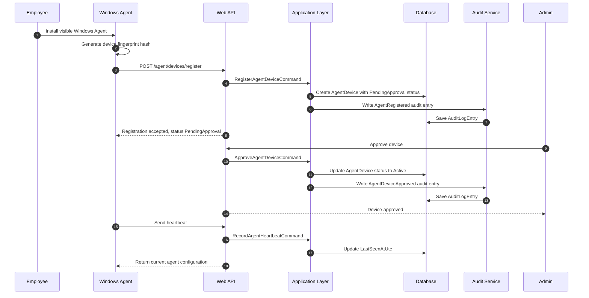

## Important Rules

1. The Agent must be visible to the employee.
2. Device fingerprint must be hashed, not stored as raw sensitive fingerprint.
3. Device starts as `PendingApproval`.
4. Admin approval is required before active use.
5. Registration and approval must be audited.

---

# 2. Monitoring Session Request and Approval Flow

## Purpose

A Manager requests a monitoring session for an employee. The system checks policy, consent requirements, and authorization before the session can start.

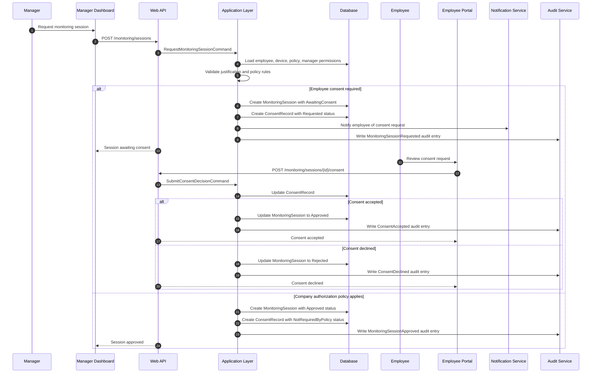

## Important Rules

1. Every session must have a business justification.
2. No monitoring should start before approval/consent rules are satisfied.
3. Consent or authorization decision must be recorded.
4. Employee notification should be sent when policy requires it.
5. Session request and approval must be audited.

---

# 3. Start Monitoring Session Flow

## Purpose

Start an approved monitoring session and make the Windows Agent aware of active capture configuration.

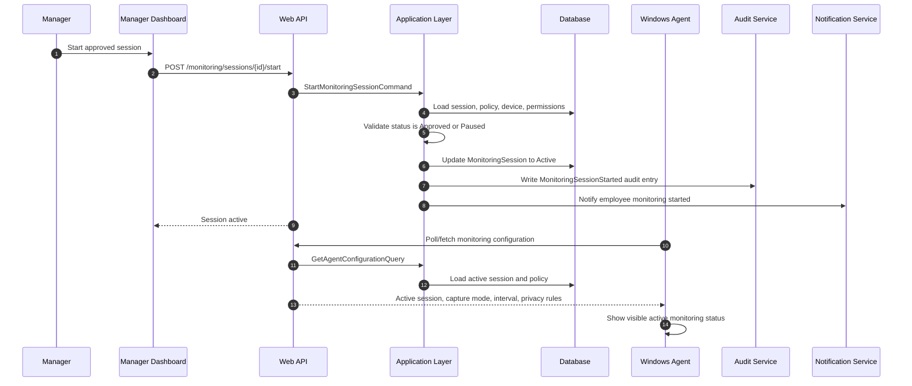

## Important Rules

1. Start is allowed only for approved sessions.
2. Employee-facing visibility is required.
3. Agent must show active monitoring status.
4. Session start must be audited.
5. Agent receives only the configuration it is allowed to use.

---

# 4. Pause or Stop Monitoring Session Flow

## Purpose

Stop capture when the session is paused or completed.

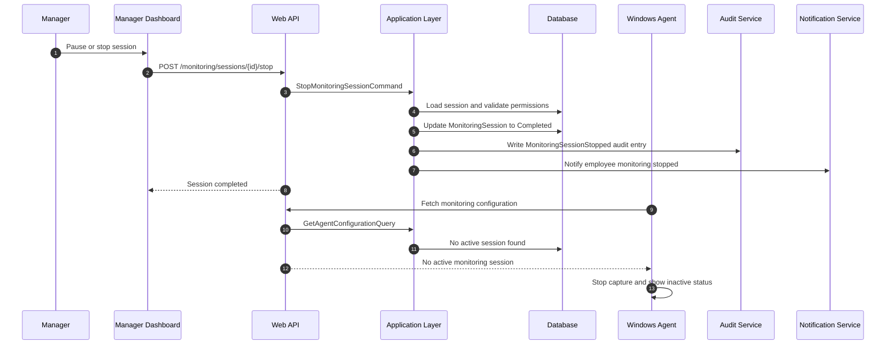

## Important Rules

1. Agent must stop capture when no active session exists.
2. Session stop must be audited.
3. Employee should see stopped/inactive status.
4. Uploads after stop should be rejected unless they belong to queued captures from a valid active period.

---

# 5. Activity Metadata and Screenshot Upload Flow

## Purpose

Upload activity metadata and screenshot asset during an active monitoring session.

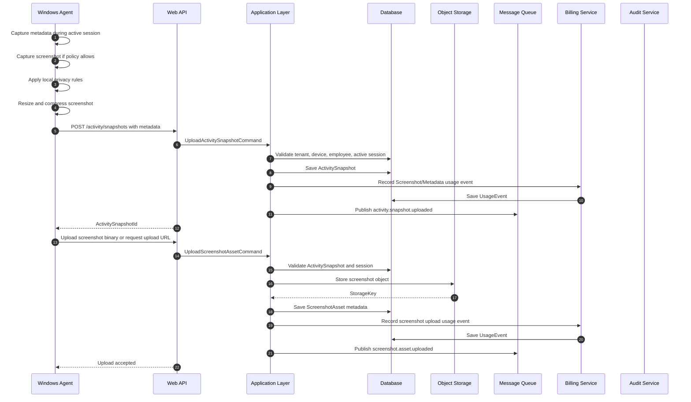

## Important Rules

1. Server must validate active session, tenant, device, and employee.
2. Screenshots must not be stored in relational database.
3. Use object storage for screenshot binaries.
4. Metadata and screenshot upload should be idempotent.
5. Billable events must be recorded.
6. Uploaded data must be queued for async processing.
7. Upload should reject invalid or unauthorized sessions.

---

# 6. Offline Upload Sync Flow

## Purpose

Allow the Agent to queue encrypted data locally when offline and upload later without breaking session integrity.

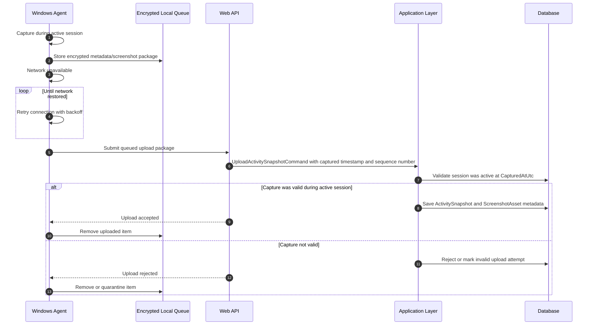

## Important Rules

1. Offline queue must be encrypted.
2. Server validates that the session was active when the capture happened.
3. Client sequence number helps preserve ordering.
4. Duplicate uploads must not create duplicate billing.
5. Invalid queued data should not be silently accepted.

---

# 7. OCR Processing Flow

## Purpose

Run OCR asynchronously after a screenshot is uploaded.

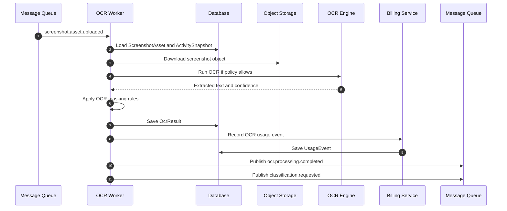

## Important Rules

1. OCR may be skipped based on policy or privacy rule.
2. OCR text is sensitive and must be protected.
3. Masked OCR text should be preferred for reporting.
4. OCR usage should be metered.
5. Worker should be idempotent.

---

# 8. Deterministic Classification Flow

## Purpose

Classify app, domain, idle state, and simple work category using cheap deterministic rules before AI.

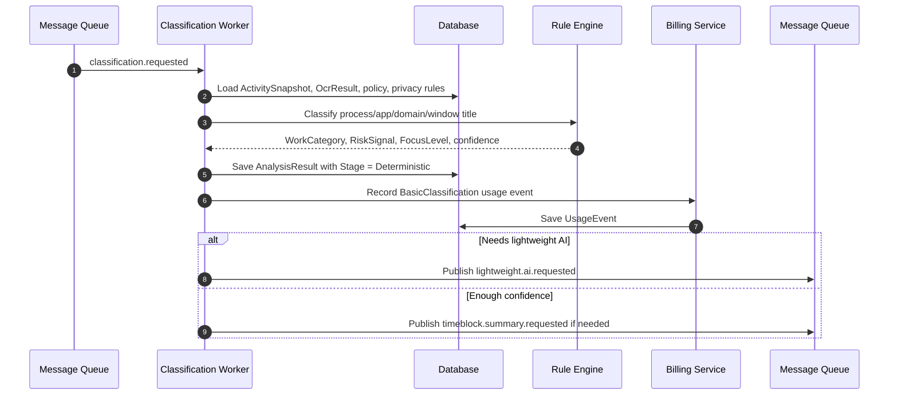

## Important Rules

1. Deterministic processing should run before expensive AI.
2. High-confidence deterministic results may avoid AI cost.
3. Classification language must stay neutral.
4. Bill basic classification if configured as billable.

---

# 9. Lightweight AI Classification Flow

## Purpose

Use low-cost AI or local model only when deterministic classification is insufficient.

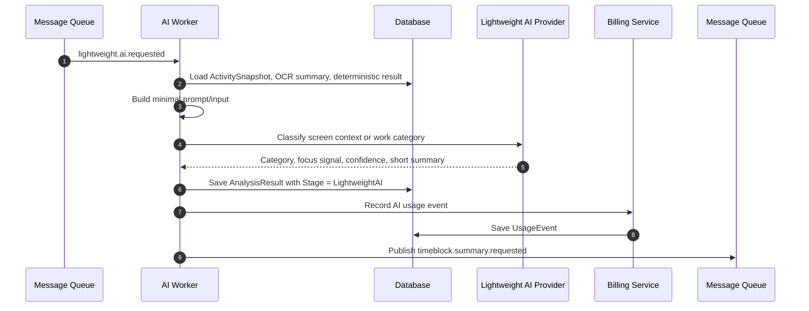

## Important Rules

1. Send minimal necessary data to AI.
2. Prefer metadata and OCR snippets over raw screenshots when possible.
3. Do not send every screenshot to expensive multimodal models.
4. Store model provider, model name, prompt version, and token usage when available.

---

# 10. Premium Deep Analysis Flow

## Purpose

Run premium AI reasoning only when requested or triggered by policy.

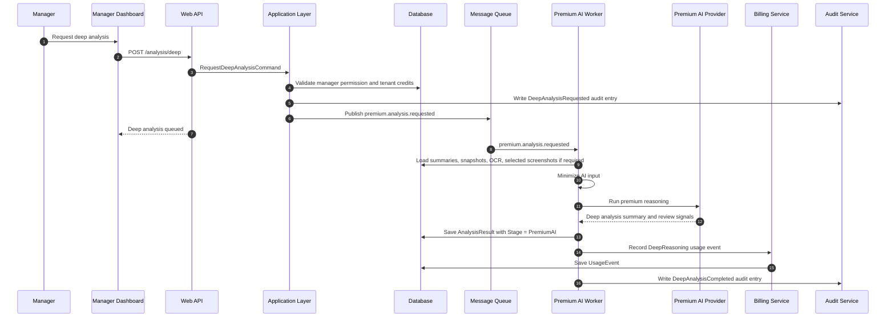

## Important Rules

1. Premium analysis should be explicit, policy-triggered, or anomaly-triggered.
2. Validate tenant credit/billing state before expensive jobs.
3. Audit deep analysis requests.
4. Avoid final moral judgment about employees.

---

# 11. Time Block Summary Flow

## Purpose

Aggregate many activity snapshots into manager-friendly time blocks.

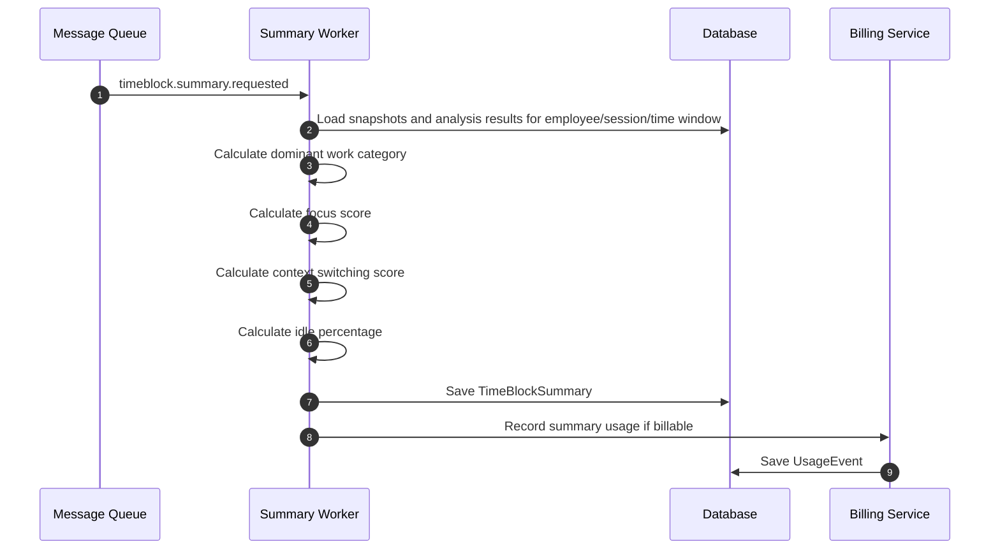

## Important Rules

1. Dashboards should use summaries, not raw screenshot scans.
2. Time blocks reduce manager cognitive load.
3. Summary generation should be idempotent for the same time window.

---

# 12. Daily Employee Summary Flow

## Purpose

Generate a daily summary from aggregated metadata and time blocks.

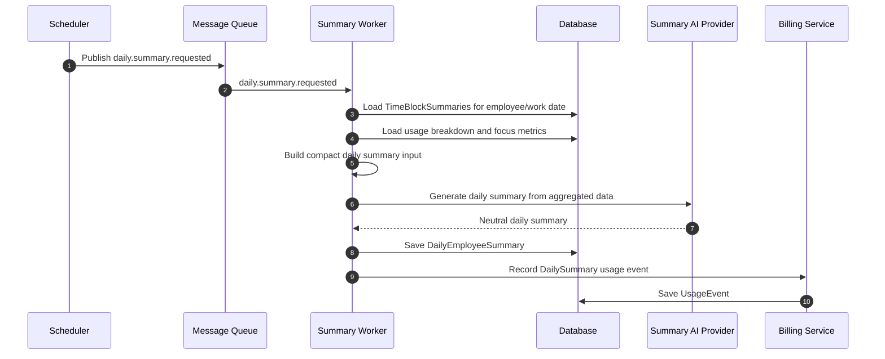

## Important Rules

1. Daily summary should be generated from aggregated data.
2. Do not send all screenshots to AI for daily summary.
3. Summary should use safe language.
4. Daily summary is a premium or semi-premium billable operation.

---

# 13. Manager Dashboard View Flow

## Purpose

Manager views team and employee summaries without directly browsing raw screenshots.

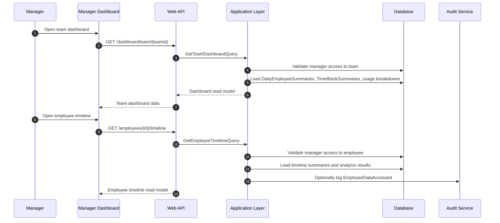

## Important Rules

1. Dashboard should prefer summaries over screenshots.
2. Manager must only access employees within authorized scope.
3. Sensitive employee data access should be audited based on policy.

---

# 14. Raw Screenshot View With Audit Flow

## Purpose

A Manager views a raw screenshot only after authorization and audit logging.

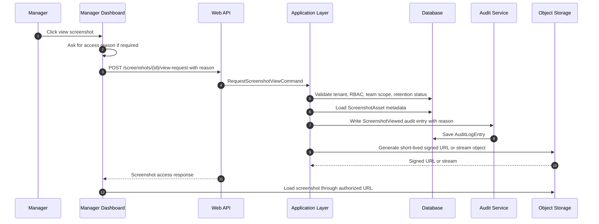

## Important Rules

1. Raw screenshot viewing must be audited.
2. Access reason should be required for sensitive access.
3. Use short-lived signed URLs or secure streaming.
4. Do not expose storage keys directly.
5. Authorization must happen before audit and storage access.

---

# 15. Employee Transparency Portal Flow

## Purpose

Employee views monitoring status, session history, retention policy, and data access history.

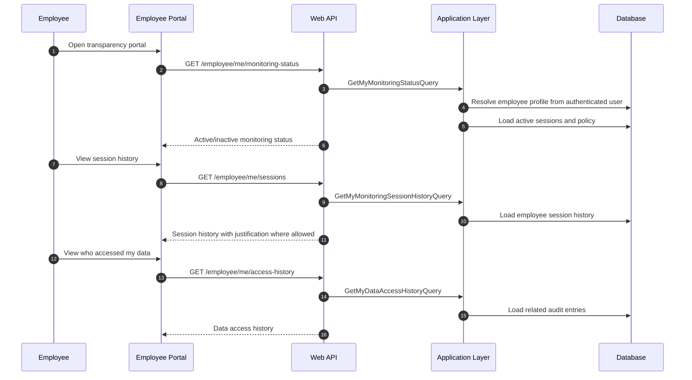

## Important Rules

1. Employee should be able to see monitoring status.
2. Employee should see collected data summary where policy allows.
3. Employee should see retention policy.
4. Employee-facing access history increases trust.

---

# 16. Usage Metering and Credit Deduction Flow

## Purpose

Record usage and deduct credits for billable operations.

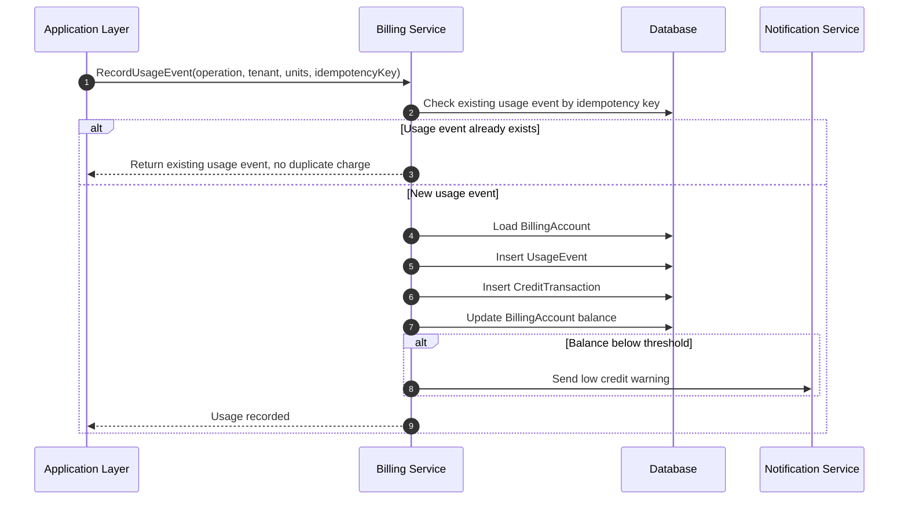

## Important Rules

1. Billing must be idempotent.
2. UsageEvents are append-only.
3. CreditTransactions are append-only.
4. BillingAccount balance update must be transactional.
5. Failed processing should not be billed unless policy explicitly says so.

---

# 17. Retention Cleanup Flow

## Purpose

Delete expired screenshots, OCR, reports, and metadata according to tenant policy.

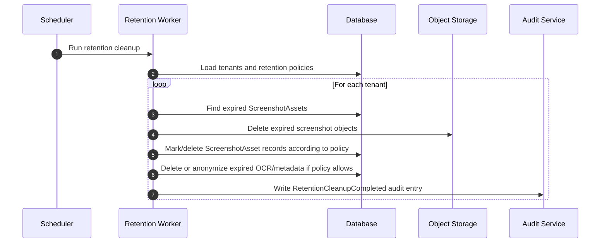

## Important Rules

1. Retention cleanup must respect tenant policy.
2. Deletion should be auditable.
3. Audit logs usually have longer retention than screenshots.
4. Object storage and database metadata must not become inconsistent.

---

# 18. Privacy Rule Update Flow

## Purpose

Admin updates privacy rules and the Agent receives updated configuration.

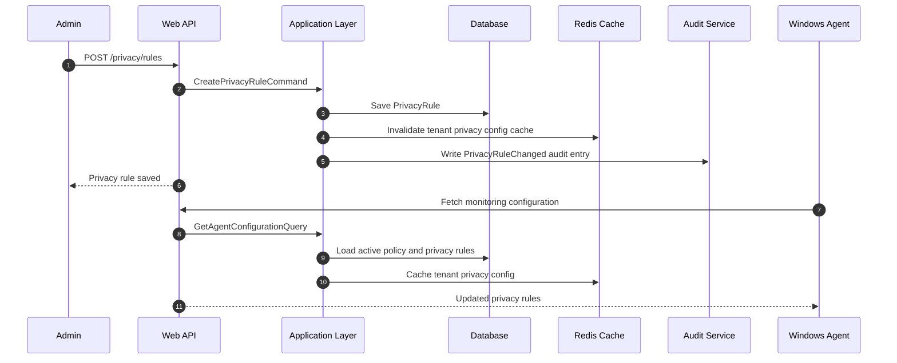

## Important Rules

1. Privacy rule changes must be audited.
2. Agent should receive updated rules quickly.
3. Cache invalidation is required after policy changes.
4. Server-side privacy checks still matter even if local agent masking exists.

---

# 19. Compliance Report Export Flow

## Purpose

Auditor or Owner exports compliance evidence.

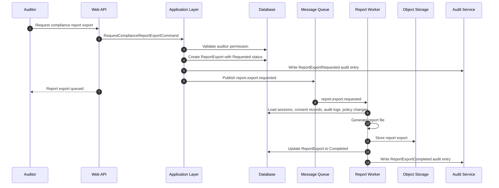

## Important Rules

1. Report exports must be audited.
2. Exported reports should have retention expiry.
3. Compliance reports should include monitoring justification, consent/authorization, policy, and access history.

---

# 20. End-to-End Happy Path

## Purpose

Show the full MVP runtime path from device setup to manager insight.

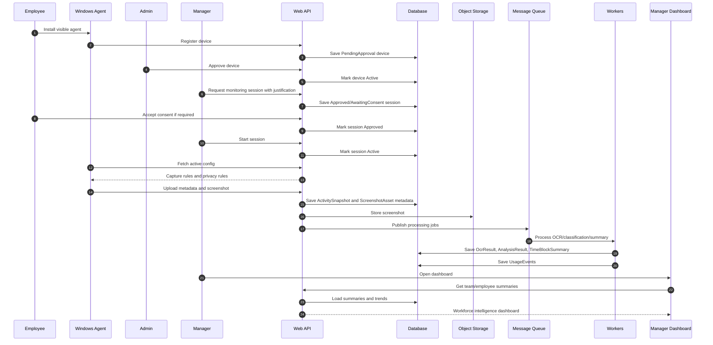

---

## Implementation Guidance for Codex

Codex should implement flows in this order:

```text
1. Agent registration
2. Device approval
3. Monitoring policy creation
4. Monitoring session request
5. Consent or authorization record
6. Start/stop monitoring session
7. Activity metadata upload
8. Screenshot object metadata upload
9. Usage event recording
10. Audit logging
11. Queue message publishing
12. OCR worker skeleton
13. Classification worker skeleton
14. Summary worker skeleton
15. Dashboard read queries
16. Screenshot view with audit
17. Employee transparency queries
```

---

## Non-Negotiable Runtime Rules

1. No active session means no capture.
2. No valid device means no upload.
3. No valid tenant means no data access.
4. No authorization means no dashboard data.
5. No audit log means no raw screenshot view.
6. No idempotency means duplicate billing risk.
7. No retention policy means enterprise compliance risk.
8. No privacy rule enforcement means trust risk.
9. No summary-first dashboard means the product becomes a screenshot viewer.
10. No safe language means the product becomes legally risky.
