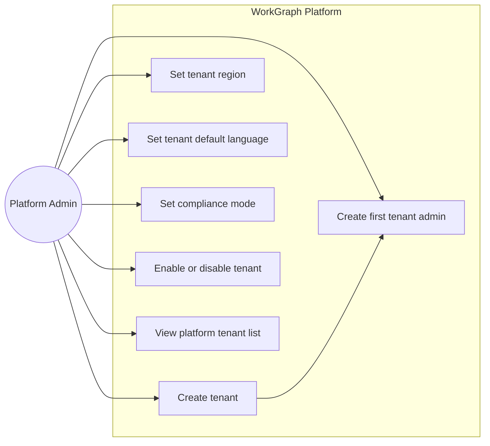
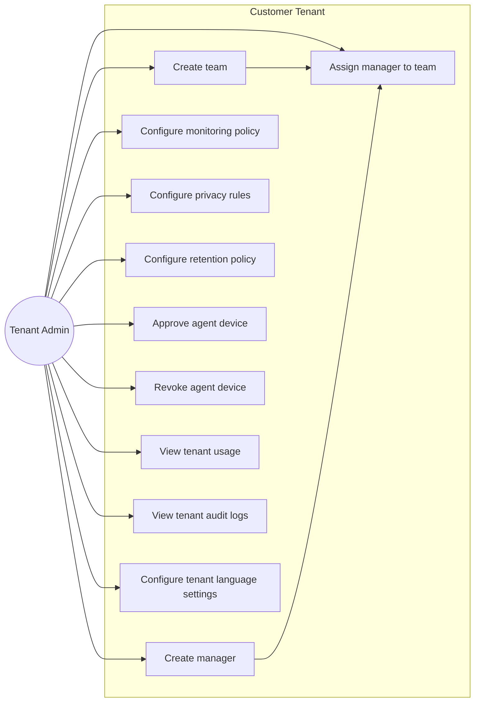
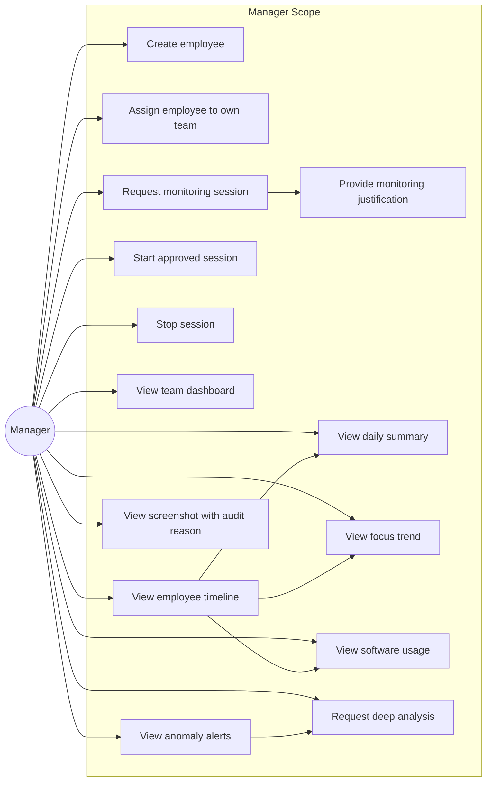
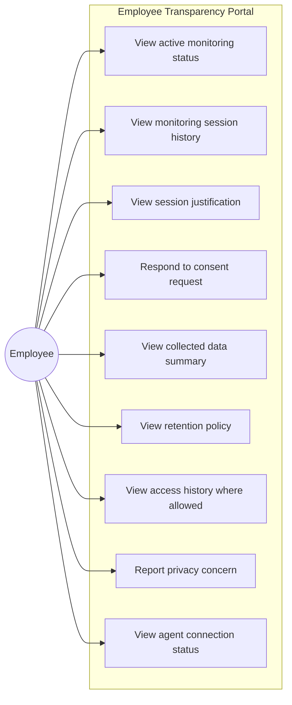
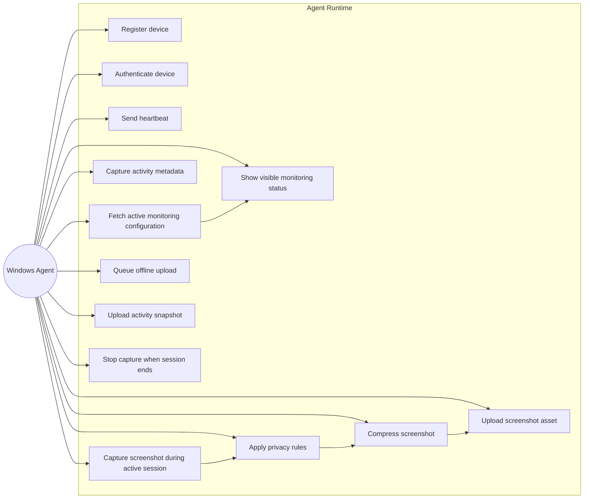
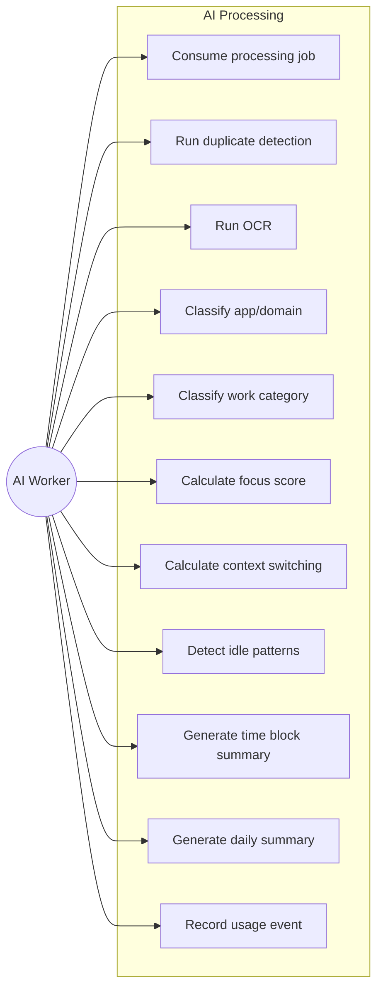
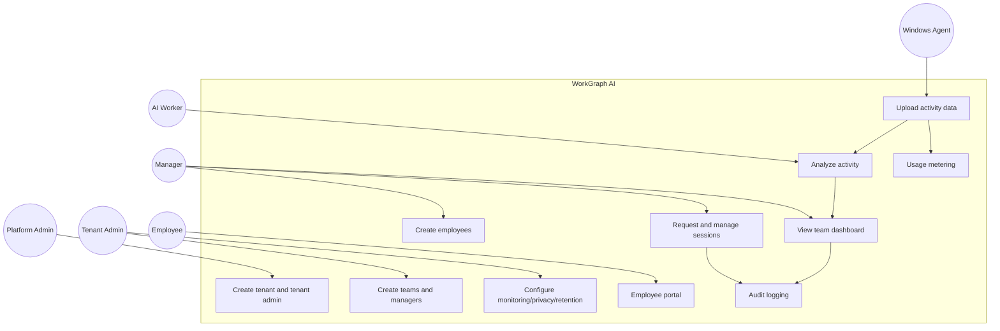

# WorkGraph AI - MVP Role-Based Use Case Diagrams

This document defines the simple MVP use cases based on the current user hierarchy.

The MVP hierarchy is:

```text
Platform Admin → Tenant Admin → Manager → Employee → Windows Agent
```

The platform must remain transparent, session-based, privacy-aware, and auditable.

---

## Actors

```text
Platform Admin
Tenant Admin
Manager
Employee
Windows Agent
AI Worker
System Worker
```

---

## Role Summary

| Role | Main Purpose |
|---|---|
| Platform Admin | Creates tenants and first tenant admins |
| Tenant Admin | Creates teams and managers, configures tenant policies |
| Manager | Creates employees, requests sessions, reviews summaries |
| Employee | Uses visible agent and transparency portal |
| Windows Agent | Uploads approved session data only |
| AI Worker | Processes OCR, classification, scoring, summaries |
| System Worker | Runs retention, billing, reports, background jobs |

---

# 1. Platform Admin Use Cases



## Platform Admin Use Cases

Platform Admin is internal WorkGraph staff.

Platform Admin creates the customer tenant and the first Tenant Admin.

Platform Admin should not normally browse customer screenshots or employee data.

---

# 2. Tenant Admin Use Cases



## Tenant Admin Use Cases

Tenant Admin manages setup and configuration for one customer company.

Tenant Admin creates teams and managers.

Tenant Admin approves Windows Agent devices before they can upload data.

Tenant Admin configures monitoring, privacy, retention, language, and region-related tenant settings.

---

# 3. Manager Use Cases



## Manager Use Cases

Manager creates employees under assigned teams.

Manager can request monitoring sessions only for employees in assigned teams.

Manager should primarily see summaries, timelines, scores, and alerts.

Raw screenshot access must be authorized and audited.

---

# 4. Employee Use Cases



## Employee Use Cases

Employee sees monitoring status and transparency information.

Employee can respond to consent requests if tenant policy requires consent.

Employee can report privacy concerns.

Employee cannot access manager dashboard or other employee data.

---

# 5. Windows Agent Use Cases



## Windows Agent Use Cases

The Agent uploads data only for its assigned employee and active monitoring session.

The Agent must be visible and must stop capture when no active session exists.

---

# 6. AI Worker Use Cases



---

# Combined MVP Use Case Diagram



---

# Simple Access Matrix

| Area | Platform Admin | Tenant Admin | Manager | Employee | Agent |
|---|---:|---:|---:|---:|---:|
| Create tenant | Yes | No | No | No | No |
| Create tenant admin | Yes | No | No | No | No |
| Create teams | No | Yes | No | No | No |
| Create managers | No | Yes | No | No | No |
| Create employees | No | Optional | Yes | No | No |
| Configure monitoring policy | No | Yes | No | No | No |
| Approve agent device | No | Yes | No | No | No |
| Request monitoring session | No | Optional | Yes | No | No |
| View team dashboard | No | Optional | Own teams | No | No |
| View own transparency portal | No | No | No | Yes | No |
| Upload activity data | No | No | No | No | Yes |
| View raw screenshot | No by default | Policy-based | Policy-based + audited | Own data if allowed | No |

---

# MVP Rule

Keep hierarchy simple:

```text
Platform Admin → Tenant Admin → Manager → Employee
```

Do not introduce Owner, Auditor, Department, Business Unit, or complex enterprise hierarchy until real customers require it.
