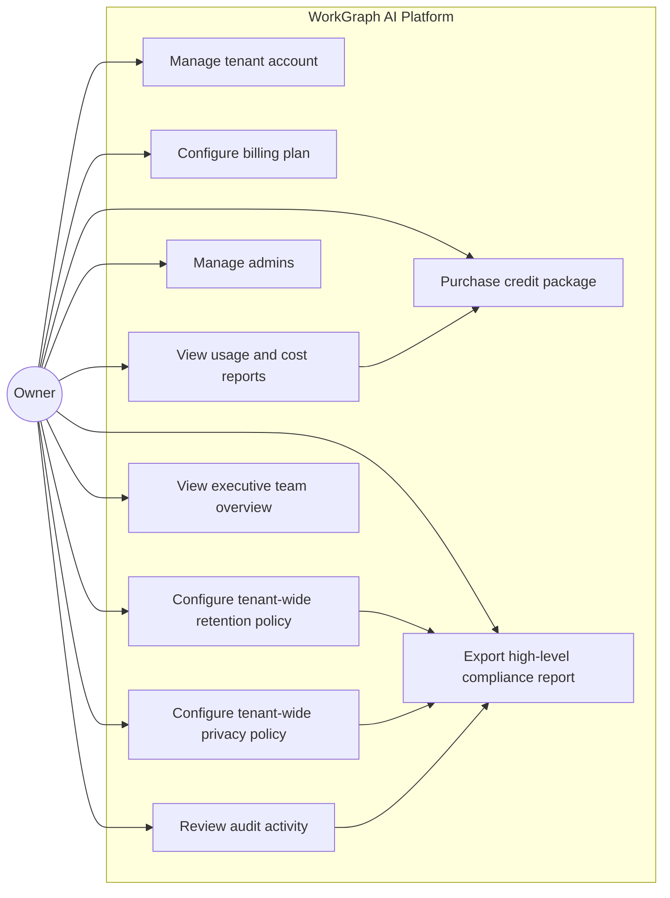
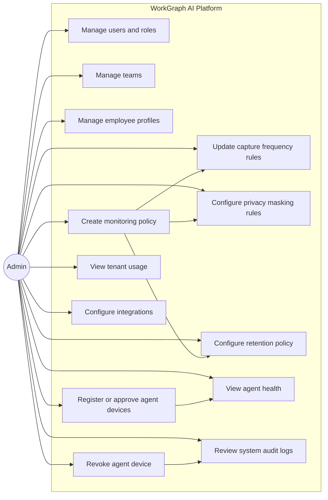
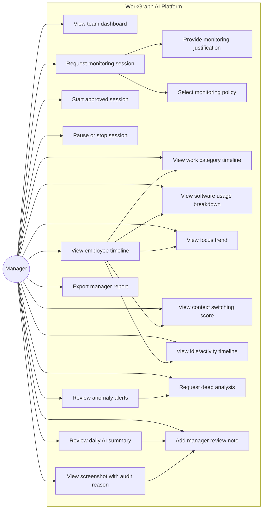
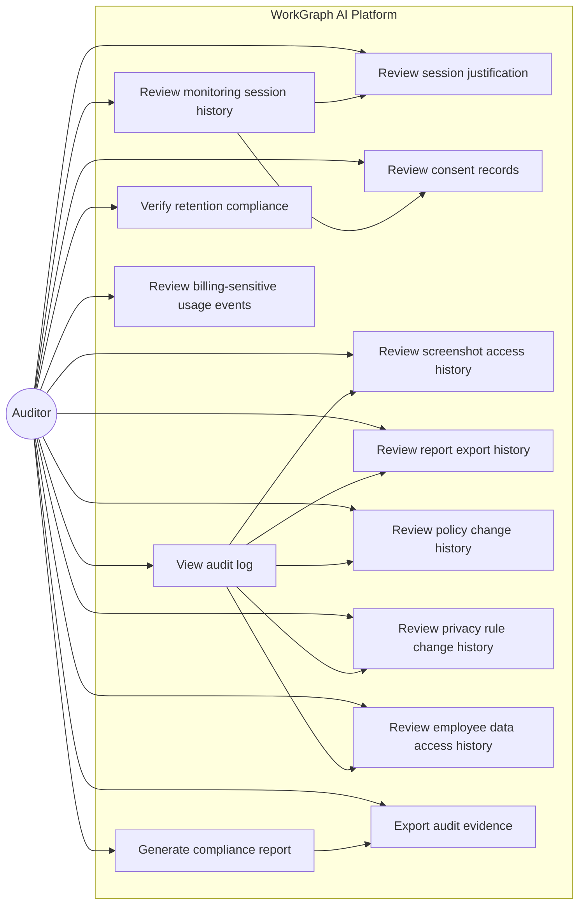
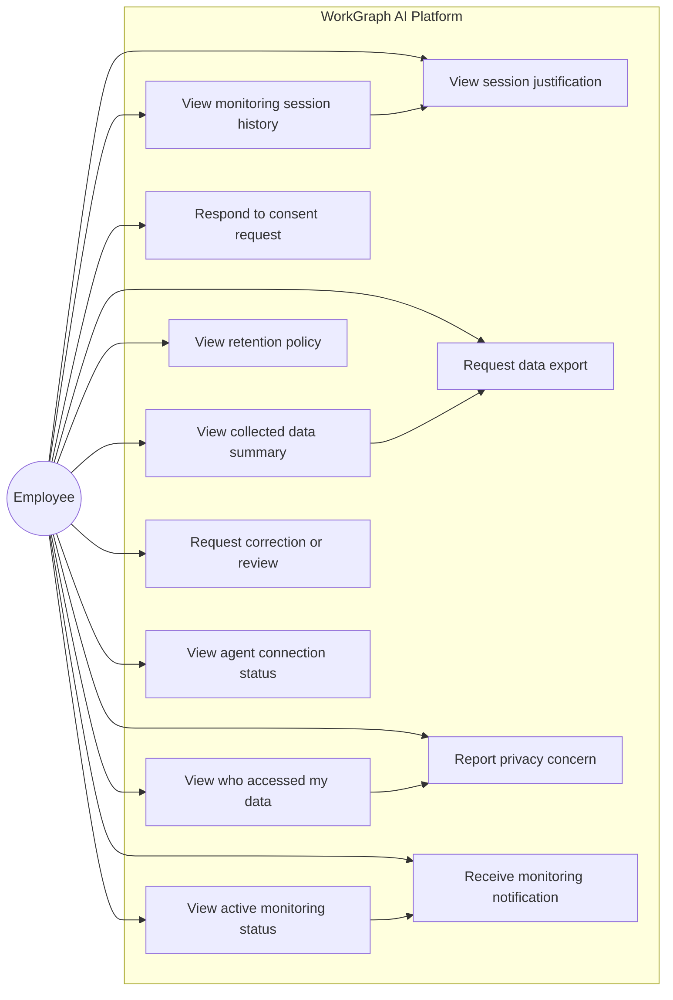
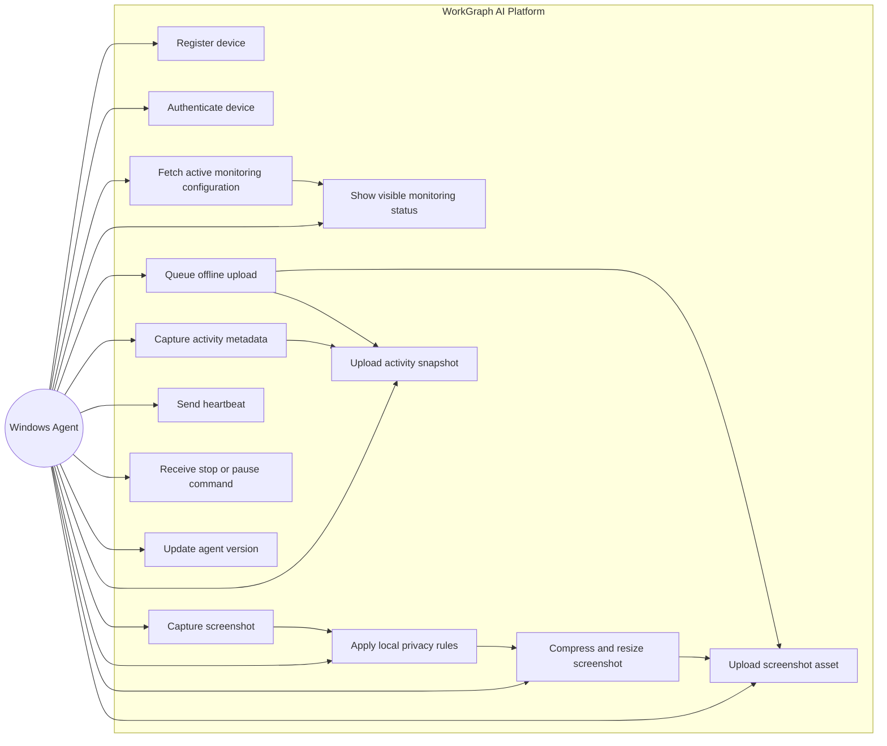
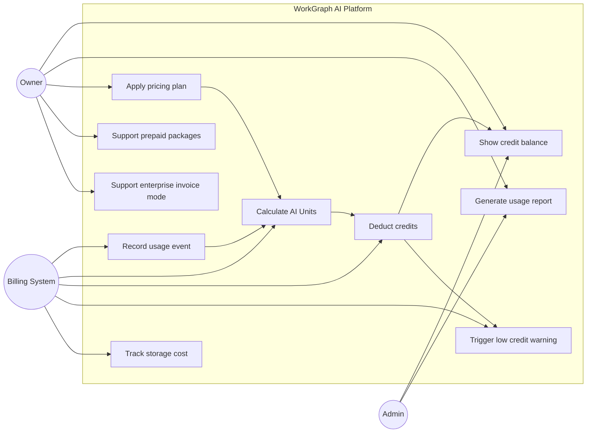
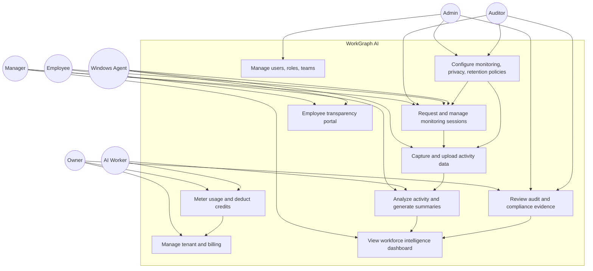

# WorkGraph AI - Role-Based Use Case Diagrams

This document defines the main use cases for each role in **WorkGraph AI**.

The platform must be designed as a transparent, consent-based, auditable workforce intelligence system.

It must not be designed as hidden surveillance or spyware.

---

## Actors

```text
Owner
Admin
Manager
Auditor
Employee
Windows Agent
AI Worker
Billing System
```

---

## Role Summary

| Role | Main Purpose |
|---|---|
| Owner | Owns tenant account, billing, high-level settings, and enterprise configuration |
| Admin | Manages users, teams, policies, devices, privacy rules, and system configuration |
| Manager | Requests approved monitoring sessions and reviews summarized workforce intelligence |
| Auditor | Reviews compliance, access history, session justification, and sensitive activity logs |
| Employee | Sees transparency information, consent requests, session history, and collected data |
| Windows Agent | Captures approved activity data only during valid monitoring sessions |
| AI Worker | Processes activity data into summaries, categories, focus signals, and reports |

---

# 1. Owner Use Case Diagram

The Owner controls the tenant account, billing model, plan, global settings, and executive-level visibility.



## Owner Use Cases

### Manage tenant account
The Owner can manage tenant-level account information, tenant status, and enterprise-level settings.

### Configure billing plan
The Owner can select Starter, Business, Enterprise, or On-Prem pricing configuration.

### Purchase credit package
The Owner can add prepaid AI Units or usage credits.

### View usage and cost reports
The Owner can review AI usage, screenshot processing volume, storage cost, and credit balance.

### Manage admins
The Owner can invite or remove Admin users.

### Configure tenant-wide retention policy
The Owner can define default retention limits for screenshots, metadata, reports, and audit records.

### Configure tenant-wide privacy policy
The Owner can define privacy rules such as masking, skipping domains, and limiting sensitive content collection.

### View executive team overview
The Owner can see organization-level productivity summaries, not raw surveillance-first views.

### Export high-level compliance report
The Owner can export compliance reports for enterprise review.

### Review audit activity
The Owner can inspect high-level administrative and sensitive access logs.

---

# 2. Admin Use Case Diagram

The Admin manages tenant configuration, teams, employees, policies, agent devices, and operational setup.



## Admin Use Cases

### Manage users and roles
The Admin can invite users, assign roles, disable users, and control access boundaries.

### Manage teams
The Admin can create teams and assign managers.

### Manage employee profiles
The Admin can create and maintain employee records used for workforce analytics.

### Register or approve agent devices
The Admin can approve Windows Agent installations before they become active.

### Revoke agent device
The Admin can revoke compromised, inactive, or unauthorized devices.

### Create monitoring policy
The Admin can define monitoring rules for capture frequency, allowed metadata, consent behavior, and masking.

### Update capture frequency rules
The Admin can configure passive, standard, intensive, and event-driven capture behavior.

### Configure privacy masking rules
The Admin can define domains, apps, window title patterns, or OCR patterns that should be blurred, skipped, or masked.

### Configure retention policy
The Admin can define how long screenshots, metadata, OCR, reports, and summaries should be kept.

### View agent health
The Admin can review device status, last seen time, agent version, and connectivity issues.

### View tenant usage
The Admin can review operational usage without necessarily controlling billing.

### Review system audit logs
The Admin can review configuration and device-related audit events.

### Configure integrations
The Admin can configure future integrations such as SSO, storage, SIEM, or enterprise identity providers.

---

# 3. Manager Use Case Diagram

The Manager uses the system for approved monitoring sessions and summarized operational insights.

Managers should not primarily browse screenshots. They should primarily consume summaries, trends, timelines, and alerts.



## Manager Use Cases

### View team dashboard
The Manager can view team-level focus trends, work category distribution, idle/activity trends, and operational summaries.

### Request monitoring session
The Manager can request a monitoring session for selected employees based on tenant policy.

### Provide monitoring justification
Every monitoring session should have a clear business reason.

Examples:

```text
Customer delivery review
Temporary quality check
Operational support audit
Security-sensitive project period
Training and coaching session
```

### Select monitoring policy
The Manager can select an allowed policy such as Passive, Standard, Intensive, or Event-Driven if permitted.

### Start approved session
The Manager can start a session only when approval/consent requirements are satisfied.

### Pause or stop session
The Manager can stop monitoring when the operational need ends.

### View employee timeline
The Manager can review aggregated activity timeline by employee.

### View work category timeline
The Manager can review categories such as Development, Support, Meeting, Documentation, Research, Communication, or Unclassified.

### View software usage breakdown
The Manager can see which applications were used during the session or day.

### View focus trend
The Manager can see focus-level signals without moral judgment.

### View context switching score
The Manager can see frequent application/window changes as a possible focus disruption signal.

### View idle/activity timeline
The Manager can see active, idle, locked, and unknown periods.

### Review daily AI summary
The Manager can review a summarized daily explanation generated from aggregated data.

### Request deep analysis
The Manager can request premium AI reasoning only when needed.

### Review anomaly alerts
The Manager can review unusual patterns such as long idle periods, sensitive content signal, or potential non-work activity.

### View screenshot with audit reason
The Manager can view raw screenshots only with proper authorization and audit logging.

### Add manager review note
The Manager can add human review notes to summaries, anomalies, or sessions.

### Export manager report
The Manager can export summaries and operational reports according to policy.

---

# 4. Auditor Use Case Diagram

The Auditor verifies compliance, access, session justification, policy changes, and sensitive data usage.



## Auditor Use Cases

### View audit log
The Auditor can review append-only records of sensitive system actions.

### Review monitoring session history
The Auditor can inspect who requested sessions, when they occurred, and what policy was used.

### Review session justification
The Auditor can verify every session had a recorded business purpose.

### Review consent records
The Auditor can verify consent status or company authorization status.

### Review screenshot access history
The Auditor can see who viewed raw screenshots, when, and why.

### Review report export history
The Auditor can see who exported reports and what type of report was exported.

### Review policy change history
The Auditor can verify changes to monitoring rules.

### Review privacy rule change history
The Auditor can verify changes to masking, skipping, and sensitive content rules.

### Review employee data access history
The Auditor can verify access to employee-specific data.

### Generate compliance report
The Auditor can generate compliance reports for internal or external review.

### Export audit evidence
The Auditor can export evidence according to tenant policy.

### Verify retention compliance
The Auditor can check whether expired screenshots and reports were removed according to policy.

### Review billing-sensitive usage events
The Auditor can inspect usage events that affect cost and billing transparency.

---

# 5. Employee Use Case Diagram

The Employee uses the system through the transparency portal and visible Windows Agent.

The Employee should know when monitoring is active, what is collected, and why.



## Employee Use Cases

### View active monitoring status
The Employee can see whether monitoring is active, paused, or stopped.

### View monitoring session history
The Employee can see previous monitoring sessions involving them.

### View session justification
The Employee can see the business reason for monitoring where policy allows.

### Respond to consent request
The Employee can accept, decline, or revoke consent where tenant policy requires employee-level consent.

### View collected data summary
The Employee can see a summary of collected metadata, screenshots, and analysis categories.

### View retention policy
The Employee can see how long collected data will be retained.

### View who accessed my data
The Employee can see access history if tenant policy allows employee-facing audit visibility.

### Request data export
The Employee can request a copy of their collected data according to company policy.

### Request correction or review
The Employee can request human review if they believe a summary or classification is wrong.

### Report privacy concern
The Employee can report that sensitive or personal content was captured.

### View agent connection status
The Employee can see whether the Windows Agent is connected and healthy.

### Receive monitoring notification
The Employee receives a visible notification when monitoring starts, pauses, resumes, or stops.

---

# 6. Windows Agent Use Case Diagram

The Windows Agent is not a human user, but it is a key actor.

It must only capture data during valid monitoring sessions.



## Windows Agent Use Cases

### Register device
The Agent registers the employee device with the server.

### Authenticate device
The Agent uses secure credentials or short-lived tokens.

### Fetch active monitoring configuration
The Agent fetches capture mode, interval, privacy rules, and active session state.

### Show visible monitoring status
The Agent must show a visible tray icon/status.

### Capture activity metadata
The Agent captures allowed metadata such as active window title, process name, app name, idle/activity state, optional browser domain, and timestamp.

### Capture screenshot
The Agent captures screenshots only during active monitoring sessions.

### Apply local privacy rules
The Agent applies rules such as skip or blur when possible.

### Compress and resize screenshot
The Agent optimizes screenshot size before upload.

### Queue offline upload
The Agent stores encrypted offline upload queue if the network is unavailable.

### Upload activity snapshot
The Agent uploads metadata to the server.

### Upload screenshot asset
The Agent uploads compressed screenshot asset to the server.

### Send heartbeat
The Agent reports health, version, and last seen status.

### Receive stop or pause command
The Agent stops or pauses capture when the server session state changes.

### Update agent version
The Agent supports signed update flow.

---

# 7. AI Worker Use Case Diagram

AI Workers process activity data asynchronously.

They should minimize expensive AI usage.

```mermaid
flowchart LR
    AIWorker((AI Worker))

    subgraph WorkGraphAI[WorkGraph AI Platform]
        UC1[Consume processing job]
        UC2[Run duplicate detection]
        UC3[Run OCR]
        UC4[Classify application/domain]
        UC5[Classify work category]
        UC6[Estimate focus level]
        UC7[Detect context switching]
        UC8[Detect idle patterns]
        UC9[Generate time block summary]
        UC10[Generate daily summary]
        UC11[Run premium deep analysis]
        UC12[Create anomaly alert]
        UC13[Record AI usage event]
        UC14[Store analysis result]
    end

    AIWorker --> UC1
    AIWorker --> UC2
    AIWorker --> UC3
    AIWorker --> UC4
    AIWorker --> UC5
    AIWorker --> UC6
    AIWorker --> UC7
    AIWorker --> UC8
    AIWorker --> UC9
    AIWorker --> UC10
    AIWorker --> UC11
    AIWorker --> UC12
    AIWorker --> UC13
    AIWorker --> UC14

    UC2 --> UC14
    UC3 --> UC14
    UC4 --> UC5
    UC5 --> UC6
    UC6 --> UC9
    UC7 --> UC9
    UC8 --> UC9
    UC9 --> UC10
    UC11 --> UC13
    UC10 --> UC13
    UC12 --> UC14
```



## AI Worker Use Cases

### Consume processing job
The worker consumes jobs from RabbitMQ, Kafka, or another queue.

### Run duplicate detection
The worker detects duplicate or near-duplicate screenshots to reduce unnecessary AI cost.

### Run OCR
The worker extracts text when needed.

### Classify application/domain
The worker classifies apps and domains using deterministic rules first.

### Classify work category
The worker assigns categories such as Development, Support, Meeting, Documentation, Research, Communication, Administration, or Unclassified.

### Estimate focus level
The worker estimates focus using safe non-judgmental signals.

### Detect context switching
The worker calculates frequent application/window/domain changes.

### Detect idle patterns
The worker detects long idle periods and inactive blocks.

### Generate time block summary
The worker summarizes many activity snapshots into a useful time block.

### Generate daily summary
The worker creates daily AI summaries from aggregated data.

### Run premium deep analysis
The worker uses expensive AI only when requested or triggered by policy.

### Create anomaly alert
The worker creates reviewable alerts, not final accusations.

### Record AI usage event
The worker records billable usage units.

### Store analysis result
The worker persists analysis outputs for dashboards and reports.

---

# 8. Billing System Use Case Diagram

Billing tracks usage-based AI Units and credit consumption.



## Billing Use Cases

### Record usage event
Every billable operation should create a usage event.

### Calculate AI Units
The system converts operations into internal AI Units.

### Deduct credits
The system deducts credits based on tenant pricing.

### Show credit balance
Owners and allowed Admins can view balance.

### Generate usage report
The system generates transparent cost reports.

### Trigger low credit warning
The system notifies tenant users when credits are low.

### Apply pricing plan
The system supports Starter, Business, Enterprise, and On-Prem pricing modes.

### Track storage cost
The system tracks retention-based storage cost.

### Support prepaid packages
The system supports prepaid credit bundles.

### Support enterprise invoice mode
Enterprise tenants may use invoice-based usage tracking.

---

# Combined High-Level Use Case Diagram



---

## Access Control Matrix

| Use Case Area | Owner | Admin | Manager | Auditor | Employee |
|---|---:|---:|---:|---:|---:|
| Tenant settings | Full | Limited | No | Read audit only | No |
| Billing | Full | Read/Limited | No | Read audit only | No |
| Users and roles | Full | Full | No | Read audit only | No |
| Teams | Full | Full | Own teams only | Read audit only | No |
| Employee profiles | Full | Full | Own team only | Read audit only | Own profile only |
| Agent devices | Read | Full | Read own team status | Audit read | Own device status |
| Monitoring policies | Full | Full | Select allowed only | Read | Read relevant policy |
| Monitoring sessions | Full | Full | Request/manage own team | Audit read | Own sessions only |
| Screenshots | Policy-based | Policy-based | Policy-based + audited | Audit read | Own data where allowed |
| AI summaries | Full | Full | Own team | Audit read | Own summary where allowed |
| Audit logs | Full | Config/system | Limited own actions | Full | Own data access history where allowed |
| Privacy rules | Full | Full | Read only | Audit read | Read relevant rules |
| Retention policies | Full | Full | Read only | Audit read | Read relevant policy |

---

## Product Safety Rules

1. Monitoring must be session-based.
2. The Windows Agent must be visible.
3. Employee-facing transparency is required.
4. Raw screenshot viewing must be audited.
5. Monitoring sessions require justification.
6. Consent or authorization records must be stored.
7. AI should produce neutral signals, not moral judgment.
8. Managers should use summaries first and screenshots second.
9. Privacy masking and retention policies must be configurable.
10. Every billable operation must be metered.

---

## Recommended MVP Use Cases

Build these first:

```text
Owner
- View usage and credit balance
- Configure tenant retention policy

Admin
- Manage users and roles
- Manage teams and employees
- Approve agent devices
- Create monitoring policy

Manager
- Request monitoring session
- Start/stop approved session
- View team dashboard
- View employee timeline
- Review daily summary

Auditor
- View audit log
- Review session justification
- Review screenshot access history

Employee
- View active monitoring status
- Respond to consent request
- View session history

Windows Agent
- Register device
- Fetch monitoring config
- Capture metadata and screenshots during active sessions
- Upload data securely

AI Worker
- Run OCR
- Run basic classification
- Generate daily summary

Billing
- Record usage events
- Deduct AI Units
- Show credit balance
```
