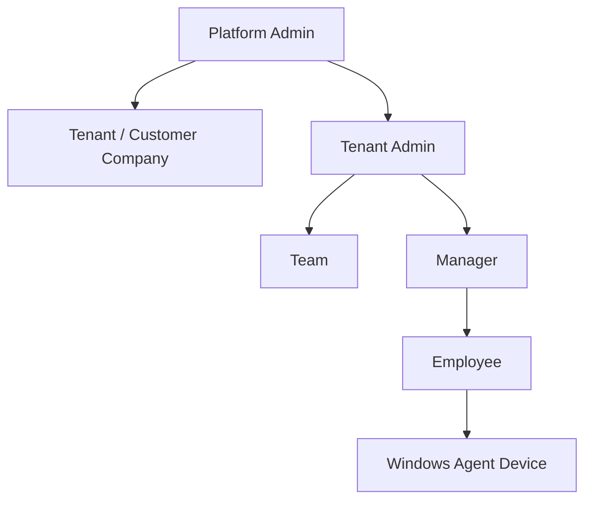
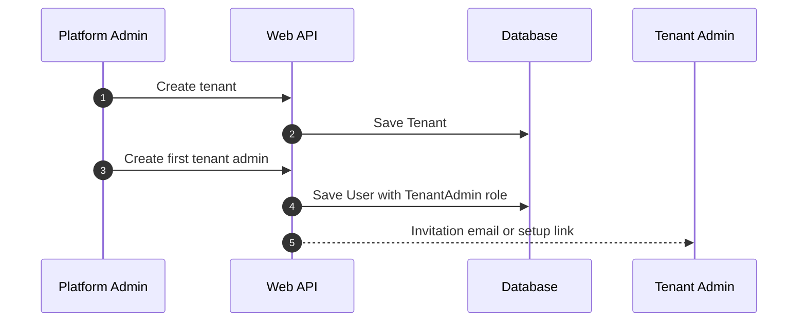
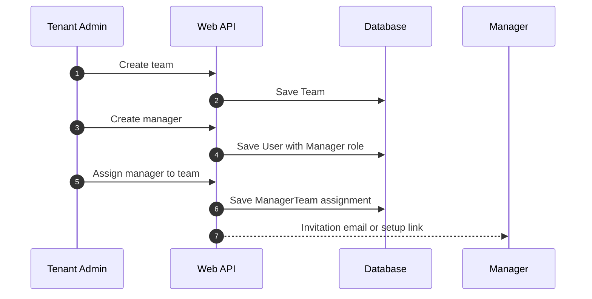
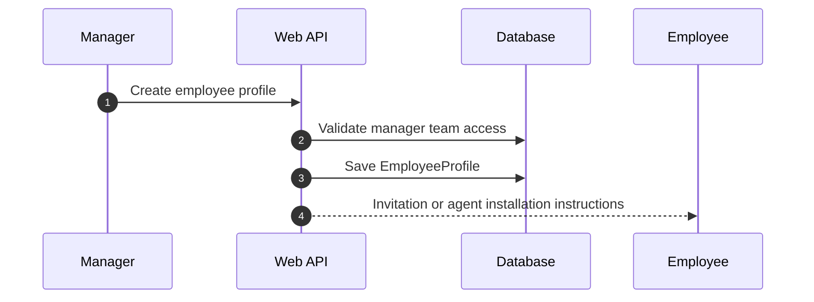
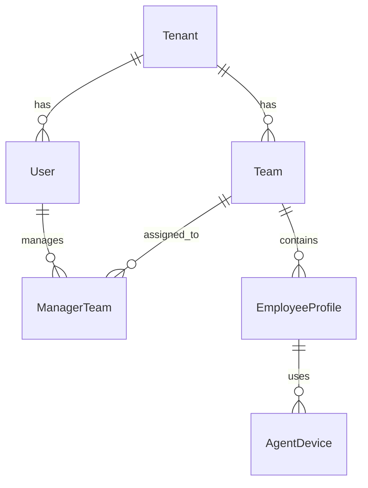

# WorkGraph AI - Simple User Hierarchy

This document defines the simple user hierarchy for WorkGraph AI.

The first version should not be complex.

---

## Simple Hierarchy

```text
Platform Admin
    ↓
Creates Tenant
    ↓
Creates Tenant Admin
    ↓
Tenant Admin creates Teams
    ↓
Tenant Admin creates Managers
    ↓
Managers create Employees
```

---

## Hierarchy Diagram



---

## Roles

## 1. Platform Admin

Platform Admin is internal WorkGraph staff.

Platform Admin can:

```text
Create tenant/customer company
Create first tenant admin
Enable/disable tenant
View platform-level status
Configure tenant region/language/compliance mode
```

Platform Admin should not normally browse customer screenshots.

---

## 2. Tenant Admin

Tenant Admin belongs to one customer company.

Tenant Admin can:

```text
Create teams
Create managers
Assign managers to teams
Configure monitoring policies
Approve agent devices
Configure privacy rules
Configure retention policies
View tenant-level usage
```

Tenant Admin manages setup and configuration.

---

## 3. Manager

Manager belongs to one tenant and manages one or more teams.

Manager can:

```text
Create employees
Assign employees to own team
Request monitoring sessions for own employees
Start/stop approved sessions
View dashboard for own team
View summaries for own employees
Request screenshot view when allowed and audited
```

Manager cannot access employees from other tenants.

Manager should not access employees outside assigned teams.

---

## 4. Employee

Employee belongs to one tenant and usually one team.

Employee can:

```text
Install/use visible Windows Agent
View monitoring status
View own session history
Respond to consent request if policy requires
View own collected data summary where allowed
Report privacy concern
```

Employee cannot access manager dashboard.

Employee cannot access other employees' data.

---

## 5. Windows Agent Device

Windows Agent Device is not a human role.

It is linked to:

```text
Tenant
Employee
Device
Monitoring Session
```

Agent can:

```text
Register device
Send heartbeat
Fetch active monitoring configuration
Upload activity metadata
Upload screenshot during active session
```

Agent cannot:

```text
View dashboard
View screenshots
Create employees
Create sessions by itself
Access other tenant data
```

---

## Simple Permission Matrix

| Action | Platform Admin | Tenant Admin | Manager | Employee | Agent |
|---|---:|---:|---:|---:|---:|
| Create tenant | Yes | No | No | No | No |
| Create tenant admin | Yes | No | No | No | No |
| Create team | No | Yes | No | No | No |
| Create manager | No | Yes | No | No | No |
| Create employee | No | Optional | Yes | No | No |
| Approve agent device | No | Yes | No | No | No |
| Request monitoring session | No | Optional | Yes | No | No |
| Start/stop monitoring session | No | Optional | Yes | No | No |
| View team dashboard | No | Optional | Yes | No | No |
| View own monitoring status | No | No | No | Yes | No |
| Upload activity data | No | No | No | No | Yes |

---

## Tenant Creation Flow



---

## Team and Manager Setup Flow



---

## Employee Creation Flow



---

## Simple Database Model

Recommended simple entities:

```text
Tenant
User
Role
Team
ManagerTeam
EmployeeProfile
AgentDevice
```

---

## Entity Relationships



---

## Suggested Roles

Use only these roles in MVP:

```text
PlatformAdmin
TenantAdmin
Manager
Employee
AgentDevice
SystemWorker
```

Do not add Owner/Auditor/Department/BusinessUnit in MVP unless needed later.

They can be added in enterprise version.

---

## Simple Rules for Codex

1. Platform Admin creates tenants.
2. Platform Admin creates the first Tenant Admin.
3. Tenant Admin creates teams.
4. Tenant Admin creates managers.
5. Tenant Admin assigns managers to teams.
6. Managers create employees under their assigned teams.
7. Employees belong to one tenant and one team in MVP.
8. Agent devices belong to one employee.
9. Managers can access only their assigned teams.
10. Employees can access only their own data.
11. Agent can upload only for its assigned employee and active session.

---

## Final Rule

Keep hierarchy simple in MVP:

```text
Platform Admin → Tenant Admin → Manager → Employee
```

Do not over-engineer organization structure until real customers require it.
